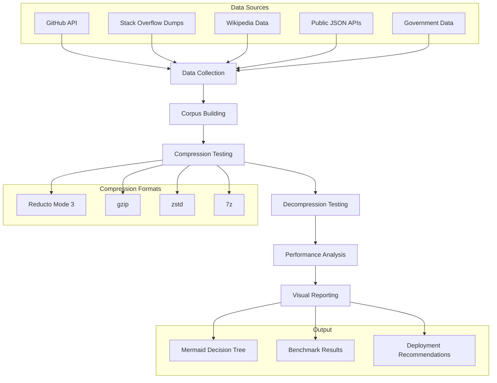

# Design Document

## Overview

The Compression Benchmark Suite is designed as a production-ready evaluation system that answers the critical question: "When should I choose Reducto Mode 3 over existing compression formats?" The system fetches real-world data from public APIs, builds realistic reference corpora, and produces actionable insights for compression format selection.

**Core Design Principle**: Test compression formats under realistic conditions that mirror how organizations would actually deploy them, using real data patterns that naturally exhibit the redundancy characteristics where differential compression excels.

## Architecture

The system follows a pipeline architecture with clear separation of concerns:



## Components and Interfaces

### 1. Data Collection Engine

**Purpose**: Fetch real-world data from public APIs and repositories that naturally exhibit redundancy patterns.

```rust
#[async_trait]
pub trait DataSource {
    async fn collect_data(&self, target_size: usize) -> Result<Vec<DataFile>, CollectionError>;
    fn data_type(&self) -> DataType;
    fn redundancy_level(&self) -> RedundancyLevel;
}

pub struct GitHubDataSource {
    client: reqwest::Client,
    api_token: Option<String>,
}

pub struct StackOverflowDataSource {
    dump_url: String,
    cache_dir: PathBuf,
}

pub struct WikipediaDataSource {
    api_endpoint: String,
    language: String,
}

#[derive(Debug, Clone)]
pub struct DataFile {
    pub name: String,
    pub content: Vec<u8>,
    pub source_type: DataType,
    pub redundancy_level: RedundancyLevel,
    pub metadata: HashMap<String, String>,
}

#[derive(Debug, Clone, Copy)]
pub enum DataType {
    SourceCode,
    Documentation,
    StructuredData,
    LogData,
    Configuration,
}

#[derive(Debug, Clone, Copy)]
pub enum RedundancyLevel {
    High,    // 60%+ repeated patterns
    Medium,  // 30-60% repeated patterns  
    Low,     // <30% repeated patterns
}
```

### 2. Corpus Management System

**Purpose**: Build and manage reference corpora from real-world shared knowledge bases.

```rust
pub struct CorpusBuilder {
    block_size: usize,
    hasher: RollingHasher,
}

pub struct ReferenceCorpus {
    pub manifest: CorpusManifest,
    pub data: Vec<u8>,
    pub metadata: CorpusMetadata,
}

#[derive(Debug)]
pub struct CorpusMetadata {
    pub total_blocks: usize,
    pub unique_blocks: usize,
    pub source_distribution: HashMap<DataType, f64>,
    pub build_time: Duration,
    pub effectiveness_score: f64, // Predicted compression advantage
}

impl CorpusBuilder {
    pub async fn build_corpus(
        &self,
        data_files: &[DataFile],
        corpus_ratio: f64,
    ) -> Result<ReferenceCorpus, CorpusError> {
        // Select highest-redundancy data for corpus
        // Build block index with rolling hash
        // Calculate effectiveness metrics
    }
    
    pub fn analyze_corpus_quality(&self, corpus: &ReferenceCorpus) -> CorpusQualityReport {
        // Measure block utilization
        // Calculate redundancy coverage
        // Estimate compression potential
    }
}
```

### 3. Compression Testing Framework

**Purpose**: Execute compression tests across multiple formats with production-realistic settings.

```rust
#[async_trait]
pub trait CompressionFormat {
    fn name(&self) -> &'static str;
    async fn compress(&self, data: &[u8]) -> Result<CompressionResult, CompressionError>;
    async fn decompress(&self, compressed: &[u8]) -> Result<Vec<u8>, CompressionError>;
    fn settings_description(&self) -> String;
}

pub struct CompressionResult {
    pub compressed_data: Vec<u8>,
    pub compression_ratio: f64,
    pub compression_time: Duration,
    pub peak_memory: usize,
    pub cpu_time: Duration,
}

pub struct ReductoMode3Format {
    corpus: Arc<ReferenceCorpus>,
    block_size: usize,
}

pub struct StandardFormat {
    format_type: StandardFormatType,
    compression_level: u8,
}

#[derive(Debug, Clone, Copy)]
pub enum StandardFormatType {
    Gzip,
    Zstd,
    SevenZip,
}

pub struct CompressionBenchmark {
    formats: Vec<Box<dyn CompressionFormat>>,
    test_iterations: usize,
    timeout: Duration,
}

impl CompressionBenchmark {
    pub async fn run_benchmark(
        &self,
        test_files: &[DataFile],
    ) -> Result<BenchmarkResults, BenchmarkError> {
        // Execute compression tests for each format
        // Measure performance metrics
        // Validate data integrity
        // Calculate statistical measures
    }
}
```

### 4. Performance Analysis Engine

**Purpose**: Analyze results and generate actionable insights for format selection.

```rust
pub struct PerformanceAnalyzer {
    cost_model: CostModel,
}

#[derive(Debug)]
pub struct CostModel {
    pub storage_cost_per_gb_month: f64,
    pub cpu_cost_per_second: f64,
    pub network_cost_per_gb: f64,
    pub latency_cost_per_ms: f64,
}

#[derive(Debug)]
pub struct AnalysisResults {
    pub format_rankings: Vec<FormatRanking>,
    pub recommendations: Vec<Recommendation>,
    pub break_even_analysis: BreakEvenAnalysis,
    pub deployment_guidance: DeploymentGuidance,
}

#[derive(Debug)]
pub struct FormatRanking {
    pub format_name: String,
    pub scenario: OptimizationScenario,
    pub advantage_percentage: f64,
    pub confidence_level: f64,
}

#[derive(Debug, Clone, Copy)]
pub enum OptimizationScenario {
    MinimizeStorageCost,
    MinimizeLatency,
    MinimizeCpuUsage,
    BalancedPerformance,
}

#[derive(Debug)]
pub struct Recommendation {
    pub scenario: String,
    pub recommended_format: String,
    pub expected_benefit: String,
    pub deployment_considerations: Vec<String>,
}

impl PerformanceAnalyzer {
    pub fn analyze_results(
        &self,
        benchmark_results: &BenchmarkResults,
        corpus_metadata: &CorpusMetadata,
    ) -> AnalysisResults {
        // Calculate cost-effectiveness metrics
        // Identify optimal formats for each scenario
        // Generate deployment recommendations
        // Determine break-even points
    }
    
    pub fn calculate_organizational_impact(
        &self,
        results: &AnalysisResults,
        org_data_volume: usize,
        org_characteristics: OrganizationProfile,
    ) -> OrganizationalImpact {
        // Scale results to organizational data volumes
        // Factor in deployment complexity
        // Calculate ROI estimates
    }
}
```

### 5. Visual Reporting System

**Purpose**: Generate executive-ready visual summaries and technical documentation.

```rust
pub struct ReportGenerator {
    template_engine: TemplateEngine,
}

pub struct MermaidDiagramBuilder {
    diagram_type: DiagramType,
}

#[derive(Debug, Clone, Copy)]
pub enum DiagramType {
    DecisionTree,
    PerformanceComparison,
    CostAnalysis,
    DeploymentGuide,
}

impl ReportGenerator {
    pub fn generate_executive_summary(
        &self,
        analysis: &AnalysisResults,
    ) -> ExecutiveSummary {
        // Create one-page summary with key insights
        // Generate primary decision tree diagram
        // Include quantified business impact
    }
    
    pub fn generate_technical_report(
        &self,
        benchmark_results: &BenchmarkResults,
        analysis: &AnalysisResults,
    ) -> TechnicalReport {
        // Detailed performance metrics
        // Statistical analysis
        // Deployment recommendations
        // Troubleshooting guidance
    }
    
    pub fn create_mermaid_decision_tree(
        &self,
        recommendations: &[Recommendation],
    ) -> String {
        // Generate decision tree showing format selection logic
        // Include quantified benefits and trade-offs
        // Use vertical orientation for mobile-friendly display
    }
}
```

## Data Models

### Core Data Structures

```rust
#[derive(Debug, Serialize, Deserialize)]
pub struct BenchmarkResults {
    pub test_metadata: TestMetadata,
    pub format_results: HashMap<String, FormatResults>,
    pub corpus_analysis: CorpusAnalysis,
    pub system_info: SystemInfo,
}

#[derive(Debug, Serialize, Deserialize)]
pub struct TestMetadata {
    pub timestamp: DateTime<Utc>,
    pub total_data_size: usize,
    pub data_distribution: HashMap<DataType, usize>,
    pub test_duration: Duration,
    pub system_specs: SystemSpecs,
}

#[derive(Debug, Serialize, Deserialize)]
pub struct FormatResults {
    pub format_name: String,
    pub compression_metrics: CompressionMetrics,
    pub decompression_metrics: DecompressionMetrics,
    pub reliability_metrics: ReliabilityMetrics,
    pub resource_usage: ResourceUsage,
}

#[derive(Debug, Serialize, Deserialize)]
pub struct CompressionMetrics {
    pub compression_ratio: StatisticalMeasure,
    pub compression_time: StatisticalMeasure,
    pub throughput_mbps: StatisticalMeasure,
    pub space_savings_percentage: f64,
}

#[derive(Debug, Serialize, Deserialize)]
pub struct StatisticalMeasure {
    pub mean: f64,
    pub std_dev: f64,
    pub min: f64,
    pub max: f64,
    pub confidence_interval_95: (f64, f64),
}
```

## Error Handling

The system uses structured error handling with comprehensive error recovery:

```rust
#[derive(Error, Debug)]
pub enum BenchmarkError {
    #[error("Data collection failed: {source}")]
    DataCollection { source: String },
    
    #[error("Corpus building failed: {reason}")]
    CorpusBuilding { reason: String },
    
    #[error("Compression format {format} failed: {error}")]
    CompressionFailed { format: String, error: String },
    
    #[error("Performance analysis failed: {details}")]
    AnalysisFailed { details: String },
    
    #[error("Report generation failed: {stage}")]
    ReportGeneration { stage: String },
    
    #[error("System resource exhausted: {resource}")]
    ResourceExhausted { resource: String },
}

pub type BenchmarkResult<T> = Result<T, BenchmarkError>;

// Error recovery strategies
impl BenchmarkRunner {
    async fn run_with_recovery(&self) -> BenchmarkResult<BenchmarkResults> {
        // Graceful degradation when APIs are unavailable
        // Continue testing available formats when others fail
        // Generate partial reports when full analysis fails
        // Provide clear guidance on what succeeded/failed
    }
}
```

## Testing Strategy

### Unit Testing
- Test each data source independently with mocked APIs
- Validate corpus building algorithms with known datasets
- Test compression format wrappers with sample data
- Verify analysis calculations with controlled inputs

### Integration Testing
- Test complete pipeline with cached real-world data
- Validate end-to-end data flow and error handling
- Test report generation with various result scenarios
- Verify system behavior under resource constraints

### Performance Testing
- Benchmark the benchmark system itself for overhead
- Test with various data sizes and corpus configurations
- Validate memory usage and cleanup
- Test concurrent execution capabilities

### Contract Testing
- Validate API integration contracts with external services
- Test fallback behavior when services are unavailable
- Verify data format compatibility across versions
- Test error handling for malformed external data

## Deployment Considerations

### System Requirements
- Minimum 8GB RAM for processing 100MB datasets
- 2GB disk space for temporary files and caches
- Network access for API data collection
- Optional: API tokens for higher rate limits

### Configuration Management
```rust
#[derive(Debug, Deserialize)]
pub struct BenchmarkConfig {
    pub data_collection: DataCollectionConfig,
    pub compression_settings: CompressionConfig,
    pub analysis_parameters: AnalysisConfig,
    pub output_settings: OutputConfig,
}

#[derive(Debug, Deserialize)]
pub struct DataCollectionConfig {
    pub target_size_mb: usize,
    pub api_tokens: HashMap<String, String>,
    pub cache_directory: PathBuf,
    pub fallback_to_cached: bool,
}
```

### Performance Optimization
- Parallel compression testing across formats
- Streaming data processing for large files
- Efficient memory management with RAII patterns
- Caching of expensive operations (corpus building, API calls)

### Monitoring and Observability
- Progress reporting with estimated completion times
- Resource usage monitoring and alerts
- Detailed logging for debugging and analysis
- Metrics collection for system performance optimization

This design ensures the benchmark system provides reliable, actionable insights while handling real-world deployment challenges gracefully.