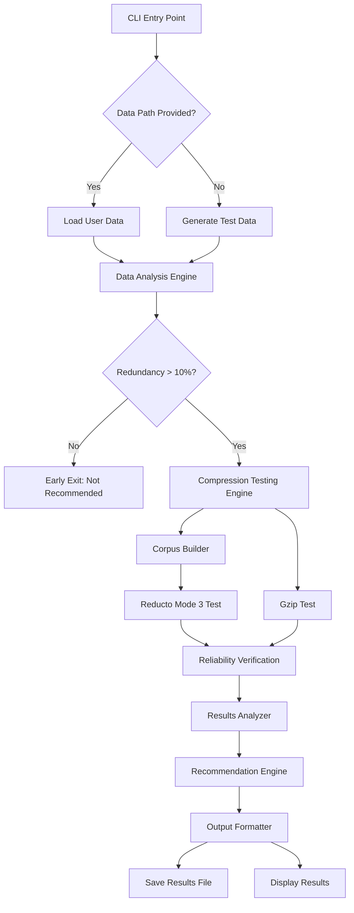
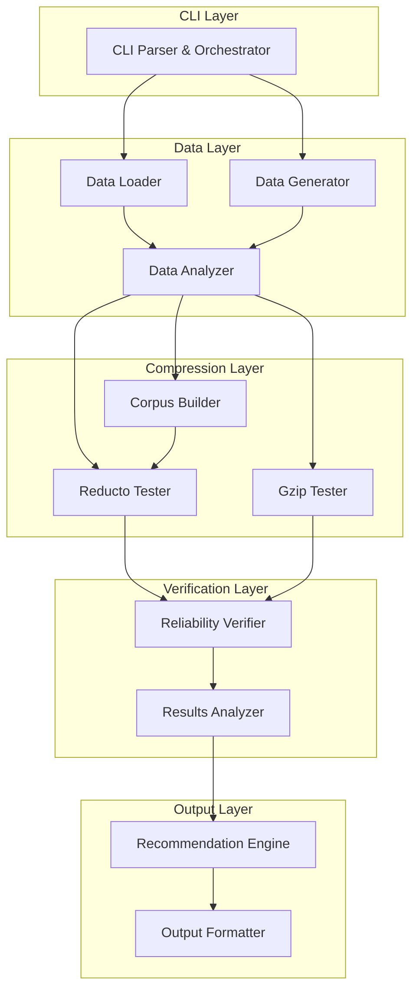

# Design Document

## Overview

The Compression Benchmark Suite is a command-line tool that provides developers with a definitive answer to: **"Will Reducto Mode 3 save me storage/bandwidth costs on MY data?"**

The system follows a simple pipeline: **Data Analysis → Compression Testing → Reliability Verification → Clear Recommendation**, all completed within 60 seconds.

**Key Design Principles:**
- **Simplicity over complexity**: Only test what matters (Reducto vs gzip)
- **Speed over perfection**: 60-second time limit drives all architectural decisions
- **Conservative bias**: Default to "NOT RECOMMENDED" when results are ambiguous
- **Real-world focus**: Test actual user data, not synthetic benchmarks

## Architecture

### High-Level Flow



### Component Architecture

The system is organized into distinct components with clear responsibilities:



## Components and Interfaces

### 1. CLI Parser & Orchestrator

**Responsibility**: Entry point, argument parsing, and workflow coordination

```rust
pub struct BenchmarkCli {
    data_path: Option<PathBuf>,
    time_limit: Duration,
    output_file: PathBuf,
}

impl BenchmarkCli {
    pub async fn run(&self) -> Result<BenchmarkResult, BenchmarkError>;
}
```

**Key Design Decisions:**
- Single binary entry point for simplicity
- Built-in 60-second timeout with graceful degradation
- Automatic fallback to smaller data samples when time-constrained

### 2. Data Management Components

#### Data Loader
```rust
pub struct DataLoader {
    max_total_size: usize, // 100MB limit
}

impl DataLoader {
    pub fn load_directory(&self, path: &Path) -> Result<DataSet, LoadError>;
    pub fn estimate_redundancy(&self, data: &DataSet) -> f64;
}
```

#### Data Generator
```rust
pub struct DataGenerator;

impl DataGenerator {
    pub fn generate_realistic_data(&self, size: usize) -> DataSet;
    // Generates: source code, JSON logs, documentation
}
```

#### Data Analyzer
```rust
pub struct DataAnalyzer;

impl DataAnalyzer {
    pub fn analyze_redundancy(&self, data: &DataSet) -> RedundancyAnalysis;
    pub fn predict_differential_effectiveness(&self, analysis: &RedundancyAnalysis) -> bool;
}

pub struct RedundancyAnalysis {
    pub redundancy_percentage: f64,
    pub pattern_types: Vec<PatternType>,
    pub recommended_corpus_size: usize,
}
```

**Key Design Decisions:**
- Early exit when redundancy < 10% to save time
- Pattern analysis guides corpus building strategy
- Conservative redundancy detection to avoid false positives

### 3. Compression Testing Components

#### Corpus Builder
```rust
pub struct CorpusBuilder {
    target_percentage: f64, // 30% of data
    max_build_time: Duration, // 10 seconds
}

impl CorpusBuilder {
    pub fn build_optimal_corpus(&self, data: &DataSet, analysis: &RedundancyAnalysis) -> Result<Corpus, CorpusError>;
    pub fn validate_corpus_effectiveness(&self, corpus: &Corpus, data: &DataSet) -> f64;
}
```

#### Compression Testers
```rust
pub trait CompressionTester {
    fn name(&self) -> &'static str;
    fn compress(&self, data: &[u8], corpus: Option<&Corpus>) -> Result<CompressionResult, CompressionError>;
    fn decompress(&self, compressed: &[u8], corpus: Option<&Corpus>) -> Result<Vec<u8>, CompressionError>;
}

pub struct ReductoTester {
    corpus: Option<Corpus>,
}

pub struct GzipTester {
    level: u32, // Always 6 for production default
}

pub struct CompressionResult {
    pub compressed_size: usize,
    pub compression_time: Duration,
    pub compression_ratio: f64,
    pub compressed_data: Vec<u8>,
}
```

**Key Design Decisions:**
- Trait-based design allows easy addition of other compressors if needed
- Corpus building time is included in Reducto's total time
- Gzip level 6 chosen as production-realistic baseline

### 4. Reliability Verification

```rust
pub struct ReliabilityVerifier;

impl ReliabilityVerifier {
    pub fn verify_integrity(&self, original: &[u8], decompressed: &[u8]) -> bool;
    pub fn measure_decompression_speed(&self, tester: &dyn CompressionTester, compressed: &[u8]) -> Duration;
    pub fn check_speed_reasonableness(&self, reducto_time: Duration, gzip_time: Duration) -> bool;
}
```

**Key Design Decisions:**
- BLAKE3 hashing for fast, cryptographically secure integrity verification
- 5x speed limit for decompression (more lenient than compression's 10x limit)
- Immediate failure and exit on any data corruption

### 5. Analysis and Recommendation

```rust
pub struct ResultsAnalyzer;

impl ResultsAnalyzer {
    pub fn compare_results(&self, reducto: &CompressionResult, gzip: &CompressionResult) -> ComparisonResult;
    pub fn determine_winner(&self, comparison: &ComparisonResult) -> Winner;
}

pub struct RecommendationEngine;

impl RecommendationEngine {
    pub fn generate_recommendation(&self, winner: Winner, comparison: &ComparisonResult) -> Recommendation;
    pub fn calculate_cost_savings(&self, compression_improvement: f64) -> Option<String>;
}

pub enum Winner {
    Reducto { compression_improvement: f64, speed_ratio: f64 },
    Gzip { reason: String },
    Inconclusive { reason: String },
}

pub struct Recommendation {
    pub decision: Decision,
    pub rationale: String,
    pub next_steps: String,
    pub cost_savings: Option<String>,
}

pub enum Decision {
    Recommended,
    NotRecommended,
}
```

**Key Design Decisions:**
- Conservative bias: inconclusive results default to "NOT RECOMMENDED"
- Speed threshold: Reducto must not be >10x slower than gzip
- Cost savings calculation provides concrete business value

### 6. Output Formatting

```rust
pub struct OutputFormatter;

impl OutputFormatter {
    pub fn format_console_output(&self, recommendation: &Recommendation, results: &BenchmarkResults) -> String;
    pub fn format_file_output(&self, recommendation: &Recommendation, results: &BenchmarkResults) -> String;
    pub fn display_progress(&self, stage: BenchmarkStage);
}

pub struct BenchmarkResults {
    pub data_analysis: RedundancyAnalysis,
    pub compression_results: Vec<CompressionResult>,
    pub reliability_results: ReliabilityResults,
    pub total_time: Duration,
}
```

## Data Models

### Core Data Types

```rust
#[derive(Debug, Clone)]
pub struct DataSet {
    pub files: Vec<FileData>,
    pub total_size: usize,
    pub data_type: DataType,
}

#[derive(Debug, Clone)]
pub struct FileData {
    pub path: PathBuf,
    pub content: Vec<u8>,
    pub size: usize,
}

#[derive(Debug, Clone, PartialEq)]
pub enum DataType {
    SourceCode,
    JsonLogs,
    Documentation,
    Mixed,
    Unknown,
}

#[derive(Debug)]
pub struct Corpus {
    pub blocks: Vec<CorpusBlock>,
    pub total_size: usize,
    pub build_time: Duration,
    pub effectiveness_score: f64,
}

#[derive(Debug)]
pub struct CorpusBlock {
    pub data: Vec<u8>,
    pub hash: u64,
    pub frequency: usize,
}
```

### Performance Constraints

```rust
pub struct PerformanceConstraints {
    pub max_total_time: Duration,        // 60 seconds
    pub max_corpus_build_time: Duration, // 10 seconds
    pub max_data_size: usize,           // 100MB
    pub max_speed_ratio: f64,           // 10x slower than gzip
    pub max_decompression_ratio: f64,   // 5x slower than gzip
    pub min_redundancy_threshold: f64,  // 10%
}
```

## Error Handling

### Error Hierarchy

```rust
#[derive(Error, Debug)]
pub enum BenchmarkError {
    #[error("Data loading failed: {0}")]
    DataLoad(#[from] LoadError),
    
    #[error("Compression test failed: {0}")]
    Compression(#[from] CompressionError),
    
    #[error("Reliability verification failed: {0}")]
    Reliability(#[from] ReliabilityError),
    
    #[error("Timeout: benchmark exceeded {limit:?}")]
    Timeout { limit: Duration },
    
    #[error("Insufficient data: need at least {min} bytes, got {actual}")]
    InsufficientData { min: usize, actual: usize },
}

#[derive(Error, Debug)]
pub enum LoadError {
    #[error("Directory not found: {path}")]
    DirectoryNotFound { path: PathBuf },
    
    #[error("Permission denied: {path}")]
    PermissionDenied { path: PathBuf },
    
    #[error("Data size exceeds limit: {size} > {limit}")]
    SizeExceeded { size: usize, limit: usize },
}

#[derive(Error, Debug)]
pub enum CompressionError {
    #[error("Compression failed: {reason}")]
    CompressionFailed { reason: String },
    
    #[error("Decompression failed: {reason}")]
    DecompressionFailed { reason: String },
    
    #[error("Corpus build failed: {reason}")]
    CorpusBuildFailed { reason: String },
}

#[derive(Error, Debug)]
pub enum ReliabilityError {
    #[error("Data corruption detected: hash mismatch")]
    DataCorruption,
    
    #[error("Decompression too slow: {actual:?} > {limit:?}")]
    DecompressionTooSlow { actual: Duration, limit: Duration },
}
```

**Key Design Decisions:**
- Structured errors with context for debugging
- Early exit on any reliability failure
- Clear error messages guide user action

## Testing Strategy

### Unit Testing Approach

```rust
#[cfg(test)]
mod tests {
    use super::*;
    
    #[test]
    fn test_redundancy_analysis_accuracy() {
        // Test with known redundant data patterns
        let data = create_redundant_test_data(50); // 50% redundancy
        let analyzer = DataAnalyzer::new();
        let analysis = analyzer.analyze_redundancy(&data);
        
        assert!((analysis.redundancy_percentage - 50.0).abs() < 5.0);
    }
    
    #[test]
    fn test_corpus_build_time_limit() {
        let builder = CorpusBuilder::new();
        let large_data = create_large_test_data(50_000_000); // 50MB
        
        let start = Instant::now();
        let result = builder.build_optimal_corpus(&large_data, &analysis);
        let elapsed = start.elapsed();
        
        assert!(elapsed <= Duration::from_secs(10));
        assert!(result.is_ok());
    }
    
    #[tokio::test]
    async fn test_60_second_time_limit() {
        let cli = BenchmarkCli::new(None, Duration::from_secs(60));
        
        let start = Instant::now();
        let result = cli.run().await;
        let elapsed = start.elapsed();
        
        assert!(elapsed <= Duration::from_secs(60));
        assert!(result.is_ok());
    }
}
```

### Integration Testing

```rust
#[cfg(test)]
mod integration_tests {
    #[tokio::test]
    async fn test_end_to_end_with_real_data() {
        // Test with actual source code directory
        let test_data_dir = create_test_source_code_directory();
        let cli = BenchmarkCli::new(Some(test_data_dir), Duration::from_secs(60));
        
        let result = cli.run().await.unwrap();
        
        assert!(result.recommendation.decision == Decision::Recommended || 
                result.recommendation.decision == Decision::NotRecommended);
        assert!(result.total_time <= Duration::from_secs(60));
    }
    
    #[tokio::test]
    async fn test_reliability_verification_catches_corruption() {
        // Test with intentionally corrupted decompression
        let mut mock_tester = MockCompressionTester::new();
        mock_tester.set_corruption_mode(true);
        
        let verifier = ReliabilityVerifier::new();
        let result = verifier.verify_integrity(&original_data, &corrupted_data);
        
        assert!(!result);
    }
}
```

### Property-Based Testing

```rust
use proptest::prelude::*;

proptest! {
    #[test]
    fn compression_ratio_is_consistent(
        data in prop::collection::vec(any::<u8>(), 1000..10000)
    ) {
        let tester = GzipTester::new(6);
        let result1 = tester.compress(&data, None).unwrap();
        let result2 = tester.compress(&data, None).unwrap();
        
        // Compression should be deterministic
        prop_assert_eq!(result1.compressed_size, result2.compressed_size);
        prop_assert_eq!(result1.compression_ratio, result2.compression_ratio);
    }
    
    #[test]
    fn decompression_is_lossless(
        data in prop::collection::vec(any::<u8>(), 100..1000)
    ) {
        let tester = GzipTester::new(6);
        let compressed = tester.compress(&data, None).unwrap();
        let decompressed = tester.decompress(&compressed.compressed_data, None).unwrap();
        
        prop_assert_eq!(data, decompressed);
    }
}
```

## Performance Considerations

### Time Budget Allocation

The 60-second time limit is allocated as follows:

- **Data Loading/Generation**: 5 seconds (8%)
- **Data Analysis**: 10 seconds (17%)
- **Corpus Building**: 10 seconds (17%)
- **Compression Testing**: 25 seconds (42%)
- **Reliability Verification**: 8 seconds (13%)
- **Results Analysis & Output**: 2 seconds (3%)

### Memory Management

```rust
pub struct MemoryManager {
    max_memory_usage: usize, // 500MB limit
    current_usage: AtomicUsize,
}

impl MemoryManager {
    pub fn check_memory_limit(&self, additional: usize) -> Result<(), MemoryError>;
    pub fn track_allocation(&self, size: usize);
    pub fn track_deallocation(&self, size: usize);
}
```

**Key Optimizations:**
- Stream processing for large files to avoid loading everything into memory
- Aggressive cleanup of intermediate results
- Memory-mapped files for corpus access during compression
- Early exit strategies when time/memory limits are approached

### Scalability Constraints

- **Maximum data size**: 100MB (prevents excessive memory usage)
- **Maximum file count**: 10,000 files (prevents filesystem overhead)
- **Corpus size limit**: 30% of input data or 30MB, whichever is smaller
- **Compression block size**: 64KB (balances compression ratio vs speed)

## Security Considerations

### Input Validation

```rust
pub struct InputValidator;

impl InputValidator {
    pub fn validate_path(&self, path: &Path) -> Result<(), ValidationError>;
    pub fn validate_file_size(&self, size: usize) -> Result<(), ValidationError>;
    pub fn validate_file_type(&self, path: &Path) -> Result<(), ValidationError>;
}
```

**Security Measures:**
- Path traversal prevention (no `../` in paths)
- File size limits to prevent DoS attacks
- File type validation (only process safe file types)
- No execution of user-provided code or scripts
- Sandboxed temporary directory for intermediate files

### Resource Limits

- CPU time limits enforced via tokio timeouts
- Memory usage monitoring and limits
- Disk space limits for temporary files
- Network access completely disabled (no external dependencies)

## Deployment and Distribution

### Binary Distribution

```toml
# Cargo.toml
[package]
name = "compression-benchmark"
version = "0.1.0"
edition = "2021"

[[bin]]
name = "benchmark"
path = "src/bin/benchmark.rs"

[dependencies]
tokio = { version = "1.0", features = ["full"] }
clap = { version = "4.0", features = ["derive"] }
anyhow = "1.0"
thiserror = "1.0"
blake3 = "1.5"
flate2 = "1.0"  # For gzip
serde = { version = "1.0", features = ["derive"] }
serde_json = "1.0"
```

### Installation and Usage

```bash
# Installation
cargo install compression-benchmark

# Usage examples
benchmark                           # Use generated test data
benchmark /path/to/my/project      # Test specific directory
benchmark --help                   # Show all options
```

### Output Format

```
Compression Benchmark Results
============================

Data Analysis: 45% redundancy detected, proceeding with compression test
Corpus built: 1,247 blocks, 42% redundancy detected

Compression Results:
- Reducto Mode 3: 2.3:1 ratio, 1.2s compression time
- Gzip (level 6): 1.8:1 ratio, 0.3s compression time

Reliability: PASS - All data verified with BLAKE3

RECOMMENDED: Use Reducto Mode 3
- 28% smaller files than gzip
- 4x slower compression (acceptable for batch processing)
- Estimated savings: $45/month in storage costs

Next steps: Add Reducto to your project with: cargo add reducto

Results saved to: benchmark_results.txt
Total benchmark time: 47 seconds
```

This design provides a comprehensive foundation for implementing the compression benchmark suite while maintaining the simplicity and speed requirements outlined in the specifications.