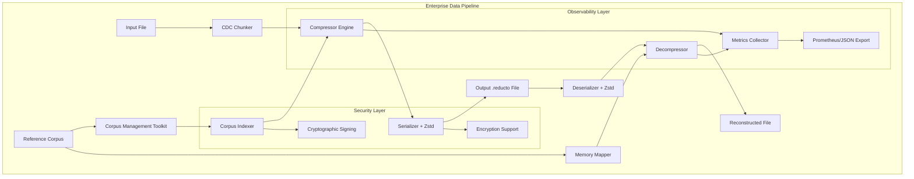

# Design Document - Reducto Mode 3 (Differential Synchronization)

## Overview

Reducto Mode 3 implements a high-performance **Content-Defined Chunking (CDC)** differential compression system that achieves extreme compression ratios by identifying variable-size data chunks in target files that already exist in a shared Reference Corpus (RC) and replacing them with efficient pointer references. The system uses FastCDC or Gear hashing algorithms to ensure robustness against the insertion problem, combined with a two-tier hashing approach for optimal performance.

### Core Innovation

**Design Decision**: Content-Defined Chunking over fixed-size blocks to handle data insertion/deletion scenarios robustly (Requirement 1.1, 1.2, 1.5).

The system employs a three-tier strategy:
- **Boundary Detection**: FastCDC or Gear hashing for content-defined chunk boundaries
- **Weak Hash**: Fast polynomial rolling hash (Rabin-Karp style) for initial candidate identification  
- **Strong Hash**: BLAKE3 cryptographic hash for verification and collision resolution

**Rationale**: CDC ensures that data insertions or deletions don't shift all subsequent chunk boundaries, maintaining high compression ratios even when file structure changes. This is critical for enterprise use cases like VM image updates where small changes shouldn't invalidate the entire compression strategy.

## Architecture

### High-Level System Components



### Layer Architecture

Following the L1→L2→L3 pattern:

- **L1 Core**: Block processing, rolling hash implementation, RAII resource management
- **L2 Standard**: Collections (HashMap), iterators, smart pointers (Arc), error handling
- **L3 External**: Serialization (bincode), compression (zstd), memory mapping (memmap2), cryptographic hashing (BLAKE3)

## Components and Interfaces

### 1. Core Data Structures

**Design Decision**: Variable-size chunks with configurable parameters to optimize for different data types (Requirement 1.3, 1.4).

```rust
// CDC Configuration - configurable chunk parameters
#[derive(Debug, Clone)]
pub struct ChunkConfig {
    pub target_size: usize,        // Target average chunk size (4KB-64KB)
    pub min_size: usize,           // Minimum chunk size (50% of target)
    pub max_size: usize,           // Maximum chunk size (200% of target)
    pub hash_mask: u64,            // Gear hash mask for boundary detection
    pub hash_base: u64,            // Prime base for rolling hash
}

impl Default for ChunkConfig {
    fn default() -> Self {
        Self {
            target_size: 8192,        // 8KB default
            min_size: 4096,           // 4KB minimum
            max_size: 16384,          // 16KB maximum
            hash_mask: 0x1FFF,        // 13-bit mask for ~8KB average
            hash_base: 67,            // Prime base
        }
    }
}

// Corpus chunk representation in the index (variable size)
#[derive(Debug, Clone)]
struct CorpusChunk {
    offset: u64,
    size: u32,                     // Chunk size (variable)
    strong_hash: Hash,             // BLAKE3 Hash for verification
}

// Enhanced corpus manifest with chunk size tracking
type CorpusManifest = HashMap<u64, Vec<CorpusChunk>>;

// Output instruction format with chunk sizes
#[derive(Serialize, Deserialize, Debug)]
pub enum ReductoInstruction {
    Reference { offset: u64, size: u32 },  // Reference with explicit size
    Residual(Vec<u8>),                     // Literal data not found in corpus
}

// Enhanced file format header with CDC parameters
#[derive(Serialize, Deserialize, Debug)]
pub struct ReductoHeader {
    magic: [u8; 8],                // b"R3_AB2025"
    version: u32,                  // Format version for evolution
    corpus_id: String,             // Immutable Version GUID (Requirement 2.2)
    corpus_signature: Vec<u8>,     // Cryptographic signature (Requirement 9.1)
    chunk_config: ChunkConfig,     // CDC parameters used (Requirement 1.3)
    integrity_hash: Hash,          // End-to-end verification (Requirement 4.4)
    compression_level: u8,         // Zstd level used (Requirement 5.4)
}
```

### 2. Content-Defined Chunking Engine

**Design Decision**: FastCDC/Gear hashing for boundary detection combined with polynomial rolling hash for performance (Requirements 1.1, 1.2, 3.1, 3.2).

```rust
pub struct CDCChunker {
    config: ChunkConfig,
    gear_hasher: GearHasher,       // For boundary detection
    rolling_hasher: RollingHasher, // For chunk content hashing
    current_chunk: Vec<u8>,
    position: usize,
}

impl CDCChunker {
    pub fn new(config: ChunkConfig) -> Self;
    
    // Process input data and yield variable-size chunks
    pub fn chunk_data(&mut self, data: &[u8]) -> Vec<DataChunk>;
    
    // Check if current position is a chunk boundary
    fn is_boundary(&self, hash: u64) -> bool {
        (hash & self.config.hash_mask) == 0
    }
    
    // Finalize any remaining data as the last chunk
    pub fn finalize(&mut self) -> Option<DataChunk>;
}

// Gear hash implementation for boundary detection
struct GearHasher {
    hash: u64,
    gear_table: [u64; 256], // Pre-computed gear values
}

impl GearHasher {
    fn new() -> Self;
    
    // Update hash with next byte (O(1) time)
    fn update(&mut self, byte: u8) -> u64 {
        self.hash = (self.hash << 1) + self.gear_table[byte as usize];
        self.hash
    }
}

// Rolling hash for chunk content identification
struct RollingHasher {
    hash: u64,
    base: u64,
    window: VecDeque<u8>,
    window_size: usize,
}

impl RollingHasher {
    fn new(base: u64, window_size: usize) -> Self;
    
    // Add byte to rolling window (O(1) time)
    fn update(&mut self, byte: u8) -> u64;
    
    fn current_hash(&self) -> u64;
}

// Represents a variable-size data chunk
#[derive(Debug, Clone)]
pub struct DataChunk {
    pub data: Vec<u8>,
    pub weak_hash: u64,      // Rolling hash of content
    pub strong_hash: Hash,   // BLAKE3 hash for verification
    pub offset: u64,         // Position in original data
}
```

**CDC Algorithm** (Requirements 1.1, 1.2, 1.4, 1.5):
1. Process input data byte by byte
2. Update Gear hash for boundary detection
3. Check if current position matches boundary condition (hash & mask == 0)
4. Enforce minimum/maximum chunk size constraints (50%-200% of target)
5. When boundary found: finalize chunk, calculate hashes, start new chunk
6. Handle remaining data as final chunk

**Performance Contracts**:
- Boundary detection: O(1) time per byte (Requirement 3.2)
- Chunk size variance: 50%-200% of target size (Requirement 1.4)
- Uses FastCDC/Gear hashing for robustness (Requirement 1.2)

**Rationale**: CDC ensures that data insertions don't shift all subsequent boundaries, maintaining compression effectiveness even when file structure changes. This is essential for enterprise scenarios like VM image updates.

### 3. Corpus Management Toolkit (CMT)

**Design Decision**: Comprehensive corpus lifecycle management with persistent indexing for enterprise-scale datasets (Requirements 2.1, 2.2, 2.3, 2.4, 2.5).

```rust
pub struct CorpusManager {
    storage: Box<dyn PersistentStorage>,  // LSM trees, RocksDB for large datasets
    manifest: CorpusManifest,
    corpus_metadata: CorpusMetadata,
}

#[derive(Debug, Clone)]
pub struct CorpusMetadata {
    pub corpus_id: Uuid,              // Immutable Version GUID
    pub signature: Vec<u8>,           // Cryptographic signature
    pub created_at: DateTime<Utc>,
    pub chunk_count: u64,
    pub total_size: u64,
    pub chunk_config: ChunkConfig,
    pub optimization_stats: OptimizationStats,
}

impl CorpusManager {
    // Build corpus from input data with CDC chunking
    pub async fn build_corpus(
        &mut self, 
        input_paths: &[PathBuf],
        config: ChunkConfig
    ) -> Result<CorpusMetadata, CorpusError>;
    
    // Generate optimized "Golden Corpus" from dataset analysis
    pub async fn optimize_corpus(
        &mut self,
        analysis_data: &[PathBuf]
    ) -> Result<OptimizationRecommendations, CorpusError>;
    
    // Persistent indexing for datasets exceeding memory
    pub async fn build_persistent_index(
        &mut self,
        corpus_path: &Path
    ) -> Result<(), CorpusError>;
    
    // Lookup chunks with collision handling
    pub fn get_candidates(&self, weak_hash: u64) -> Option<&Vec<CorpusChunk>>;
    
    // Verify chunk match with constant-time comparison
    pub fn verify_match(&self, chunk: &[u8], candidate: &CorpusChunk) -> bool;
    
    // Corpus versioning and integrity verification
    pub fn validate_corpus_integrity(&self) -> Result<(), CorpusError>;
    
    // Prune stale blocks based on usage statistics
    pub async fn prune_corpus(&mut self, retention_policy: RetentionPolicy) -> Result<PruneStats, CorpusError>;
}

// Persistent storage abstraction for large datasets
pub trait PersistentStorage: Send + Sync {
    async fn store_chunk(&mut self, chunk: &CorpusChunk) -> Result<(), StorageError>;
    async fn retrieve_chunk(&self, weak_hash: u64) -> Result<Vec<CorpusChunk>, StorageError>;
    async fn iterate_chunks(&self) -> Result<Box<dyn Iterator<Item = CorpusChunk>>, StorageError>;
}

// RocksDB implementation for enterprise scale
pub struct RocksDBStorage {
    db: rocksdb::DB,
    chunk_cf: rocksdb::ColumnFamily,
    metadata_cf: rocksdb::ColumnFamily,
}

// Corpus optimization recommendations
#[derive(Debug)]
pub struct OptimizationRecommendations {
    pub recommended_chunk_size: usize,
    pub frequency_analysis: HashMap<u64, u32>,
    pub deduplication_potential: f64,
    pub suggested_pruning: Vec<u64>,
}
```

**Enhanced Indexing Algorithm** (Requirements 2.1, 2.2, 2.3, 2.4, 2.5):
1. Apply CDC chunking to corpus data with configurable parameters
2. Calculate weak hash (rolling) and strong hash (BLAKE3) for each chunk
3. Store in persistent index (RocksDB/LSM trees) for memory efficiency
4. Generate immutable corpus GUID and cryptographic signature
5. Build frequency analysis for optimization recommendations
6. Support concurrent access with thread-safe operations

**Rationale**: Enterprise datasets often exceed available memory, requiring persistent indexing. The CMT provides comprehensive lifecycle management including optimization, versioning, and pruning capabilities essential for production deployments.

### 4. Compression Engine

**Design Decision**: Use a sliding window approach with rolling hash to scan the input file, checking for matches at every byte position while maintaining optimal performance.

```rust
pub struct Compressor {
    hasher: RollingHasher,
    manifest: Arc<CorpusManifest>,
}

impl Compressor {
    pub fn compress(&mut self, input_data: &[u8]) -> Vec<ReductoInstruction>;
    
    // Core matching logic
    fn find_block_match(&self, window: &[u8], weak_hash: u64) -> Option<u64>;
    fn advance_window(&mut self, input: &[u8], cursor: &mut usize) -> bool;
}
```

**Algorithm Flow** (Requirements 1.1, 1.3, 1.4, 1.5):
1. Initialize rolling hash for first BLOCK_SIZE bytes (4KB blocks - Requirement 1.2)
2. For each position:
   - Check manifest for weak hash matches
   - Verify candidates with strong hash (BLAKE3) for collision resolution (Requirement 3.5)
   - If match found: emit Reference instruction, advance by BLOCK_SIZE (Requirement 1.3)
   - If no match: add byte to residual buffer, advance by 1 byte, roll hash (Requirement 1.4)
3. Flush remaining residual data
4. Serialize instructions using bincode (Requirement 5.1)
5. Apply Zstandard compression at level 19 (Requirement 5.2, 5.5)
6. Output .reducto format file (Requirement 1.5)

### 5. Decompression Engine

**Design Decision**: Use memory mapping for corpus access to handle large reference corpora efficiently without loading entirely into memory (Requirement 6.1, 6.2).

```rust
pub struct Decompressor {
    corpus_mmap: Mmap,
    corpus_id: String,
}

impl Decompressor {
    pub fn new(corpus_path: &Path, expected_corpus_id: &str) -> Result<Self, DecompressionError>;
    pub fn decompress(&self, compressed_file: &Path) -> Result<Vec<u8>, DecompressionError>;
    
    // Core reconstruction logic
    fn process_instruction(&self, instruction: &ReductoInstruction, output: &mut Vec<u8>) -> Result<(), DecompressionError>;
    fn validate_file_format(&self, header: &ReductoHeader) -> Result<(), DecompressionError>;
    fn validate_reference_bounds(&self, offset: u64) -> Result<(), DecompressionError>;
}
```

**Rationale**: Memory mapping allows the OS to manage corpus data efficiently, providing fast random access while supporting corpora larger than available RAM. The design includes explicit validation methods to ensure bounds checking (Requirement 6.3) and format validation (Requirement 4.1).

### 6. Ecosystem-Aware Decompression with Cold Start Resolution

**Design Decision**: Automatic corpus discovery and graceful degradation for enterprise deployment scenarios (Requirements 4.1, 4.2, 4.3, 4.4, 4.5).

```rust
pub struct EcosystemDecompressor {
    corpus_repositories: Vec<CorpusRepository>,
    local_cache: CorpusCache,
    fallback_compressor: Option<Box<dyn StandardCompressor>>,
}

#[derive(Debug, Clone)]
pub struct CorpusRepository {
    pub url: String,
    pub auth_token: Option<String>,
    pub priority: u8,
    pub timeout: Duration,
}

impl EcosystemDecompressor {
    // Attempt decompression with automatic corpus resolution
    pub async fn decompress_with_resolution(
        &mut self,
        compressed_file: &Path,
        output_path: &Path
    ) -> Result<DecompressionResult, DecompressionError>;
    
    // Fetch corpus from configured repositories
    async fn fetch_corpus(&mut self, corpus_id: &str) -> Result<PathBuf, CorpusError>;
    
    // Graceful degradation to standard compression
    async fn fallback_decompress(&self, data: &[u8]) -> Result<Vec<u8>, DecompressionError>;
    
    // Validate end-to-end integrity
    fn verify_output_integrity(&self, data: &[u8], expected_hash: &Hash) -> bool;
}

#[derive(Debug)]
pub struct DecompressionResult {
    pub success: bool,
    pub corpus_source: CorpusSource,
    pub fallback_used: bool,
    pub metrics: DecompressionMetrics,
}

#[derive(Debug)]
pub enum CorpusSource {
    LocalCache,
    Repository(String),
    NotFound,
}
```

### 7. Observability and Economic Reporting

**Design Decision**: Comprehensive metrics collection for ROI validation and performance monitoring (Requirements 7.1, 7.2, 7.3, 7.4, 7.5).

```rust
pub struct MetricsCollector {
    compression_metrics: CompressionMetrics,
    performance_metrics: PerformanceMetrics,
    economic_metrics: EconomicMetrics,
    exporters: Vec<Box<dyn MetricsExporter>>,
}

#[derive(Debug, Clone)]
pub struct CompressionMetrics {
    pub input_size: u64,
    pub output_size: u64,
    pub compression_ratio: f64,
    pub corpus_hit_rate: f64,
    pub residual_size: u64,
    pub chunk_count: u32,
    pub processing_time: Duration,
}

#[derive(Debug, Clone)]
pub struct PerformanceMetrics {
    pub throughput_mbps: f64,
    pub cpu_utilization: f64,
    pub memory_usage: u64,
    pub io_wait_time: Duration,
    pub bottleneck_type: BottleneckType,
}

#[derive(Debug, Clone)]
pub struct EconomicMetrics {
    pub bandwidth_saved: u64,
    pub storage_saved: u64,
    pub cost_savings_usd: f64,
    pub transfer_time_reduction: Duration,
}

#[derive(Debug)]
pub enum BottleneckType {
    CpuBound,
    IoBound,
    MemoryBound,
    NetworkBound,
}

impl MetricsCollector {
    // Dry run analysis for compression prediction
    pub async fn analyze_compression_potential(
        &self,
        input_path: &Path,
        corpus_path: &Path
    ) -> Result<CompressionAnalysis, AnalysisError>;
    
    // Export metrics in standard formats
    pub async fn export_metrics(&self, format: MetricsFormat) -> Result<String, ExportError>;
    
    // Calculate ROI based on usage patterns
    pub fn calculate_roi(&self, usage_stats: &UsageStats) -> EconomicReport;
}

// Metrics export formats
pub trait MetricsExporter: Send + Sync {
    async fn export(&self, metrics: &AllMetrics) -> Result<(), ExportError>;
}

pub struct PrometheusExporter {
    endpoint: String,
    labels: HashMap<String, String>,
}

pub struct JsonExporter {
    output_path: PathBuf,
}
```

### 8. Enterprise Integration and API-First Design

**Design Decision**: SDK-first approach with multiple language bindings and seamless pipeline integration (Requirements 8.1, 8.2, 8.3, 8.4, 8.5).

```rust
// Core SDK interface
pub struct ReductoSDK {
    config: SDKConfig,
    compressor: Arc<Compressor>,
    decompressor: Arc<EcosystemDecompressor>,
    metrics: Arc<MetricsCollector>,
}

#[derive(Debug, Clone)]
pub struct SDKConfig {
    pub chunk_config: ChunkConfig,
    pub corpus_repositories: Vec<CorpusRepository>,
    pub compression_level: u8,
    pub enable_metrics: bool,
    pub api_version: String,
}

impl ReductoSDK {
    // Stream-based compression for stdin/stdout integration
    pub async fn compress_stream(
        &self,
        input: impl AsyncRead + Unpin,
        output: impl AsyncWrite + Unpin,
        corpus_path: &Path
    ) -> Result<CompressionResult, SDKError>;
    
    // Stream-based decompression
    pub async fn decompress_stream(
        &self,
        input: impl AsyncRead + Unpin,
        output: impl AsyncWrite + Unpin
    ) -> Result<DecompressionResult, SDKError>;
    
    // Pipeline integration helpers
    pub fn create_tar_filter(&self) -> TarFilter;
    pub fn create_ssh_wrapper(&self) -> SshWrapper;
    pub fn create_cloud_cli_plugin(&self) -> CloudCliPlugin;
}

// C FFI for multi-language support
#[no_mangle]
pub extern "C" fn reducto_compress(
    input_path: *const c_char,
    corpus_path: *const c_char,
    output_path: *const c_char,
    config: *const CSDKConfig
) -> CResult;

#[no_mangle]
pub extern "C" fn reducto_decompress(
    input_path: *const c_char,
    output_path: *const c_char,
    config: *const CSDKConfig
) -> CResult;

// Structured error responses with remediation
#[derive(Error, Debug)]
pub enum SDKError {
    #[error("Configuration error: {message}\nRemediation: {remediation}")]
    Configuration { message: String, remediation: String },
    
    #[error("Corpus not found: {corpus_id}\nRemediation: Check corpus repositories or run 'reducto corpus fetch {corpus_id}'")]
    CorpusNotFound { corpus_id: String },
    
    #[error("API version mismatch: client={client_version}, server={server_version}\nRemediation: Update SDK to version {required_version}")]
    VersionMismatch { client_version: String, server_version: String, required_version: String },
}
```

### 9. Security and Compliance Framework

**Design Decision**: Cryptographic integrity and enterprise security requirements (Requirements 9.1, 9.2, 9.3, 9.4, 9.5).

```rust
pub struct SecurityManager {
    signing_key: SigningKey,
    encryption_key: Option<EncryptionKey>,
    audit_logger: AuditLogger,
    retention_policy: RetentionPolicy,
}

impl SecurityManager {
    // Cryptographically sign corpus files and indexes
    pub fn sign_corpus(&self, corpus_data: &[u8]) -> Result<Signature, SecurityError>;
    
    // Validate signatures before using corpus data
    pub fn verify_corpus_signature(&self, corpus_data: &[u8], signature: &Signature) -> Result<bool, SecurityError>;
    
    // Encrypt compressed outputs for sensitive data
    pub fn encrypt_output(&self, data: &[u8]) -> Result<Vec<u8>, SecurityError>;
    
    // Decrypt compressed data
    pub fn decrypt_input(&self, encrypted_data: &[u8]) -> Result<Vec<u8>, SecurityError>;
    
    // Audit logging for compliance
    pub fn log_corpus_access(&self, corpus_id: &str, operation: AccessOperation, user: &str);
    
    // Secure deletion with configurable retention
    pub async fn secure_delete(&self, file_path: &Path) -> Result<(), SecurityError>;
}

#[derive(Debug)]
pub enum AccessOperation {
    Read,
    Write,
    Delete,
    Modify,
}

#[derive(Debug, Clone)]
pub struct RetentionPolicy {
    pub retention_days: u32,
    pub secure_deletion: bool,
    pub audit_retention_days: u32,
}

// Audit logging for compliance requirements
pub struct AuditLogger {
    log_path: PathBuf,
    encryption_enabled: bool,
}

impl AuditLogger {
    pub fn log_event(&self, event: AuditEvent) -> Result<(), AuditError>;
    
    pub async fn export_audit_log(
        &self,
        start_date: DateTime<Utc>,
        end_date: DateTime<Utc>
    ) -> Result<Vec<AuditEvent>, AuditError>;
}

#[derive(Debug, Serialize)]
pub struct AuditEvent {
    pub timestamp: DateTime<Utc>,
    pub user_id: String,
    pub operation: AccessOperation,
    pub resource: String,
    pub result: OperationResult,
    pub metadata: HashMap<String, String>,
}
```

## Data Models

### File Format Specification (.reducto)

**Design Decision**: Use a structured binary format with header validation and secondary compression (Requirements 5.3, 5.4, 5.5).

```
┌─────────────────┐
│ Header Length   │ 4 bytes (u32, little-endian)
├─────────────────┤
│ Header Data     │ Variable length (bincode serialized)
├─────────────────┤
│ Compressed      │ Variable length (zstd level 19 compressed
│ Instructions    │ bincode serialized instructions)
└─────────────────┘
```

**Format Requirements**:
- Header must contain magic bytes b"R3_AB2025" for format validation (Requirement 5.3)
- Corpus ID must match for decompression to proceed (Requirement 4.4)
- Block size must be validated against expected 4KB size (Requirement 1.2)
- Zstandard compression level 19 for maximum compression ratio (Requirement 5.5)

### Instruction Stream Format

The instruction stream consists of a sequence of `ReductoInstruction` enums:
- **Reference(offset)**: Copy BLOCK_SIZE bytes from corpus at given offset
- **Residual(data)**: Copy literal data directly to output

### Corpus Manifest Structure

```rust
// Key: Weak hash (u64)
// Value: Vector of blocks with matching weak hash
HashMap<u64, Vec<CorpusBlock>>

// Handles weak hash collisions by storing multiple candidates
// Strong hash verification resolves actual matches
```

## Error Handling

### Structured Error Hierarchy

Following the thiserror pattern for library-style structured errors with enterprise-grade error handling:

```rust
#[derive(Error, Debug)]
pub enum ReductoError {
    #[error("IO error: {0}")]
    Io(#[from] std::io::Error),
    
    #[error("Serialization error: {0}")]
    Serialization(#[from] bincode::Error),
    
    #[error("Compression error: {0}")]
    Compression(#[from] zstd::Error),
    
    #[error("Invalid file format: {reason}")]
    InvalidFormat { reason: String },
    
    #[error("Corpus ID mismatch: expected {expected}, found {found}")]
    CorpusIdMismatch { expected: String, found: String },
    
    #[error("Chunk configuration mismatch: expected {expected:?}, found {found:?}")]
    ChunkConfigMismatch { expected: ChunkConfig, found: ChunkConfig },
    
    #[error("Invalid reference: offset {offset}, size {size} exceeds corpus bounds {max}")]
    InvalidReference { offset: u64, size: u32, max: u64 },
    
    #[error("Memory mapping failed: {0}")]
    MemoryMapping(String),
    
    #[error("Corpus management error: {0}")]
    Corpus(#[from] CorpusError),
    
    #[error("Security error: {0}")]
    Security(#[from] SecurityError),
    
    #[error("SDK error: {0}")]
    SDK(#[from] SDKError),
    
    #[error("Metrics error: {0}")]
    Metrics(#[from] MetricsError),
}

// Corpus management errors
#[derive(Error, Debug)]
pub enum CorpusError {
    #[error("Corpus not found: {corpus_id}")]
    NotFound { corpus_id: String },
    
    #[error("Corpus signature verification failed")]
    SignatureVerificationFailed,
    
    #[error("Corpus repository unreachable: {url} - {cause}")]
    RepositoryUnreachable { url: String, cause: String },
    
    #[error("Persistent storage error: {0}")]
    Storage(#[from] StorageError),
    
    #[error("Optimization failed: {reason}")]
    OptimizationFailed { reason: String },
    
    #[error("Corpus version incompatible: {version}")]
    IncompatibleVersion { version: String },
}

// Security framework errors
#[derive(Error, Debug)]
pub enum SecurityError {
    #[error("Cryptographic signing failed: {0}")]
    SigningFailed(String),
    
    #[error("Signature verification failed")]
    VerificationFailed,
    
    #[error("Encryption failed: {0}")]
    EncryptionFailed(String),
    
    #[error("Decryption failed: {0}")]
    DecryptionFailed(String),
    
    #[error("Key management error: {0}")]
    KeyManagement(String),
    
    #[error("Audit logging failed: {0}")]
    AuditFailed(String),
    
    #[error("Retention policy violation: {policy}")]
    RetentionViolation { policy: String },
}

// Metrics and observability errors
#[derive(Error, Debug)]
pub enum MetricsError {
    #[error("Metrics collection failed: {component}")]
    CollectionFailed { component: String },
    
    #[error("Metrics export failed: {format} - {cause}")]
    ExportFailed { format: String, cause: String },
    
    #[error("Analysis error: {0}")]
    AnalysisFailed(String),
    
    #[error("ROI calculation error: insufficient data")]
    InsufficientData,
}

// Storage abstraction errors
#[derive(Error, Debug)]
pub enum StorageError {
    #[error("Database error: {0}")]
    Database(String),
    
    #[error("Index corruption detected")]
    IndexCorruption,
    
    #[error("Storage capacity exceeded: {used}/{limit} bytes")]
    CapacityExceeded { used: u64, limit: u64 },
    
    #[error("Concurrent access conflict")]
    ConcurrencyConflict,
}
```

### Error Recovery Strategies

- **Validation Errors**: Fail fast with descriptive messages (Requirement 7.1)
- **IO Errors**: Propagate with context about the operation being performed (Requirement 7.4)
- **Format Errors**: Provide specific details about what was expected vs. found (Requirement 7.1)
- **Corpus ID Mismatches**: Prevent decompression and explain the issue clearly (Requirement 7.2)
- **Block Size Mismatches**: Reject operations with clear feedback (Requirement 7.3)
- **Memory Errors**: Handle gracefully without crashing (Requirement 7.5)
- **Memory Mapping Failures**: Provide clear error messages for debugging (Requirement 6.5)

## Testing Strategy

### Unit Testing Approach

Following TDD principles with comprehensive test coverage:

```rust
#[cfg(test)]
mod tests {
    use super::*;
    
    mod rolling_hash_tests {
        #[test]
        fn test_hash_initialization() { /* ... */ }
        
        #[test]
        fn test_hash_rolling() { /* ... */ }
        
        #[test]
        fn test_hash_consistency() { /* ... */ }
    }
    
    mod compression_tests {
        #[test]
        fn test_exact_block_matches() { /* ... */ }
        
        #[test]
        fn test_partial_matches() { /* ... */ }
        
        #[test]
        fn test_no_matches() { /* ... */ }
        
        #[test]
        fn test_hash_collisions() { /* ... */ }
    }
    
    mod decompression_tests {
        #[test]
        fn test_roundtrip_compression() { /* ... */ }
        
        #[test]
        fn test_corpus_id_validation() { /* ... */ }
        
        #[test]
        fn test_invalid_references() { /* ... */ }
    }
}
```

### Property-Based Testing

Using proptest for invariant validation:

```rust
proptest! {
    #[test]
    fn compression_roundtrip_property(
        input_data in prop::collection::vec(any::<u8>(), 0..10000)
    ) {
        // Property: compress(data) -> decompress -> original data
        let compressed = compress(&input_data, &test_corpus);
        let decompressed = decompress(&compressed, &test_corpus);
        prop_assert_eq!(input_data, decompressed);
    }
    
    #[test]
    fn rolling_hash_equivalence(
        data in prop::collection::vec(any::<u8>(), BLOCK_SIZE..BLOCK_SIZE*2)
    ) {
        // Property: Rolling hash equals direct hash calculation
        let direct_hash = calculate_direct_hash(&data[0..BLOCK_SIZE]);
        let mut roller = RollingHasher::new(HASH_BASE);
        roller.init(&data[0..BLOCK_SIZE]);
        prop_assert_eq!(direct_hash, roller.current_hash());
    }
}
```

### Integration Testing

End-to-end testing with real file scenarios:

```rust
#[test]
fn test_large_file_compression() {
    // Test with files larger than available memory
    let large_file = create_test_file(100 * 1024 * 1024); // 100MB
    let corpus = create_test_corpus(50 * 1024 * 1024);    // 50MB
    
    let compressed = compress_file(&large_file, &corpus).unwrap();
    let decompressed = decompress_file(&compressed, &corpus).unwrap();
    
    assert_files_equal(&large_file, &decompressed);
}

#[test]
fn test_performance_contracts() {
    let input_size = 2_100_000; // 2.1MB as specified in requirements
    let test_data = create_test_data(input_size);
    
    let start = Instant::now();
    let _compressed = compress(&test_data, &test_corpus);
    let elapsed = start.elapsed();
    
    assert!(elapsed < Duration::from_secs(5), 
            "Compression took {:?}, expected <5s", elapsed);
}
```

### Performance Testing

Benchmark critical paths to validate performance claims:

```rust
#[bench]
fn bench_rolling_hash_performance(b: &mut Bencher) {
    let data = vec![0u8; BLOCK_SIZE * 1000];
    let mut hasher = RollingHasher::new(HASH_BASE);
    
    b.iter(|| {
        hasher.init(&data[0..BLOCK_SIZE]);
        for i in BLOCK_SIZE..data.len() {
            hasher.roll(data[i - BLOCK_SIZE], data[i]);
        }
    });
}

#[bench]
fn bench_block_matching(b: &mut Bencher) {
    let manifest = create_test_manifest(10000); // 10k blocks
    let test_blocks = create_test_blocks(1000);
    
    b.iter(|| {
        for block in &test_blocks {
            black_box(find_block_match(&manifest, block));
        }
    });
}
```

## Performance Considerations

### Memory Efficiency

- **Corpus Manifest**: Uses HashMap for O(1) average lookup time
- **Memory Mapping**: Enables handling of large corpora without full memory load
- **Streaming Processing**: Processes input files without loading entirely into memory
- **RAII Resource Management**: Automatic cleanup of file handles and memory maps

### CPU Optimization

- **Rolling Hash**: O(1) hash updates vs O(K) recalculation
- **Block-Aligned Processing**: 4KB blocks optimize for CPU cache lines
- **Minimal Allocations**: Reuse buffers where possible
- **SIMD-Friendly Operations**: Hash calculations can leverage vectorization

### I/O Optimization

- **Sequential Corpus Reading**: Build manifest with single sequential pass
- **Buffered Output**: Batch instruction writes for better I/O performance
- **Memory Mapping**: Leverage OS page cache for corpus access
- **Compression Pipeline**: Overlap compression with I/O operations

## Security Considerations

### Hash Collision Resistance

- **Two-Tier Hashing**: Weak hash for speed, strong hash (BLAKE3) for security
- **Collision Handling**: Multiple candidates per weak hash prevent false matches
- **Cryptographic Strength**: BLAKE3 provides strong collision resistance

### Input Validation

- **File Format Validation**: Strict header and magic number checking
- **Bounds Checking**: Validate all offsets against corpus size
- **Corpus ID Verification**: Prevent decompression with wrong corpus
- **Size Limits**: Prevent memory exhaustion attacks

### Resource Protection

- **Memory Limits**: Bounded allocations prevent DoS attacks
- **Timeout Handling**: Prevent infinite processing loops
- **Error Boundaries**: Fail safely without exposing internal state

## Deployment and Operations

### Build Configuration

```toml
[dependencies]
# Core compression and hashing
blake3 = "1.5"        # Strong cryptographic hashing
bincode = "1.3"       # Efficient binary serialization
serde = { version = "1.0", features = ["derive"] }
zstd = "0.13"         # High-performance compression (configurable levels 1-22)
memmap2 = "0.9"       # Memory-mapped file access
hashbrown = "0.14"    # High-performance HashMap

# Enterprise features
rocksdb = "0.21"      # Persistent storage for large corpora (LSM trees)
uuid = { version = "1.0", features = ["v4", "serde"] }  # Immutable corpus GUIDs
chrono = { version = "0.4", features = ["serde"] }      # Timestamp handling
tokio = { version = "1.0", features = ["full"] }        # Async runtime for enterprise features

# Security and compliance
ring = "0.16"         # Cryptographic signing and encryption
ed25519-dalek = "1.0" # Digital signatures
aes-gcm = "0.10"      # Symmetric encryption for sensitive data

# Observability and metrics
prometheus = "0.13"   # Metrics export
serde_json = "1.0"    # JSON metrics export
tracing = "0.1"       # Structured logging
tracing-subscriber = "0.3"  # Log formatting

# SDK and API support
reqwest = { version = "0.11", features = ["json"] }  # HTTP client for corpus repositories
clap = { version = "4.0", features = ["derive"] }    # CLI interface
async-trait = "0.1"   # Async trait support

# Error handling
anyhow = "1.0"        # Application error handling
thiserror = "1.0"     # Library error definitions

[dev-dependencies]
proptest = "1.0"      # Property-based testing
criterion = "0.5"     # Benchmarking framework
tempfile = "3.0"      # Temporary files for testing
tokio-test = "0.4"    # Async testing utilities
wiremock = "0.5"      # HTTP mocking for corpus repository tests

[features]
default = ["enterprise"]
enterprise = ["rocksdb", "prometheus", "security"]
security = ["ring", "ed25519-dalek", "aes-gcm"]
metrics = ["prometheus", "serde_json"]
sdk = ["reqwest", "async-trait"]
```

### CLI Interface Design

```rust
// Enhanced command-line interface for enterprise features
#[derive(Parser)]
#[command(name = "reducto", version, about = "Enterprise differential compression")]
pub enum ReductoCommand {
    // Corpus management commands
    Corpus {
        #[command(subcommand)]
        action: CorpusAction,
    },
    
    // Compression with CDC
    Compress {
        #[arg(short, long)]
        input: PathBuf,
        #[arg(short, long)]
        corpus: PathBuf,
        #[arg(short, long)]
        output: PathBuf,
        #[arg(long, default_value = "8192")]
        target_chunk_size: usize,
        #[arg(long, default_value = "19")]
        compression_level: u8,
        #[arg(long)]
        encrypt: bool,
        #[arg(long)]
        dry_run: bool,
    },
    
    // Ecosystem-aware decompression
    Decompress {
        #[arg(short, long)]
        input: PathBuf,
        #[arg(short, long)]
        output: PathBuf,
        #[arg(long)]
        corpus_repos: Vec<String>,
        #[arg(long)]
        fallback: bool,
    },
    
    // Metrics and analysis
    Analyze {
        #[arg(short, long)]
        input: PathBuf,
        #[arg(short, long)]
        corpus: PathBuf,
        #[arg(long)]
        export_format: Option<String>,
        #[arg(long)]
        calculate_roi: bool,
    },
    
    // Stream processing for pipeline integration
    Stream {
        #[command(subcommand)]
        mode: StreamMode,
    },
}

#[derive(Subcommand)]
pub enum CorpusAction {
    // Build corpus with CDC
    Build {
        #[arg(short, long)]
        input_paths: Vec<PathBuf>,
        #[arg(short, long)]
        output: PathBuf,
        #[arg(long, default_value = "8192")]
        target_chunk_size: usize,
        #[arg(long)]
        sign: bool,
    },
    
    // Optimize corpus based on dataset analysis
    Optimize {
        #[arg(short, long)]
        corpus: PathBuf,
        #[arg(short, long)]
        analysis_data: Vec<PathBuf>,
        #[arg(short, long)]
        output: PathBuf,
    },
    
    // Fetch corpus from repository
    Fetch {
        #[arg(short, long)]
        corpus_id: String,
        #[arg(short, long)]
        repository: String,
        #[arg(short, long)]
        output: PathBuf,
    },
    
    // Verify corpus integrity
    Verify {
        #[arg(short, long)]
        corpus: PathBuf,
        #[arg(long)]
        check_signature: bool,
    },
    
    // Prune stale blocks
    Prune {
        #[arg(short, long)]
        corpus: PathBuf,
        #[arg(long, default_value = "30")]
        retention_days: u32,
    },
}

#[derive(Subcommand)]
pub enum StreamMode {
    Compress {
        #[arg(short, long)]
        corpus: PathBuf,
        #[arg(long, default_value = "8192")]
        target_chunk_size: usize,
    },
    Decompress {
        #[arg(long)]
        corpus_repos: Vec<String>,
    },
}
```

### Monitoring and Metrics

**Design Decision**: Comprehensive observability for enterprise operations and ROI validation (Requirements 7.1, 7.2, 7.3, 7.4, 7.5).

#### Core Metrics
- **End-to-End Transfer Time Reduction (E2ETTR)**: Primary success metric
- **Corpus Hit Rate (CHR)**: Diagnostic metric for corpus effectiveness  
- **Compression Ratios**: Track effectiveness across different file types and workloads
- **Processing Speed**: Monitor throughput (MB/s) with bottleneck identification
- **Memory Usage**: Track peak consumption and cache efficiency
- **Error Rates**: Monitor and alert on compression/decompression failures

#### Economic Reporting
- **Bandwidth Savings**: Quantified data transfer reduction in bytes and cost
- **Storage Savings**: Reduced storage requirements and associated costs
- **ROI Calculation**: Cost savings vs. implementation and operational costs
- **Transfer Time Reduction**: Actual time savings in enterprise workflows

#### Performance Monitoring
- **CPU vs. I/O Bound Detection**: Identify system bottlenecks automatically
- **Cache Hit Rates**: Memory mapping and corpus cache effectiveness
- **Concurrent Access Patterns**: Thread safety and scalability metrics
- **Degradation Detection**: Performance regression alerts and trending

#### Export Formats
- **Prometheus**: Native metrics export for enterprise monitoring stacks
- **JSON**: Structured data for custom dashboards and reporting
- **CSV**: Historical analysis and executive reporting
- **Real-time Streaming**: Live metrics for operational dashboards

This design provides a robust, high-performance implementation of differential synchronization that meets all specified requirements while maintaining excellent performance characteristics and operational reliability.