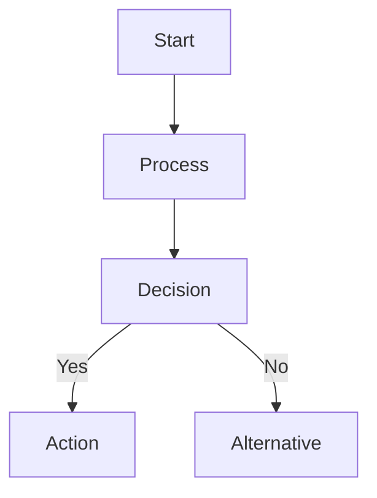
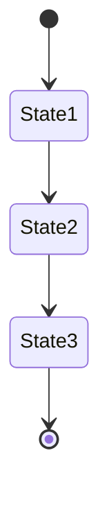
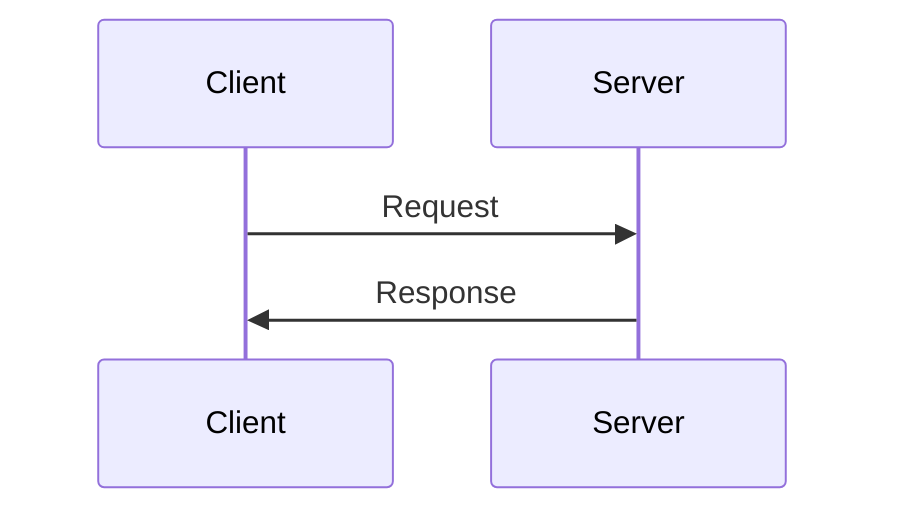
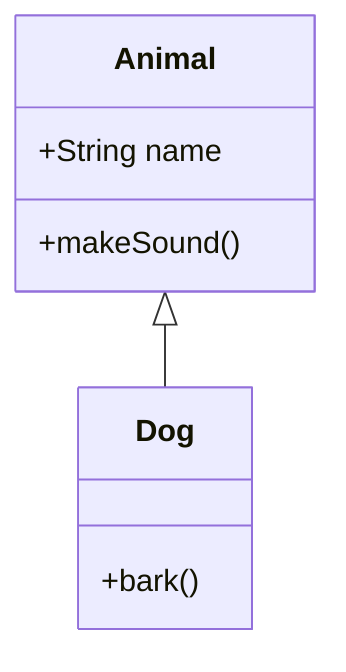
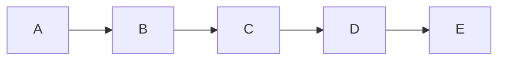
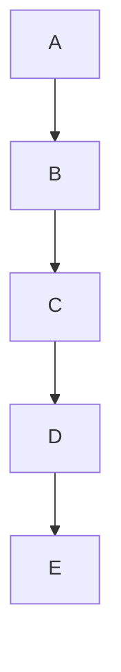
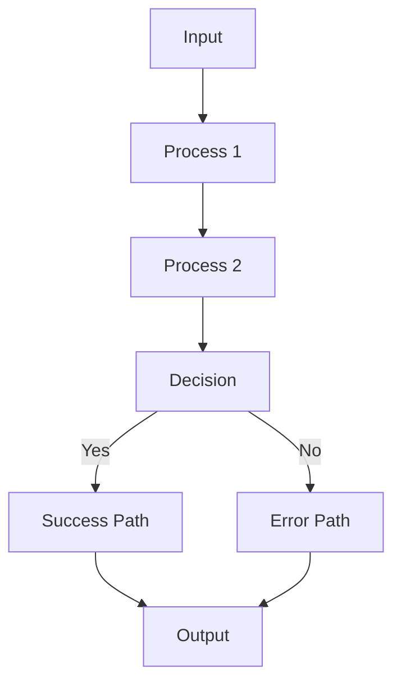

# Diagram Conventions and Standards

## Mermaid Diagram Orientation

**All Mermaid diagrams should preferably use vertical orientation (top-to-bottom) for consistency and readability.**

### Preferred Diagram Types and Orientations

#### Flowcharts

Use `TD` (Top Down) or `TB` (Top to Bottom) instead of `LR` (Left to Right).

#### State Diagrams

State diagrams naturally flow vertically and should maintain this orientation.

#### Sequence Diagrams

Sequence diagrams are inherently vertical and should remain so.

#### Class Diagrams

Class diagrams should use vertical inheritance relationships where possible.

### Rationale

1. **Consistency**: Vertical orientation provides a consistent reading pattern across all documentation
2. **Readability**: Top-to-bottom flow matches natural reading patterns
3. **Mobile-friendly**: Vertical diagrams work better on mobile devices and narrow screens
4. **Print-friendly**: Vertical orientation fits better on standard page formats
5. **GitHub compatibility**: Vertical diagrams render more consistently in GitHub's Markdown viewer

### Exceptions

Horizontal orientation may be used only when:
- The diagram becomes too tall and loses readability
- The logical flow is inherently horizontal (e.g., timeline diagrams)
- Space constraints require horizontal layout

In such cases, document the reason for the exception in a comment above the diagram.

### Implementation Guidelines

- Always start flowcharts with `flowchart TD` or `flowchart TB`
- Use vertical node arrangements in complex diagrams
- Group related elements vertically rather than horizontally
- Consider breaking large horizontal diagrams into multiple vertical sections
- Use subgraphs to maintain vertical organization in complex diagrams

### Example: Converting Horizontal to Vertical

❌ **Avoid (Horizontal)**:

✅ **Prefer (Vertical)**:

Or for complex flows:

This convention ensures all diagrams in the project maintain a consistent, readable, and professional appearance.