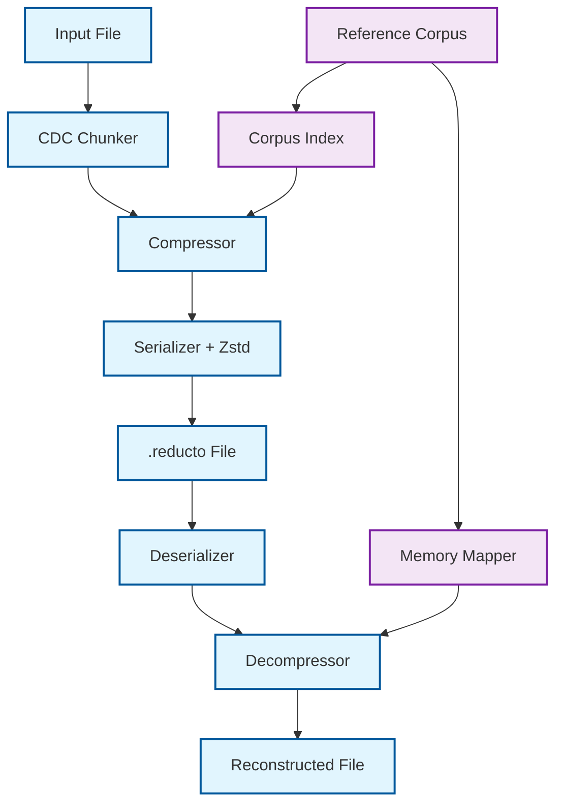
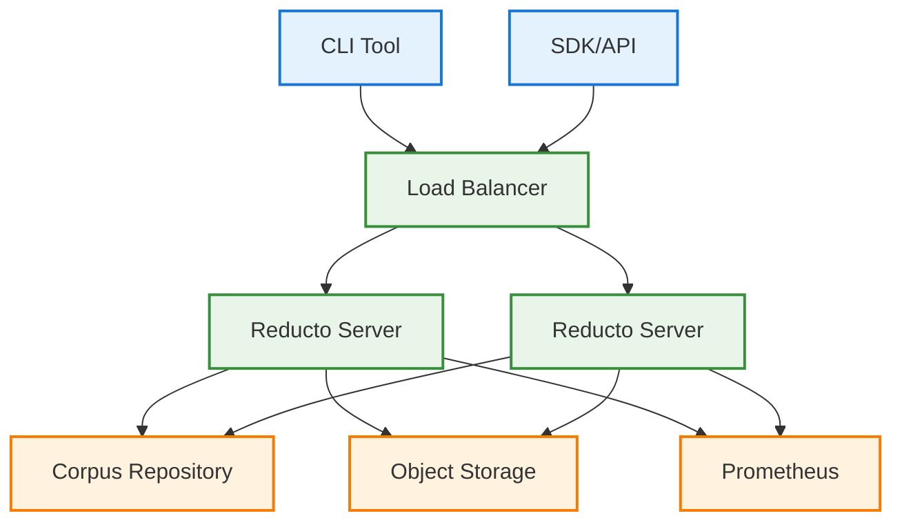

# Reducto Mode 3

[](https://github.com/your-org/reducto/actions)
[](https://github.com/your-org/reducto/actions)
[](https://github.com/your-org/reducto/actions)

Differential compression system using Content-Defined Chunking (CDC) and Reference Corpora. Achieves 10x-100x compression ratios for data with high redundancy patterns.

## Quick Start

```bash
# Install
cargo install reducto

# Build reference corpus
reducto corpus build --input /data/reference --output corpus.rc

# Compress file
reducto compress --input file.img --corpus corpus.rc --output file.reducto

# Decompress
reducto decompress --input file.reducto --output restored.img
```

## Use Cases

**VM Images**: 50:1 to 200:1 compression ratios (95-99.5% reduction)
**Container Images**: 20:1 to 100:1 ratios (95-99% reduction)  
**Database Backups**: 10:1 to 50:1 ratios (90-98% reduction)
**Text Files**: 5:1 to 20:1 ratios (80-95% reduction)

Text compression is supported and effective for source code, logs, and documentation with high redundancy patterns.

## Architecture



### Core Components

- **CDC Chunker**: FastCDC/Gear hashing for variable-size chunks
- **Dual-Hash System**: Rolling hash + BLAKE3 verification
- **Reference Corpus**: Immutable, cryptographically signed data store
- **Persistent Storage**: RocksDB for large-scale corpus management

## Performance

**Throughput**
- Compression: 500-800 MB/s
- Decompression: 1.2-2.0 GB/s  
- Corpus Lookup: <500μs per chunk
- Memory Usage: <2GB for 100GB corpus

**Deployment**



## Installation

```bash
# From source
cargo install reducto

# Pre-built binary
wget https://github.com/your-org/reducto/releases/latest/download/reducto-linux-x64.tar.gz
tar -xzf reducto-linux-x64.tar.gz && sudo mv reducto /usr/local/bin/

# Docker
docker pull reducto/enterprise:latest
```

**Requirements**: 4+ cores, 8GB RAM, 100GB storage

## Commands

**Corpus Management**
```bash
reducto corpus build --input /data --output corpus.rc
reducto corpus analyze --corpus corpus.rc --test-data /test
reducto corpus verify --corpus corpus.rc
```

**Compression/Decompression**
```bash
reducto compress --input file.img --corpus corpus.rc --output file.reducto
reducto decompress --input file.reducto --output restored.img
```

**Analysis**
```bash
reducto analyze --input file.img --corpus corpus.rc --report-format json
reducto benchmark --input /dataset --corpus corpus.rc
```

## Integration

**CI/CD Pipeline**
```yaml
- name: Compress artifacts
  run: reducto compress --input build/ --corpus ${{ secrets.CORPUS_URL }} --output artifacts.reducto
```

**Docker**
```dockerfile
RUN reducto compress --input /data --corpus /corpus.rc --output /compressed.reducto
```

**Backup Scripts**
```bash
reducto compress --input /data --corpus backup.rc --output backup.reducto
rsync backup.reducto backup-server:/backups/
```

## Monitoring

**Prometheus Metrics**
- `reducto_compression_ratio`
- `reducto_corpus_hit_rate` 
- `reducto_throughput_mbps`
- `reducto_bandwidth_saved_bytes_total`

**Grafana Dashboard**: Import `monitoring/grafana-dashboard.json`

## Security

- **Signing**: Ed25519 signatures for corpus integrity
- **Encryption**: AES-GCM for data protection  
- **Audit Logging**: Comprehensive access logging
- **Compliance**: SOC 2, GDPR, HIPAA support

## Configuration

```toml
[corpus]
repositories = ["https://corpus.company.com/api/v1"]
cache_dir = "/var/cache/reducto"
max_cache_size = "50GB"

[compression]
chunk_size = 8192
compression_level = 19

[security]
signing_key_path = "/etc/reducto/keys/signing.key"
encryption_enabled = true
```

## Troubleshooting

**Low compression ratios**: Rebuild corpus with target data
```bash
reducto corpus build --input target-dataset/ --optimize --output new-corpus.rc
```

**High memory usage**: Enable memory mapping
```bash
reducto config set corpus.memory_mapped true
```

**Slow decompression**: Pre-fetch corpus locally
```bash
reducto corpus fetch --corpus-id golden-v1 --local-cache
```

## API

**REST Endpoint**
```http
POST /api/v1/compress
{
  "file": <binary data>,
  "corpus_id": "golden-v1"
}
```

**Python SDK**
```python
import reducto
client = reducto.Client("https://reducto.company.com", "api-key")
result = client.compress(data, corpus_id="golden-v1")
```

## License

Apache 2.0 License for open source use. Enterprise license available with additional features and support.

## Contributing

See [CONTRIBUTING.md](CONTRIBUTING.md) for guidelines.