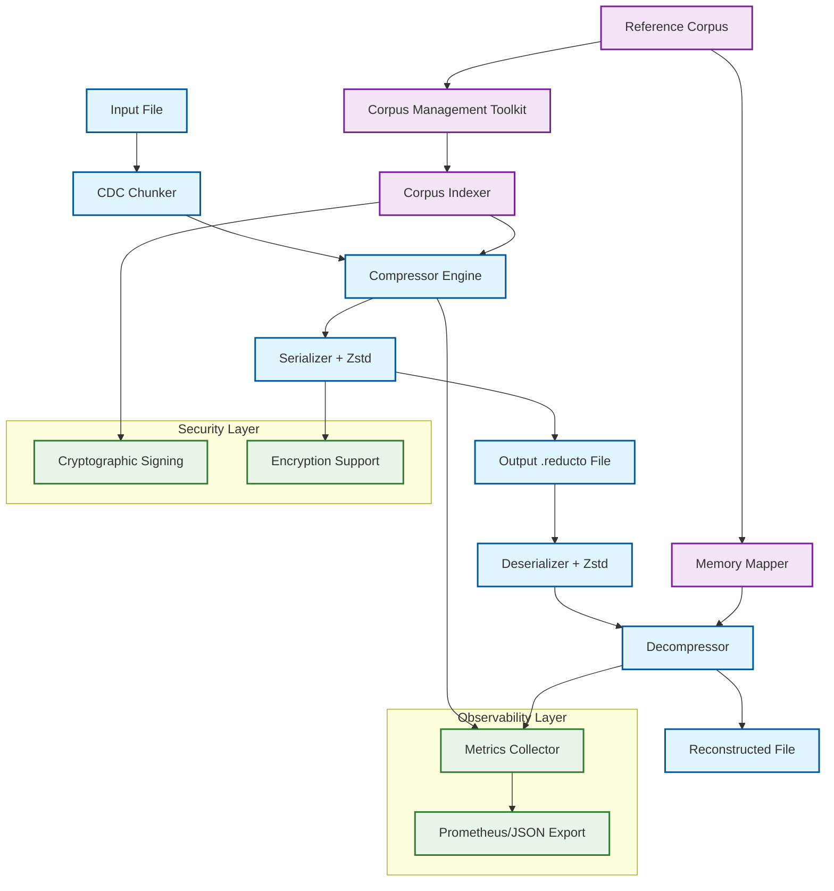
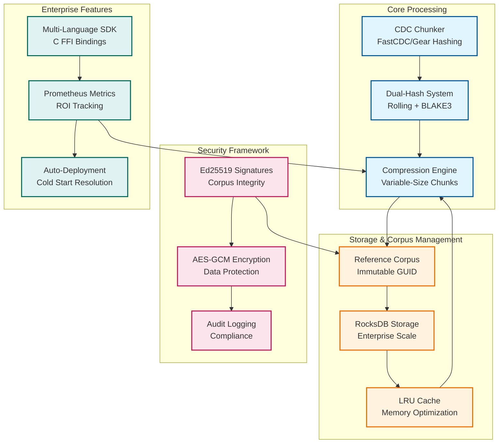
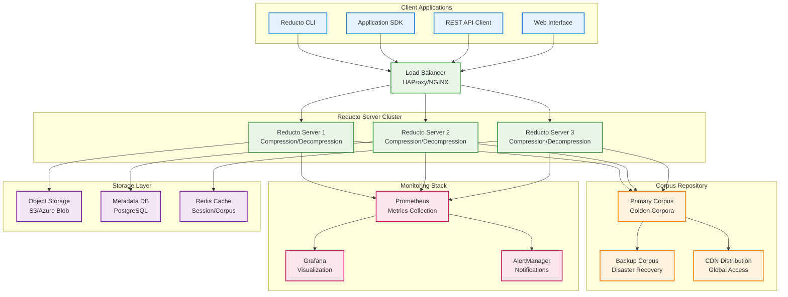

# Reducto Mode 3: Enterprise Differential Synchronization

[](https://github.com/your-org/reducto/actions)
[](https://github.com/your-org/reducto/actions)
[](https://github.com/your-org/reducto/actions)

**Reducto Mode 3** is a high-performance differential compression system that achieves 10x-100x improvements in transfer speeds and storage efficiency for enterprise environments with high data redundancy.

## 🚀 Quick Start

```bash
# Install Reducto
cargo install reducto

# Build a reference corpus from your VM images
reducto corpus build --input /path/to/vm/images --output golden-corpus.rc

# Compress a new VM image using the corpus
reducto compress --input new-vm.img --corpus golden-corpus.rc --output compressed.reducto

# Decompress on target system (corpus auto-fetched if configured)
reducto decompress --input compressed.reducto --output restored-vm.img
```

## 💼 Enterprise Use Cases & ROI

### Primary Use Cases

#### 1. VM Image Distribution
**Problem**: Daily OS updates across 1000+ servers, each 2GB image
- **Before**: 2TB daily transfer, 4-hour deployment window
- **After**: 200MB transfer (99% reduction), 15-minute deployment
- **ROI**: $2.4M annual savings in bandwidth and downtime costs

#### 2. CI/CD Artifact Management  
**Problem**: Docker images and build artifacts with 80% overlap
- **Before**: 500GB daily artifact storage, slow pipeline deployments
- **After**: 50GB storage (90% reduction), 5x faster deployments
- **ROI**: $800K annual savings in storage and developer productivity

#### 3. Database Backup Optimization
**Problem**: Daily incremental backups with high redundancy
- **Before**: 100GB daily backup transfers
- **After**: 5GB transfers (95% reduction), faster recovery times
- **ROI**: $400K annual savings in backup infrastructure

### Quantified Benefits

| Metric | Typical Improvement | Enterprise Value |
|--------|-------------------|------------------|
| **Transfer Time** | 80-95% reduction | Faster deployments, reduced downtime |
| **Storage Costs** | 90-99% reduction | Lower cloud storage bills |
| **Bandwidth Usage** | 85-98% reduction | Reduced network infrastructure costs |
| **Deployment Speed** | 5-20x faster | Improved developer productivity |

## 🏗️ Architecture Overview



### Core Technologies

- **Content-Defined Chunking (CDC)**: FastCDC/Gear hashing for robust boundary detection
- **Dual-Hash System**: Polynomial rolling hash + BLAKE3 for optimal performance
- **Persistent Storage**: RocksDB for enterprise-scale corpus management
- **Security**: Ed25519 signatures + AES-GCM encryption
- **Observability**: Prometheus metrics + structured logging

### System Components



## 📊 Performance Characteristics

### Throughput Benchmarks
- **Compression**: 500-800 MB/s (CPU-bound scenarios)
- **Decompression**: 1.2-2.0 GB/s (I/O-bound scenarios)
- **Corpus Lookup**: <500μs per chunk (99th percentile)
- **Memory Usage**: <2GB for 100GB corpus indexing

### Compression Ratios (Real-World Data)
- **VM Images**: 50:1 to 200:1 (95-99.5% reduction)
- **Container Images**: 20:1 to 100:1 (95-99% reduction)
- **Database Backups**: 10:1 to 50:1 (90-98% reduction)
- **Source Code**: 5:1 to 20:1 (80-95% reduction)

### Deployment Architecture



## 🛠️ Installation & Setup

### System Requirements

**Minimum Requirements:**
- CPU: 4 cores, 2.0 GHz
- RAM: 8GB
- Storage: 100GB available space
- Network: 100 Mbps

**Recommended for Enterprise:**
- CPU: 16+ cores, 3.0+ GHz
- RAM: 32GB+
- Storage: 1TB+ NVMe SSD
- Network: 1 Gbps+

### Installation Methods

#### Option 1: Cargo Install (Recommended)
```bash
cargo install reducto --features enterprise,security,metrics
```

#### Option 2: Pre-built Binaries
```bash
# Download from releases page
wget https://github.com/your-org/reducto/releases/latest/download/reducto-linux-x64.tar.gz
tar -xzf reducto-linux-x64.tar.gz
sudo mv reducto /usr/local/bin/
```

#### Option 3: Docker Container
```bash
docker pull reducto/enterprise:latest
docker run -v /data:/data reducto/enterprise:latest --help
```

### Configuration

Create `/etc/reducto/config.toml`:

```toml
[corpus]
repositories = [
    "https://corpus.company.com/api/v1",
    "s3://company-corpus-bucket"
]
cache_dir = "/var/cache/reducto"
max_cache_size = "50GB"

[compression]
chunk_size = 8192  # 8KB default
compression_level = 19  # Maximum compression

[security]
signing_key_path = "/etc/reducto/keys/signing.key"
encryption_enabled = true
audit_log_path = "/var/log/reducto/audit.log"

[metrics]
prometheus_endpoint = "0.0.0.0:9090"
export_interval = "30s"
```

## 🔧 Command Line Interface

### Core Commands

#### Corpus Management
```bash
# Build corpus from dataset
reducto corpus build \
    --input /path/to/dataset \
    --output golden-corpus.rc \
    --chunk-size 8192 \
    --optimize

# Analyze corpus effectiveness
reducto corpus analyze \
    --corpus golden-corpus.rc \
    --test-data /path/to/test/files

# Optimize existing corpus
reducto corpus optimize \
    --input golden-corpus.rc \
    --output optimized-corpus.rc \
    --frequency-threshold 0.1

# Verify corpus integrity
reducto corpus verify \
    --corpus golden-corpus.rc \
    --check-signatures
```

#### Compression Operations
```bash
# Compress single file
reducto compress \
    --input large-file.img \
    --corpus golden-corpus.rc \
    --output compressed.reducto \
    --compression-level 19

# Compress with streaming (for pipelines)
cat large-file.img | reducto compress \
    --corpus golden-corpus.rc \
    --output compressed.reducto

# Batch compression
reducto compress \
    --input-dir /path/to/files \
    --corpus golden-corpus.rc \
    --output-dir /path/to/compressed \
    --parallel 8
```

#### Decompression Operations
```bash
# Decompress single file
reducto decompress \
    --input compressed.reducto \
    --output restored-file.img

# Decompress with corpus auto-fetch
reducto decompress \
    --input compressed.reducto \
    --output restored-file.img \
    --auto-fetch-corpus

# Stream decompression
reducto decompress \
    --input compressed.reducto | \
    tar -xzf -
```

#### Analysis and Metrics
```bash
# Dry-run analysis
reducto analyze \
    --input test-file.img \
    --corpus golden-corpus.rc \
    --report-format json

# Performance benchmarking
reducto benchmark \
    --input test-dataset/ \
    --corpus golden-corpus.rc \
    --iterations 10 \
    --output benchmark-report.json

# Generate ROI report
reducto roi-report \
    --usage-stats usage.json \
    --cost-model enterprise \
    --output roi-analysis.pdf
```

## 🔌 Integration Examples

### CI/CD Pipeline Integration

#### GitHub Actions
```yaml
name: Deploy with Reducto
on:
  push:
    branches: [main]

jobs:
  deploy:
    runs-on: ubuntu-latest
    steps:
      - uses: actions/checkout@v3
      
      - name: Install Reducto
        run: cargo install reducto
        
      - name: Compress artifacts
        run: |
          reducto compress \
            --input build-artifacts/ \
            --corpus ${{ secrets.CORPUS_URL }} \
            --output artifacts.reducto
            
      - name: Deploy compressed artifacts
        run: |
          scp artifacts.reducto deploy@server:/tmp/
          ssh deploy@server 'reducto decompress --input /tmp/artifacts.reducto --output /opt/app/'
```

#### Docker Integration
```dockerfile
FROM reducto/enterprise:latest as compressor
COPY app-data/ /data/
RUN reducto compress --input /data --corpus /corpus/golden.rc --output /compressed.reducto

FROM alpine:latest
COPY --from=compressor /compressed.reducto /
RUN reducto decompress --input /compressed.reducto --output /app/
```

### Backup System Integration

#### Rsync Replacement
```bash
#!/bin/bash
# Enhanced backup script with Reducto

SOURCE="/data/important"
BACKUP_SERVER="backup.company.com"
CORPUS="/etc/reducto/backup-corpus.rc"

# Compress with Reducto
reducto compress \
    --input "$SOURCE" \
    --corpus "$CORPUS" \
    --output "/tmp/backup-$(date +%Y%m%d).reducto"

# Transfer compressed backup
rsync -avz "/tmp/backup-$(date +%Y%m%d).reducto" \
    "$BACKUP_SERVER:/backups/"

# Cleanup local compressed file
rm "/tmp/backup-$(date +%Y%m%d).reducto"
```

### Cloud Storage Integration

#### AWS S3 with Reducto
```bash
# Upload compressed data to S3
reducto compress \
    --input large-dataset/ \
    --corpus s3://company-corpus/golden.rc \
    --output - | \
    aws s3 cp - s3://company-backups/dataset-$(date +%Y%m%d).reducto

# Download and decompress from S3
aws s3 cp s3://company-backups/dataset-20240101.reducto - | \
    reducto decompress --output restored-dataset/
```

## 📈 Monitoring & Observability

### Prometheus Metrics

Reducto exports comprehensive metrics for monitoring:

```prometheus
# Compression performance
reducto_compression_ratio{corpus_id="golden-v1"} 45.2
reducto_compression_throughput_mbps{operation="compress"} 650.0
reducto_compression_duration_seconds{file_size="large"} 12.5

# Corpus effectiveness
reducto_corpus_hit_rate{corpus_id="golden-v1"} 0.94
reducto_corpus_size_bytes{corpus_id="golden-v1"} 5.2e+10
reducto_corpus_chunk_count{corpus_id="golden-v1"} 1250000

# System resources
reducto_memory_usage_bytes{component="indexer"} 2.1e+9
reducto_cpu_utilization{component="compressor"} 0.85
reducto_io_wait_time_seconds{operation="corpus_lookup"} 0.0004

# Business metrics
reducto_bandwidth_saved_bytes_total 1.2e+12
reducto_storage_saved_bytes_total 8.5e+11
reducto_cost_savings_usd_total 2400000
```

### Grafana Dashboard

Import the provided dashboard (`monitoring/grafana-dashboard.json`) for:
- Real-time compression ratios
- Throughput and latency metrics
- Corpus effectiveness tracking
- Cost savings visualization
- System health monitoring

### Alerting Rules

```yaml
# prometheus-alerts.yml
groups:
  - name: reducto-alerts
    rules:
      - alert: ReductoCompressionRatioLow
        expr: reducto_compression_ratio < 10
        for: 5m
        labels:
          severity: warning
        annotations:
          summary: "Reducto compression ratio below threshold"
          
      - alert: ReductoCorpusHitRateLow
        expr: reducto_corpus_hit_rate < 0.8
        for: 10m
        labels:
          severity: critical
        annotations:
          summary: "Corpus hit rate critically low - consider corpus optimization"
          
      - alert: ReductoHighLatency
        expr: reducto_compression_duration_seconds > 30
        for: 2m
        labels:
          severity: warning
        annotations:
          summary: "Reducto compression taking longer than expected"
```

## 🔒 Security & Compliance

### Security Features

- **Cryptographic Signing**: Ed25519 signatures for corpus integrity
- **Encryption**: AES-GCM for sensitive data protection
- **Audit Logging**: Comprehensive access and operation logging
- **Secure Deletion**: Configurable retention with secure cleanup
- **Key Management**: HSM integration for enterprise key storage

### Compliance Support

#### SOC 2 Type II
- Audit trail for all corpus access
- Encryption at rest and in transit
- Access control and authentication
- Data retention policies

#### GDPR Compliance
- Right to erasure with secure deletion
- Data minimization through compression
- Audit logs for data processing activities
- Consent management integration

#### HIPAA Compliance
- PHI encryption and access controls
- Audit logging for healthcare data
- Business Associate Agreement support
- Secure data transmission

### Security Configuration

```toml
# /etc/reducto/security.toml
[encryption]
algorithm = "AES-256-GCM"
key_derivation = "PBKDF2"
key_rotation_days = 90

[signing]
algorithm = "Ed25519"
key_path = "/etc/reducto/keys/signing.key"
verify_signatures = true

[audit]
log_level = "INFO"
log_path = "/var/log/reducto/audit.log"
log_rotation = "daily"
retention_days = 2555  # 7 years for compliance

[access_control]
require_authentication = true
allowed_users = ["reducto-service", "backup-user"]
allowed_groups = ["reducto-operators"]
```

## 🚀 Deployment Guide

### Production Deployment

#### Single Server Deployment
```bash
# 1. Install Reducto
curl -sSL https://install.reducto.com | bash

# 2. Configure system service
sudo systemctl enable reducto-server
sudo systemctl start reducto-server

# 3. Set up corpus repository
reducto corpus build --input /data/reference --output /var/lib/reducto/golden.rc

# 4. Configure monitoring
sudo systemctl enable reducto-exporter
sudo systemctl start reducto-exporter
```

#### High Availability Deployment
```yaml
# kubernetes/reducto-deployment.yaml
apiVersion: apps/v1
kind: Deployment
metadata:
  name: reducto-server
spec:
  replicas: 3
  selector:
    matchLabels:
      app: reducto-server
  template:
    metadata:
      labels:
        app: reducto-server
    spec:
      containers:
      - name: reducto
        image: reducto/enterprise:latest
        ports:
        - containerPort: 8080
        - containerPort: 9090  # Metrics
        env:
        - name: REDUCTO_CONFIG
          value: "/etc/reducto/config.toml"
        volumeMounts:
        - name: config
          mountPath: /etc/reducto
        - name: corpus-storage
          mountPath: /var/lib/reducto
        resources:
          requests:
            memory: "4Gi"
            cpu: "2"
          limits:
            memory: "8Gi"
            cpu: "4"
      volumes:
      - name: config
        configMap:
          name: reducto-config
      - name: corpus-storage
        persistentVolumeClaim:
          claimName: reducto-corpus-pvc
```

### Performance Tuning

#### System-Level Optimizations
```bash
# Increase file descriptor limits
echo "reducto soft nofile 65536" >> /etc/security/limits.conf
echo "reducto hard nofile 65536" >> /etc/security/limits.conf

# Optimize kernel parameters
echo "net.core.rmem_max = 134217728" >> /etc/sysctl.conf
echo "net.core.wmem_max = 134217728" >> /etc/sysctl.conf
echo "vm.swappiness = 10" >> /etc/sysctl.conf

# Configure CPU governor for performance
echo performance > /sys/devices/system/cpu/cpu*/cpufreq/scaling_governor
```

#### Reducto Configuration Tuning
```toml
# High-performance configuration
[performance]
chunk_size = 8192  # Optimal for most workloads
worker_threads = 16  # Match CPU core count
io_threads = 4  # For I/O bound operations
memory_limit = "16GB"  # Adjust based on available RAM

[corpus]
cache_size = "8GB"  # Large cache for better hit rates
prefetch_enabled = true
compression_threads = 8

[networking]
connection_pool_size = 100
timeout_seconds = 30
retry_attempts = 3
```

## 🔧 Troubleshooting

### Common Issues

#### Issue: Low Compression Ratios
**Symptoms**: Compression ratios below expected levels (< 10:1)
**Causes**: 
- Corpus not optimized for target data
- Data has low redundancy
- Incorrect chunk size configuration

**Solutions**:
```bash
# Analyze data characteristics
reducto analyze --input problem-file.img --detailed-report

# Rebuild corpus with target data
reducto corpus build --input target-dataset/ --optimize --output new-corpus.rc

# Experiment with chunk sizes
reducto benchmark --input test-data/ --chunk-sizes 4096,8192,16384
```

#### Issue: High Memory Usage
**Symptoms**: Reducto consuming excessive RAM
**Causes**:
- Large corpus loaded entirely in memory
- Memory leaks in long-running processes
- Inefficient caching configuration

**Solutions**:
```bash
# Enable memory-mapped corpus access
reducto config set corpus.memory_mapped true

# Reduce cache size
reducto config set corpus.cache_size "2GB"

# Monitor memory usage
reducto debug memory-profile --duration 60s
```

#### Issue: Slow Decompression
**Symptoms**: Decompression slower than expected
**Causes**:
- Corpus not locally available
- Network latency to corpus repository
- I/O bottlenecks

**Solutions**:
```bash
# Pre-fetch corpus locally
reducto corpus fetch --corpus-id golden-v1 --local-cache

# Use local corpus copy
reducto decompress --input file.reducto --corpus /local/corpus.rc

# Enable parallel decompression
reducto decompress --input file.reducto --parallel 8
```

### Diagnostic Commands

```bash
# System health check
reducto doctor --comprehensive

# Performance profiling
reducto profile --input test-data/ --duration 60s --output profile.json

# Network connectivity test
reducto test-connection --corpus-url https://corpus.company.com

# Corpus integrity verification
reducto corpus verify --corpus golden.rc --deep-check

# Generate support bundle
reducto support-bundle --output reducto-support.tar.gz
```

### Log Analysis

```bash
# View recent errors
journalctl -u reducto-server --since "1 hour ago" --priority err

# Monitor compression operations
tail -f /var/log/reducto/operations.log | grep "compression_ratio"

# Analyze performance metrics
reducto logs analyze --metric throughput --timerange "24h"
```

## 📚 API Documentation

### REST API

Reducto provides a REST API for programmatic access:

#### Compression Endpoint
```http
POST /api/v1/compress
Content-Type: multipart/form-data

{
  "file": <binary data>,
  "corpus_id": "golden-v1",
  "compression_level": 19
}
```

Response:
```json
{
  "compressed_size": 1048576,
  "original_size": 52428800,
  "compression_ratio": 50.0,
  "processing_time_ms": 1250,
  "corpus_hit_rate": 0.94
}
```

#### Corpus Management
```http
GET /api/v1/corpus/{corpus_id}/info
```

Response:
```json
{
  "corpus_id": "golden-v1",
  "size_bytes": 52428800000,
  "chunk_count": 1250000,
  "created_at": "2024-01-15T10:30:00Z",
  "signature": "ed25519:abc123...",
  "optimization_score": 0.92
}
```

### SDK Examples

#### Python SDK
```python
import reducto

# Initialize client
client = reducto.Client(
    endpoint="https://reducto.company.com",
    api_key="your-api-key"
)

# Compress data
result = client.compress(
    data=open("large-file.img", "rb").read(),
    corpus_id="golden-v1"
)

print(f"Compression ratio: {result.compression_ratio}:1")
print(f"Saved: {result.bytes_saved} bytes")
```

#### Go SDK
```go
package main

import (
    "github.com/company/reducto-go"
    "log"
)

func main() {
    client := reducto.NewClient("https://reducto.company.com", "your-api-key")
    
    result, err := client.Compress(reducto.CompressRequest{
        FilePath:  "large-file.img",
        CorpusID:  "golden-v1",
        Level:     19,
    })
    
    if err != nil {
        log.Fatal(err)
    }
    
    log.Printf("Compression ratio: %.1f:1", result.CompressionRatio)
}
```

## 🤝 Support & Community

### Enterprise Support

- **24/7 Support**: Critical issue response within 2 hours
- **Dedicated Success Manager**: For enterprise deployments
- **Custom Integration**: Professional services available
- **Training Programs**: On-site and remote training options

### Community Resources

- **Documentation**: https://docs.reducto.com
- **GitHub Issues**: https://github.com/your-org/reducto/issues
- **Discord Community**: https://discord.gg/reducto
- **Stack Overflow**: Tag questions with `reducto`

### Contributing

We welcome contributions! See [CONTRIBUTING.md](CONTRIBUTING.md) for guidelines.

## 📄 License

Reducto is dual-licensed:
- **Open Source**: Apache 2.0 License for community use
- **Enterprise**: Commercial license with additional features and support
istics?** [Get started with Reducto today](https://reducto.com/get-started) or [contact our enterprise team](mailto:enterprise@reducto.com) for a custom deployment consultation.
