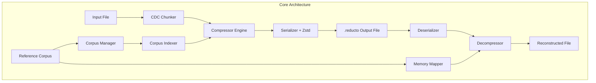

# WARP.md

This file provides guidance to WARP (warp.dev) when working with code in this repository.

## ⚡ CRITICAL: TDD-First Architecture Principles

**Test-First Development**: I should be writing tests FIRST, following the STUB → RED → GREEN → REFACTOR cycle

### The Essence: Executable Specifications Drive Everything

**Core Truth**: Traditional user stories fail LLMs because they're designed for human conversation. LLMs need executable blueprints, not ambiguous narratives.

**The Solution**: Transform all specifications into formal, testable contracts with preconditions, postconditions, and error conditions. Every claim must be validated by automated tests.

**Why This Matters**: Eliminates the #1 cause of LLM hallucination - ambiguous requirements that lead to incorrect implementations.

### The Non-Negotiables: 9 Architectural Principles

1. **Executable Specifications Over Narratives** - Contract-driven development with measurable outcomes
2. **Layered Rust Architecture (L1→L2→L3)** - Clear separation: Core → Std → External dependencies
3. **Dependency Injection for Testability** - Every component depends on traits, not concrete types
4. **RAII Resource Management** - All resources automatically managed with Drop implementations
5. **Performance Claims Must Be Test-Validated** - Every performance assertion backed by automated tests
6. **Structured Error Handling** - thiserror for libraries, anyhow for applications
7. **Complex Domain Model Support** - Handle real-world complexity, not simplified examples
8. **Concurrency Model Validation** - Thread safety validated with stress tests
9. **MVP-First Rigor** - Proven architectures over theoretical abstractions

### Diagrams and Visuals

**ALL DIAGRAMS WILL BE IN MERMAID ONLY** to ensure compatibility with GitHub - DO NOT SKIP THAT

## Common Development Commands

### Building and Running

```bash
# Build the entire project (includes benchmark and reducto binaries)
cargo build

# Build in release mode for performance testing
cargo build --release

# Run the main benchmark tool
cargo run --bin benchmark

# Run benchmark with verbose output
cargo run --bin benchmark -- --verbose

# Run benchmark on specific data directory
cargo run --bin benchmark /path/to/data

# Build and run the reducto CLI (currently has missing dependencies)
# Note: The reducto binary has unresolved dependencies and will not compile
cargo build --bin benchmark  # Only the benchmark binary works currently
```

### Testing

```bash
# Run all tests
cargo test

# Run only library tests (currently working)
cargo test --lib

# Run specific test binary (benchmark binary tests)
cargo test --bin benchmark

# Run tests with verbose output
cargo test -- --nocapture

# Run performance validation tests
cargo test performance_validation

# Run property-based tests
cargo test property_tests

# Run comprehensive stress tests
cargo test comprehensive_stress
```

### Code Quality

```bash
# Check code compilation without building
cargo check

# Format all code (note: currently fails due to formatting issues)
cargo fmt

# Run Clippy lints
cargo clippy

# Run Clippy with strict settings
cargo clippy -- -D warnings
```

### Benchmarking

```bash
# Run criterion benchmarks (if implemented)
cargo bench

# Run specific benchmark suites
cargo bench rolling_hash
cargo bench cdc_chunking
cargo bench compression_pipeline
```

### Project Structure Commands

```bash
# View project structure
find src -name "*.rs" | head -20

# View test structure
ls tests/

# Check binary targets
cargo metadata --format-version 1 | jq '.packages[0].targets[] | select(.kind[] == "bin") | .name'
```

## Architecture Overview

### High-Level System Design

Reducto Mode 3 is a differential compression system using Content-Defined Chunking (CDC) that achieves extreme compression ratios by identifying data patterns in reference corpora.



### Core Components

#### 1. **CDC Chunker** (`src/cdc_chunker.rs`)
- FastCDC/Gear hashing for variable-size chunks (4KB-64KB)
- Handles data insertion/deletion robustly
- O(1) boundary detection with pre-computed gear tables

#### 2. **Type System** (`src/types.rs`)
- Newtype patterns for type safety: `BlockOffset`, `WeakHash`, `CorpusId`
- Variable-size chunk support with `CorpusChunk`
- Enhanced file format with CDC parameters

#### 3. **Trait System** (`src/traits.rs`)
- `HashProvider`: Rolling and strong hash computation
- `BlockMatcher`: Corpus lookup and verification
- `CorpusReader`: Memory-mapped corpus access

#### 4. **Benchmark Suite**
- **Primary binary**: `benchmark` - Dead-simple compression evaluation
- **Goal**: Answer "Will Reducto Mode 3 save me storage/bandwidth costs on MY data?"
- **Process**: Load data → Build corpus → Compare gzip vs Reducto → Recommend

### Development Architecture Patterns

#### Layer Structure (L1→L2→L3)
- **L1 Core**: Ownership, lifetimes, traits, RAII, newtype patterns
- **L2 Standard**: Collections, iterators, smart pointers (Arc), error handling
- **L3 External**: Async (Tokio), serialization (Serde), compression (Zstd), memory mapping

#### Dependency Injection
- All components depend on traits, not concrete types
- Enables comprehensive testing with mock implementations
- Example: `BlockMatcher` trait allows testing without real corpus files

#### Error Handling Strategy
- **Libraries**: `thiserror` for structured, matchable errors
- **Applications**: `anyhow` for contextual error chains
- **Propagation**: `?` operator for clean error bubbling

#### Contract-Driven Development
Every major function includes:
- **Preconditions**: Input validation requirements
- **Postconditions**: Guaranteed outputs and side effects
- **Error Conditions**: Comprehensive error scenarios
- **Performance Contracts**: Time complexity guarantees

### Key Design Decisions

#### Content-Defined Chunking over Fixed Blocks
**Rationale**: CDC ensures that data insertions/deletions don't shift all subsequent chunk boundaries, maintaining high compression ratios even when file structure changes.

#### Dual-Hash System
- **Weak Hash**: Fast polynomial rolling hash (Rabin-Karp) for candidate identification
- **Strong Hash**: BLAKE3 cryptographic hash for verification and collision resolution

#### Variable-Size Chunks with Constraints
- **Target Size**: 8KB default (configurable 4KB-64KB)
- **Min/Max Bounds**: 50%-200% of target size
- **Boundary Detection**: Gear hash with configurable masks

## Project State and Working Components

### Currently Working ✅
- **Benchmark binary**: Fully functional CLI tool
- **Library tests**: Comprehensive test coverage for data loading
- **Core data structures**: Types, traits, and error handling
- **CDC chunker**: Gear hashing and boundary detection logic

### In Development 🚧  
- **Reducto CLI**: Missing external dependencies (console, dialoguer, etc.)
- **Compression pipeline**: Core compression logic implementation
- **Corpus management**: Building and optimizing reference corpora

### Test Coverage
- **Unit Tests**: 7 passing tests in data loading module
- **Integration Tests**: Multiple test files for different components
- **Property Tests**: Boundary stability and performance validation
- **Stress Tests**: Enterprise load and workflow testing

## Development Workflow

### Making Changes
1. **Start with Tests**: Follow TDD approach from design principles
2. **Check Compilation**: Use `cargo check` frequently
3. **Run Tests**: `cargo test --lib` to verify changes
4. **Format Code**: `cargo fmt` (fix formatting issues first)
5. **Lint**: `cargo clippy` for code quality

### Adding New Features
1. **Define Contracts**: Add trait definitions with preconditions/postconditions
2. **Write Tests**: Property-based tests for complex algorithms
3. **Implement Stubs**: Use TODO comments for unimplemented sections
4. **Iterate**: RED → GREEN → REFACTOR cycle

### Performance Validation
- All performance claims must be test-validated
- Use criterion benchmarks for precise measurements
- Validate memory layout efficiency with size assertions
- Test concurrent operations with stress tests

## Key Files and Their Purposes

- `src/lib.rs` - Main library entry point and benchmark orchestration
- `src/bin/benchmark.rs` - CLI for compression evaluation tool
- `src/bin/reducto.rs` - Enterprise CLI (currently non-functional)
- `src/types.rs` - Core data structures with newtype patterns
- `src/traits.rs` - Interface contracts for dependency injection
- `src/cdc_chunker.rs` - Content-Defined Chunking implementation
- `src/data_loader.rs` - Data loading with size limits and filtering
- `tests/` - Comprehensive test suite for all components
- `.kiro/specs/` - Formal requirements and design specifications
- `.kiro/steering/` - Architecture principles and code conventions

## Notes for Future Development

- The `reducto` binary requires additional dependencies to be added to Cargo.toml
- Focus on completing the benchmark suite first as it provides immediate value
- All compression claims should be validated against the requirements in `.kiro/specs/`
- Follow the idiomatic Rust patterns documented in `.kiro/steering/code-conventions.md`
- Use contract-driven development as specified in design principles