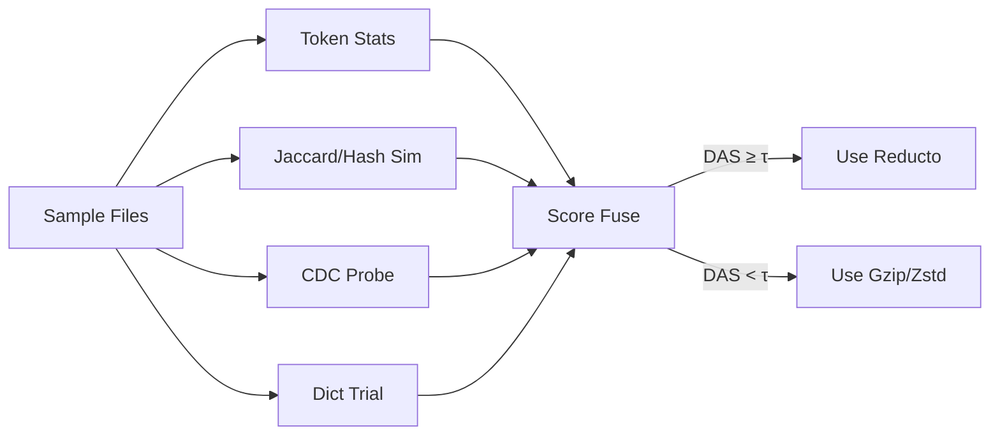

# WARP Option 01 — Differentiating Reducto (2025‑09‑24 07:45 UTC)

Purpose
- Answer two questions deeply:
  1) What data does Reducto win on (vs gzip/zstd), and how do we detect it upfront?
  2) What algorithmic upgrades (grounded in known research and systems practice) will create a durable advantage?
- Produce an executable plan (tests-first) to evolve the current mock into a differentiated Mode 3 pipeline.

Executive TL;DR
- Win where cross-file, cross-version redundancy is high and structured (source trees, container layers, VM base images, rolling logs, DB backups, datasets with small edits). Avoid already-compressed/encrypted media.
- Replace the mock with a multi-scale CDC + corpus-indexed delta pipeline, then add domain-aware boundary biasing and dictionary-trained residuals. Prioritize robust matching and cheap lookups over exotic compression tricks.
- Decision gate: fast pre-analysis computes a “Differential Advantage Score” (DAS). If DAS < threshold or time budget is too tight, fall back to gzip/zstd.


Core Concept — Differential Compression, Not “General Compression”
- Gzip/zstd are great at single-file entropy coding; they cannot leverage knowledge across versions or fleets.
- Reducto’s edge comes from: stable boundaries + cross-file reference + long-range reuse + learned (or heuristic) dictionaries for the remaining residuals.


High-Level Architecture (Target)
```mermaid path=null start=null
flowchart TB
    subgraph IN[Input]
        U[User Data ≤100MB] --> A[Pre-Analysis]
    end

    A -->|DAS >= τ & Budget OK| P[CDC Pipeline]
    A -->|else| G[Fallback Gzip/Zstd]

    subgraph PIPE[Reducto Mode 3]
        P --> B[Multi-scale CDC (FastCDC/Gear)]
        B --> C[Fingerprinting (Weak+Strong)]
        C --> D[Global Index Lookup]
        D --> E[Instruction Builder]
        E --> F[Residual Codec (Zstd dict)]
        F --> O[.reducto Artifact]
    end

    style PIPE fill:#eef7ff,stroke:#3977c5,stroke-width:2px
    style IN fill:#f7f7f7,stroke:#888,stroke-width:1px
```


Where Reducto Wins (Data Fit) — Answer to Q1
- Strong fit
  - Monorepos and code snapshots across commits/branches
  - Container/VM base images across versions/environments
  - Rolling application logs (JSON/NDJSON) with stable schema + repeated tokens
  - Periodic DB backups (row/column updates small vs full dump)
  - Dataset snapshots with incremental labeling/annotation
- Weak fit
  - Already-compressed (zip/jpg/mp4/pdf), encrypted, or high-entropy telemetry
  - Highly heterogeneous bundles with short, unique chunks

Fast Upfront Signal (DAS = Differential Advantage Score)
- Ingredients (computed in < 2–3s for ≤100MB sample):
  - Token redundancy: top-K token frequency skew (Zipfiness)
  - Line/Jaccard similarity across files
  - CDC uniqueness ratio: fraction of unique chunk fingerprints in a random sample
  - Rolling-hash autocorrelation (stable boundaries likelihood)
  - Dictionary trial: zstd with small trained dict vs raw zstd delta
- Decision
  - If DAS ≥ τ and predicted corpus hit-rate ≥ 20–30%, use Reducto; else fallback to gzip/zstd.

DAS Flow



Algorithmic Upgrades — Answer to Q2
1) Multi-Scale CDC with Boundary Normalization
- Use FastCDC/Gear with two (or three) target sizes (e.g., 8KB and 64KB). Small scale catches micro-edits; large scale captures long runs.
- Boundary normalization (mask tuning + min/max windows) reduces drift on insertions/deletions.
- Emit a hierarchical chunk graph: large-chunk spans with embedded micro-chunks for fine-grained matching.

2) Dual-Hash + Short-String Paths
- Weak hash: Gear/Rabin on sliding windows for candidates.
- Strong hash: BLAKE3 on chunk extents for collision safety.
- Additional path for short strings: highway or cityhash for ≤ 64B tokens found frequently in logs/code.

3) Locality-Aware Global Index
- Store (strong_hash → positions) in LSM/RocksDB-style index with a compact Bloom filter per shard.
- Hotset in-memory, cold shards mmapped; prefetch by file similarity cluster.
- Segment index by scale (small/large chunks) to reduce candidate ambiguity.

4) Corpus Strategy (Build/Choose/Train)
- Initial: select top-entropy-reducing chunks via reservoir or greedy coverage.
- Train a zstd dictionary on residuals extracted from the same sample window.
- Reuse corpus across runs; amortize build cost and maintain versioned corpora.

5) Residual Coding with Trained Dict + Long-Range Mode
- Residuals go through zstd with a trained dictionary.
- Enable long-range matching (LDM) for residuals to catch near-misses not encoded as references.

6) Domain-Aware Boundary Biasing (Lightweight)
- Bias CDC boundary decisions near structural tokens: newline, braces, commas in JSON/CSV/TSV; shebangs; import lines.
- Don’t fully parse ASTs—just push anchors where semantics are stable across edits.

7) Concurrency & SIMD
- Hashing: BLAKE3 is SIMD-optimized; pipeline stages operate on bounded queues.
- Index IO: batch lookups; coalesce seeks; use read-ahead.

8) Verification & Stability
- Strong-hash verify matched references.
- Stress tests: random insertion/deletion noise; re-chunk stability checks; corpus hit-rate CI guardrails.


Why This Beats gzip/zstd
- gzip/zstd compress single inputs well but don’t know similar files elsewhere.
- Reducto exploits cross-file redundancy and stable structures. With good boundaries and a global index, matched references dwarf raw entropy coding on code, logs, images with small variant edits.


Implementation Plan (TDD-first)
Milestone 1 — Minimal Differential Path (2–3 days)
- Replace mock: implement single-scale FastCDC, dual-hash verification, instruction encoding (COPY ref, ADD residual).
- Index: in-memory hashmap for the sample; mmapped file offsets.
- Residuals: plain zstd level 6.
- Tests
  - property: chunk boundary stability under single insertion/deletion
  - integration: end-to-end diff vs gzip on a small code repo snapshot
  - performance: time budget respected for ≤100MB

Milestone 2 — Multi-Scale + Index Sharding (3–5 days)
- Add large-scale CDC; emit hierarchical chunks.
- Shard index by scale; add Bloom filters; batch lookups.
- Tests: match recall and collision rate, shard balance under mixed workloads.

Milestone 3 — Corpus Selection + Dict Residuals (3–5 days)
- Greedy/reservoir chunk selection; persist corpus; train zstd dict on residuals.
- Tests: dictionary improves residual compression ≥ 15% on code/log samples.

Milestone 4 — Boundary Biasing + DAS Gate (3–4 days)
- Lightweight token-aware anchors; feature extraction; DAS scorer; fallback path.
- Tests: false-positive rate of DAS; decision-time ≤ 2–3s for 100MB.

Milestone 5 — Robustness & Ops (ongoing)
- Crash-only design; index integrity; corpus versioning; metrics export; large-file streaming.


KPIs and Success Criteria
- Compression ratio uplift vs gzip on strong-fit data:
  - Code/Logs: ≥ 2–5× better than gzip
  - VM/Container layers: ≥ 3–10× over gzip depending on image base commonality
- Speed: ≤ 3× slower than gzip on compression; ≥ 0.5× speed on decompression
- Corpus hit-rate: ≥ 25–40% on strong-fit workloads
- Time budget: ≤ 60s for the benchmark; corpus reuse makes repeat runs faster


Risks and Mitigations
- Heterogeneous datasets tank hit-rate → DAS gate + fallback
- Index hotset memory growth → shard by scale and LRU hot-cache, mmap the rest
- Overfitting dictionary → retrain per dataset family; keep small dicts (64–128KB)
- Boundary instability on noisy edits → boundary normalization + token anchor bias
- Operational complexity → ship sensible defaults, optional corpus reuse, auto-prune


Competitive Lens
- gzip/zstd: unmatched breadth, but single-file only; Reducto wins on cross-version reuse.
- xdelta/bsdiff/rdiff: pairwise delta; Reducto generalizes to N-way corpora and streaming.
- Backup tools (restic/borg): dedup focus; Reducto targets WAN/storage cost for app-specific flows with a tighter time budget.


Validation Matrix (Executable Specs)
- Unit: chunking invariants; hashing collisions; instruction encoding
- Property: stability under edits; recall vs controlled synthetic redundancy
- Integration: end-to-end on code/log/VM samples; corpus reuse impact
- Performance: throughput, memory ceilings, index latency
- Reliability: round-trip integrity (BLAKE3), corruption detection


Appendix — Module Blueprint
- cdc_chunker.rs: multi-scale FastCDC with mask tuning (min/max/target)
- corpus_manager.rs: selection/persistence/versioning; dict training
- compressor.rs: instruction builder; reference matcher; batching
- serializer.rs: header, integrity hash, varint encoding, streams
- ecosystem_decompressor.rs: symmetrical instruction application
- metrics_collector.rs: hit-rate, ratio, time, cache stats
- traits.rs: DI for chunker/index/compressor for testability


Next Actions (short)
1) Implement Milestone 1 with tests; wire benchmark to real CDC path.
2) Add DAS gate and emit per-run report (hit-rate, predicted ROI).
3) Benchmark on real repo/logs to tune corpus fraction and boundary masks.
