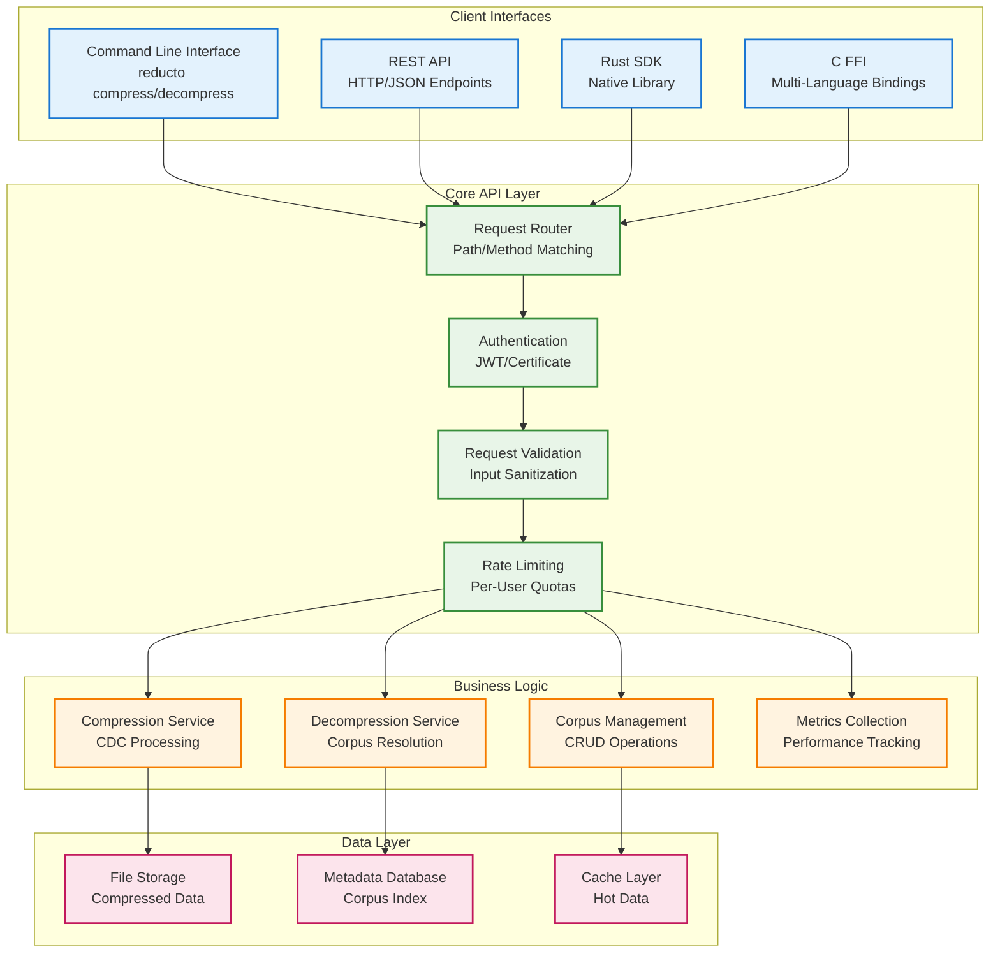

# Reducto API Documentation

## Overview

Reducto provides multiple APIs for integration:
- **Command Line Interface (CLI)**: Full-featured command-line tool
- **REST API**: HTTP-based API for web services
- **Rust SDK**: Native Rust library integration
- **C FFI**: Foreign Function Interface for other languages

### API Architecture



### Request Flow

```mermaid
graph TD
    %% Request initiation
    CLIENT[Client Request<br/>CLI/REST/SDK/FFI]
    
    %% Authentication and validation
    subgraph "Request Processing"
        direction TB
        AUTH[Authentication<br/>Verify Credentials]
        AUTHZ[Authorization<br/>Check Permissions]
        VALID[Input Validation<br/>Sanitize Parameters]
        RATE[Rate Limiting<br/>Check Quotas]
    end
    
    %% Operation routing
    subgraph "Operation Routing"
        direction LR
        ROUTE{Operation Type}
        COMP_OP[Compression<br/>Operation]
        DECOMP_OP[Decompression<br/>Operation]
        CORPUS_OP[Corpus<br/>Management]
        METRICS_OP[Metrics<br/>Query]
    end
    
    %% Processing and response
    subgraph "Processing & Response"
        direction TB
        PROCESS[Execute Operation<br/>Business Logic]
        COLLECT[Collect Metrics<br/>Performance Data]
        RESPONSE[Format Response<br/>JSON/Binary]
        LOG[Audit Logging<br/>Security Events]
    end
    
    %% Connect flow
    CLIENT --> AUTH
    AUTH --> AUTHZ
    AUTHZ --> VALID
    VALID --> RATE
    RATE --> ROUTE
    
    ROUTE -->|compress| COMP_OP
    ROUTE -->|decompress| DECOMP_OP
    ROUTE -->|corpus| CORPUS_OP
    ROUTE -->|metrics| METRICS_OP
    
    COMP_OP --> PROCESS
    DECOMP_OP --> PROCESS
    CORPUS_OP --> PROCESS
    METRICS_OP --> PROCESS
    
    PROCESS --> COLLECT
    COLLECT --> RESPONSE
    RESPONSE --> LOG
    LOG --> CLIENT
    
    %% Styling
    classDef start fill:#e1f5fe,stroke:#01579b,stroke-width:2px
    classDef process fill:#e8f5e8,stroke:#2e7d32,stroke-width:2px
    classDef operation fill:#fff3e0,stroke:#ef6c00,stroke-width:2px
    classDef end fill:#fce4ec,stroke:#c2185b,stroke-width:2px
    
    class CLIENT start
    class AUTH,AUTHZ,VALID,RATE process
    class COMP_OP,DECOMP_OP,CORPUS_OP,METRICS_OP operation
    class PROCESS,COLLECT,RESPONSE,LOG end
```

## Command Line Interface

### Core Commands

#### `reducto compress`

Compress files using a reference corpus.

**Syntax:**
```bash
reducto compress [OPTIONS] --input <INPUT> --corpus <CORPUS> --output <OUTPUT>
```

**Options:**
- `--input, -i <INPUT>`: Input file or directory to compress
- `--corpus, -c <CORPUS>`: Reference corpus file (.rc)
- `--output, -o <OUTPUT>`: Output compressed file (.reducto)
- `--compression-level <LEVEL>`: Zstd compression level (1-22, default: 19)
- `--chunk-size <SIZE>`: CDC chunk size in bytes (4096-65536, default: 8192)
- `--parallel <THREADS>`: Number of parallel compression threads
- `--dry-run`: Analyze compression potential without creating output
- `--metrics`: Export detailed metrics to JSON

**Examples:**

```bash
# Basic compression
reducto compress \
    --input large-vm-image.img \
    --corpus golden-corpus.rc \
    --output compressed-vm.reducto

# High-performance compression with custom settings
reducto compress \
    --input /data/vm-images/ \
    --corpus /corpus/vm-golden.rc \
    --output /compressed/batch.reducto \
    --compression-level 22 \
    --chunk-size 16384 \
    --parallel 16 \
    --metrics

# Dry-run analysis
reducto compress \
    --input test-file.img \
    --corpus golden-corpus.rc \
    --dry-run \
    --output analysis-report.json
```

**Output Format:**
```json
{
  "operation": "compress",
  "input_size": 2147483648,
  "output_size": 41943040,
  "compression_ratio": 51.2,
  "processing_time_ms": 3250,
  "throughput_mbps": 659.7,
  "corpus_hit_rate": 0.94,
  "chunk_count": 262144,
  "residual_size": 2621440,
  "memory_usage_mb": 1024,
  "cpu_utilization": 0.85
}
```

#### `reducto decompress`

Decompress .reducto files to restore original data.

**Syntax:**
```bash
reducto decompress [OPTIONS] --input <INPUT> --output <OUTPUT>
```

**Options:**
- `--input, -i <INPUT>`: Input compressed file (.reducto)
- `--output, -o <OUTPUT>`: Output file or directory
- `--corpus <CORPUS>`: Local corpus file (optional if auto-fetch enabled)
- `--auto-fetch`: Automatically fetch required corpus from repositories
- `--verify`: Verify output integrity using cryptographic hashes
- `--parallel <THREADS>`: Number of parallel decompression threads

**Examples:**

```bash
# Basic decompression
reducto decompress \
    --input compressed-vm.reducto \
    --output restored-vm.img

# Decompression with auto-fetch and verification
reducto decompress \
    --input compressed-vm.reducto \
    --output restored-vm.img \
    --auto-fetch \
    --verify \
    --parallel 8

# Stream decompression to stdout
reducto decompress \
    --input compressed-data.reducto \
    --output - | tar -xzf -
```

#### `reducto corpus`

Manage reference corpora for optimal compression.

**Subcommands:**

##### `corpus build`
```bash
reducto corpus build [OPTIONS] --input <INPUT> --output <OUTPUT>
```

**Options:**
- `--input, -i <INPUT>`: Input dataset directory
- `--output, -o <OUTPUT>`: Output corpus file (.rc)
- `--chunk-size <SIZE>`: CDC chunk size (default: 8192)
- `--optimize`: Enable corpus optimization during build
- `--frequency-threshold <THRESHOLD>`: Minimum chunk frequency (0.0-1.0)
- `--max-size <SIZE>`: Maximum corpus size limit
- `--parallel <THREADS>`: Parallel processing threads

**Example:**
```bash
# Build optimized corpus from VM image dataset
reducto corpus build \
    --input /data/vm-images/ \
    --output golden-vm-corpus.rc \
    --chunk-size 8192 \
    --optimize \
    --frequency-threshold 0.05 \
    --max-size 50GB \
    --parallel 16
```

##### `corpus analyze`
```bash
reducto corpus analyze --corpus <CORPUS> [OPTIONS]
```

**Options:**
- `--corpus, -c <CORPUS>`: Corpus file to analyze
- `--test-data <PATH>`: Test dataset for effectiveness analysis
- `--detailed`: Generate detailed analysis report
- `--output <FILE>`: Save analysis to file

**Example:**
```bash
# Analyze corpus effectiveness
reducto corpus analyze \
    --corpus golden-corpus.rc \
    --test-data /data/test-files/ \
    --detailed \
    --output corpus-analysis.json
```

**Output:**
```json
{
  "corpus_id": "golden-v1-20240115",
  "total_size": 53687091200,
  "chunk_count": 1310720,
  "unique_chunks": 1245680,
  "deduplication_ratio": 0.95,
  "average_chunk_size": 8192,
  "chunk_size_variance": 0.23,
  "frequency_distribution": {
    "high_frequency": 124568,
    "medium_frequency": 623400,
    "low_frequency": 497712
  },
  "effectiveness_metrics": {
    "hit_rate": 0.94,
    "coverage": 0.89,
    "efficiency_score": 0.92
  },
  "optimization_recommendations": [
    "Consider increasing frequency threshold to 0.1",
    "Chunk size 8192 is optimal for this dataset",
    "Corpus size can be reduced by 15% with minimal impact"
  ]
}
```

##### `corpus optimize`
```bash
reducto corpus optimize --input <INPUT> --output <OUTPUT> [OPTIONS]
```

**Options:**
- `--input, -i <INPUT>`: Input corpus file
- `--output, -o <OUTPUT>`: Optimized output corpus
- `--frequency-threshold <THRESHOLD>`: Remove chunks below frequency
- `--size-limit <SIZE>`: Target corpus size limit
- `--preserve-coverage <RATIO>`: Minimum coverage to maintain

**Example:**
```bash
# Optimize existing corpus
reducto corpus optimize \
    --input large-corpus.rc \
    --output optimized-corpus.rc \
    --frequency-threshold 0.1 \
    --size-limit 20GB \
    --preserve-coverage 0.9
```

##### `corpus verify`
```bash
reducto corpus verify --corpus <CORPUS> [OPTIONS]
```

**Options:**
- `--corpus, -c <CORPUS>`: Corpus file to verify
- `--check-signatures`: Verify cryptographic signatures
- `--deep-check`: Perform comprehensive integrity check
- `--repair`: Attempt to repair minor corruption

**Example:**
```bash
# Comprehensive corpus verification
reducto corpus verify \
    --corpus golden-corpus.rc \
    --check-signatures \
    --deep-check
```

#### `reducto analyze`

Analyze compression potential and performance characteristics.

**Syntax:**
```bash
reducto analyze [OPTIONS] --input <INPUT>
```

**Options:**
- `--input, -i <INPUT>`: Input file or directory to analyze
- `--corpus <CORPUS>`: Reference corpus for analysis
- `--chunk-sizes <SIZES>`: Test multiple chunk sizes (comma-separated)
- `--report-format <FORMAT>`: Output format (json, yaml, table)
- `--detailed`: Include detailed chunk-level analysis
- `--benchmark`: Include performance benchmarking

**Examples:**

```bash
# Basic analysis
reducto analyze \
    --input test-dataset/ \
    --corpus golden-corpus.rc \
    --report-format json

# Comprehensive analysis with benchmarking
reducto analyze \
    --input large-file.img \
    --corpus golden-corpus.rc \
    --chunk-sizes 4096,8192,16384,32768 \
    --detailed \
    --benchmark \
    --report-format yaml
```

**Output:**
```yaml
analysis_summary:
  input_size: 2147483648
  estimated_compression_ratio: 45.2
  optimal_chunk_size: 8192
  corpus_coverage: 0.89
  processing_time_estimate: "3.2s"

chunk_analysis:
  total_chunks: 262144
  unique_chunks: 15728
  corpus_matches: 233456
  residual_chunks: 28688
  hit_rate: 0.891

performance_profile:
  cpu_bound_operations: 0.65
  io_bound_operations: 0.35
  memory_requirements: "1.2GB"
  recommended_threads: 8

optimization_recommendations:
  - "Current corpus provides excellent coverage"
  - "Consider chunk size 8192 for optimal performance"
  - "Expected bandwidth savings: 95.2%"
```

#### `reducto benchmark`

Performance benchmarking and validation.

**Syntax:**
```bash
reducto benchmark [OPTIONS] --input <INPUT>
```

**Options:**
- `--input, -i <INPUT>`: Input dataset for benchmarking
- `--corpus <CORPUS>`: Reference corpus
- `--iterations <COUNT>`: Number of benchmark iterations
- `--operations <OPS>`: Operations to benchmark (compress,decompress,both)
- `--threads <THREADS>`: Thread counts to test (comma-separated)
- `--output <FILE>`: Save benchmark results

**Example:**
```bash
# Comprehensive performance benchmark
reducto benchmark \
    --input /data/benchmark-dataset/ \
    --corpus golden-corpus.rc \
    --iterations 10 \
    --operations both \
    --threads 1,4,8,16 \
    --output benchmark-results.json
```

**Output:**
```json
{
  "benchmark_config": {
    "dataset_size": 10737418240,
    "iterations": 10,
    "timestamp": "2024-01-15T14:30:00Z"
  },
  "compression_results": {
    "threads_1": {
      "avg_throughput_mbps": 245.6,
      "avg_compression_ratio": 42.1,
      "avg_duration_ms": 43750,
      "memory_usage_mb": 512
    },
    "threads_8": {
      "avg_throughput_mbps": 1456.3,
      "avg_compression_ratio": 42.1,
      "avg_duration_ms": 7380,
      "memory_usage_mb": 2048
    }
  },
  "decompression_results": {
    "threads_1": {
      "avg_throughput_mbps": 892.4,
      "avg_duration_ms": 12050
    },
    "threads_8": {
      "avg_throughput_mbps": 3247.8,
      "avg_duration_ms": 3310
    }
  },
  "recommendations": {
    "optimal_threads": 8,
    "expected_performance": "1.4 GB/s compression, 3.2 GB/s decompression",
    "memory_recommendation": "4GB for optimal performance"
  }
}
```

### Configuration Management

#### Global Configuration
```bash
# Set global configuration values
reducto config set <KEY> <VALUE>
reducto config get <KEY>
reducto config list

# Examples
reducto config set corpus.default_repository "https://corpus.company.com"
reducto config set compression.default_level 19
reducto config set security.verify_signatures true
```

#### Environment Variables
```bash
export REDUCTO_CONFIG_PATH="/etc/reducto/config.toml"
export REDUCTO_CORPUS_CACHE_DIR="/var/cache/reducto"
export REDUCTO_LOG_LEVEL="INFO"
export REDUCTO_METRICS_ENDPOINT="http://prometheus:9090"
```

## REST API

### Base URL
```
https://api.reducto.company.com/v1
```

### Authentication
```http
Authorization: Bearer <api-token>
Content-Type: application/json
```

### Endpoints

#### POST /compress
Compress data using a reference corpus.

**Request:**
```http
POST /v1/compress
Content-Type: multipart/form-data

{
  "file": <binary data>,
  "corpus_id": "golden-v1",
  "compression_level": 19,
  "chunk_size": 8192,
  "metadata": {
    "source": "vm-image",
    "version": "2024.01"
  }
}
```

**Response:**
```json
{
  "job_id": "comp-123e4567-e89b-12d3-a456-426614174000",
  "status": "completed",
  "result": {
    "compressed_size": 41943040,
    "original_size": 2147483648,
    "compression_ratio": 51.2,
    "processing_time_ms": 3250,
    "corpus_hit_rate": 0.94,
    "download_url": "https://api.reducto.company.com/v1/download/comp-123e4567...",
    "expires_at": "2024-01-16T14:30:00Z"
  },
  "metrics": {
    "throughput_mbps": 659.7,
    "memory_usage_mb": 1024,
    "cpu_utilization": 0.85
  }
}
```

#### POST /decompress
Decompress a .reducto file.

**Request:**
```http
POST /v1/decompress
Content-Type: multipart/form-data

{
  "file": <compressed binary data>,
  "verify_integrity": true,
  "auto_fetch_corpus": true
}
```

**Response:**
```json
{
  "job_id": "decomp-123e4567-e89b-12d3-a456-426614174000",
  "status": "completed",
  "result": {
    "decompressed_size": 2147483648,
    "processing_time_ms": 1250,
    "corpus_id": "golden-v1",
    "integrity_verified": true,
    "download_url": "https://api.reducto.company.com/v1/download/decomp-123e4567...",
    "expires_at": "2024-01-16T14:30:00Z"
  }
}
```

#### GET /corpus/{corpus_id}
Get corpus information.

**Response:**
```json
{
  "corpus_id": "golden-v1",
  "name": "Golden VM Corpus v1.0",
  "size_bytes": 52428800000,
  "chunk_count": 1250000,
  "created_at": "2024-01-15T10:30:00Z",
  "updated_at": "2024-01-15T10:30:00Z",
  "signature": "ed25519:abc123def456...",
  "metadata": {
    "dataset_type": "vm-images",
    "optimization_score": 0.92,
    "coverage_metrics": {
      "hit_rate": 0.94,
      "efficiency": 0.89
    }
  },
  "download_url": "https://corpus.company.com/v1/golden-v1.rc",
  "checksum": "sha256:e3b0c44298fc1c149afbf4c8996fb92427ae41e4649b934ca495991b7852b855"
}
```

#### POST /corpus
Create a new corpus.

**Request:**
```http
POST /v1/corpus
Content-Type: multipart/form-data

{
  "name": "Custom VM Corpus",
  "dataset": <binary data>,
  "chunk_size": 8192,
  "optimize": true,
  "frequency_threshold": 0.05,
  "metadata": {
    "dataset_type": "vm-images",
    "source": "production-vms"
  }
}
```

#### GET /jobs/{job_id}
Get job status and results.

**Response:**
```json
{
  "job_id": "comp-123e4567-e89b-12d3-a456-426614174000",
  "status": "processing",
  "progress": 0.65,
  "created_at": "2024-01-15T14:25:00Z",
  "updated_at": "2024-01-15T14:27:30Z",
  "estimated_completion": "2024-01-15T14:30:00Z",
  "result": null,
  "error": null
}
```

#### GET /metrics
Get system metrics.

**Response:**
```json
{
  "timestamp": "2024-01-15T14:30:00Z",
  "system": {
    "cpu_utilization": 0.45,
    "memory_usage_gb": 12.5,
    "disk_usage_gb": 245.8,
    "network_io_mbps": 156.3
  },
  "operations": {
    "compressions_per_hour": 1250,
    "decompressions_per_hour": 890,
    "avg_compression_ratio": 42.1,
    "avg_throughput_mbps": 650.0
  },
  "corpus": {
    "active_corpora": 15,
    "total_corpus_size_gb": 850.2,
    "avg_hit_rate": 0.91
  }
}
```

### Error Responses

All API errors follow this format:

```json
{
  "error": {
    "code": "COMPRESSION_FAILED",
    "message": "Compression operation failed due to insufficient corpus coverage",
    "details": {
      "corpus_hit_rate": 0.23,
      "minimum_required": 0.50,
      "suggestion": "Consider using a more comprehensive corpus or rebuilding with target dataset"
    },
    "request_id": "req-123e4567-e89b-12d3-a456-426614174000",
    "timestamp": "2024-01-15T14:30:00Z"
  }
}
```

**Common Error Codes:**
- `INVALID_REQUEST`: Malformed request data
- `CORPUS_NOT_FOUND`: Specified corpus does not exist
- `COMPRESSION_FAILED`: Compression operation failed
- `DECOMPRESSION_FAILED`: Decompression operation failed
- `INSUFFICIENT_RESOURCES`: System resources exhausted
- `RATE_LIMIT_EXCEEDED`: API rate limit exceeded
- `AUTHENTICATION_FAILED`: Invalid or expired API token

## Rust SDK

### Installation

Add to `Cargo.toml`:
```toml
[dependencies]
reducto = { version = "1.0", features = ["enterprise", "async"] }
tokio = { version = "1.0", features = ["full"] }
```

### Basic Usage

```rust
use reducto::{ReductoSDK, CompressRequest, DecompressRequest};
use std::path::Path;

#[tokio::main]
async fn main() -> Result<(), Box<dyn std::error::Error>> {
    // Initialize SDK
    let sdk = ReductoSDK::new()
        .with_corpus_repository("https://corpus.company.com")
        .with_cache_dir("/var/cache/reducto")
        .build()?;

    // Compress a file
    let compress_request = CompressRequest::builder()
        .input_path("/data/large-file.img")
        .corpus_id("golden-v1")
        .output_path("/tmp/compressed.reducto")
        .compression_level(19)
        .chunk_size(8192)
        .build()?;

    let result = sdk.compress(compress_request).await?;
    
    println!("Compression ratio: {:.1}:1", result.compression_ratio);
    println!("Processing time: {}ms", result.processing_time_ms);
    println!("Corpus hit rate: {:.2}%", result.corpus_hit_rate * 100.0);

    // Decompress the file
    let decompress_request = DecompressRequest::builder()
        .input_path("/tmp/compressed.reducto")
        .output_path("/tmp/restored.img")
        .verify_integrity(true)
        .build()?;

    let decompress_result = sdk.decompress(decompress_request).await?;
    
    println!("Decompression completed in {}ms", decompress_result.processing_time_ms);
    println!("Integrity verified: {}", decompress_result.integrity_verified);

    Ok(())
}
```

### Advanced Usage

#### Stream Processing
```rust
use reducto::{ReductoSDK, StreamCompressor};
use tokio::io::{AsyncReadExt, AsyncWriteExt};

async fn stream_compression_example() -> Result<(), Box<dyn std::error::Error>> {
    let sdk = ReductoSDK::new().build()?;
    
    let mut input = tokio::fs::File::open("large-input.img").await?;
    let mut output = tokio::fs::File::create("compressed.reducto").await?;
    
    let mut compressor = sdk.create_stream_compressor("golden-v1").await?;
    
    let mut buffer = vec![0u8; 64 * 1024]; // 64KB buffer
    loop {
        let bytes_read = input.read(&mut buffer).await?;
        if bytes_read == 0 { break; }
        
        let compressed_chunk = compressor.process_chunk(&buffer[..bytes_read]).await?;
        output.write_all(&compressed_chunk).await?;
    }
    
    let final_chunk = compressor.finalize().await?;
    output.write_all(&final_chunk).await?;
    
    Ok(())
}
```

#### Corpus Management
```rust
use reducto::{CorpusManager, CorpusBuildRequest};

async fn corpus_management_example() -> Result<(), Box<dyn std::error::Error>> {
    let corpus_manager = CorpusManager::new()
        .with_storage_backend("rocksdb")
        .with_storage_path("/var/lib/reducto/corpus")
        .build()?;

    // Build a new corpus
    let build_request = CorpusBuildRequest::builder()
        .input_directory("/data/training-set")
        .output_path("/corpus/new-corpus.rc")
        .chunk_size(8192)
        .optimize(true)
        .frequency_threshold(0.05)
        .parallel_workers(16)
        .build()?;

    let corpus_metadata = corpus_manager.build_corpus(build_request).await?;
    
    println!("Built corpus: {}", corpus_metadata.corpus_id);
    println!("Chunk count: {}", corpus_metadata.chunk_count);
    println!("Optimization score: {:.2}", corpus_metadata.optimization_score);

    // Analyze corpus effectiveness
    let analysis = corpus_manager
        .analyze_corpus(&corpus_metadata.corpus_id)
        .with_test_dataset("/data/test-set")
        .detailed_analysis(true)
        .run().await?;

    println!("Hit rate: {:.2}%", analysis.hit_rate * 100.0);
    println!("Coverage: {:.2}%", analysis.coverage * 100.0);

    Ok(())
}
```

#### Metrics and Monitoring
```rust
use reducto::{MetricsCollector, MetricsExporter};

async fn metrics_example() -> Result<(), Box<dyn std::error::Error>> {
    let metrics = MetricsCollector::new()
        .with_prometheus_endpoint("http://prometheus:9090")
        .with_export_interval(std::time::Duration::from_secs(30))
        .build()?;

    // Start metrics collection
    let _metrics_handle = metrics.start_collection().await?;

    // Perform operations (metrics collected automatically)
    let sdk = ReductoSDK::new().with_metrics(metrics.clone()).build()?;
    
    // ... perform compression/decompression operations ...

    // Export metrics manually
    let current_metrics = metrics.get_current_metrics().await?;
    println!("Current compression ratio: {:.1}", current_metrics.avg_compression_ratio);
    println!("Throughput: {:.1} MB/s", current_metrics.throughput_mbps);

    Ok(())
}
```

### Error Handling

```rust
use reducto::{ReductoError, CorpusError, CompressionError};

async fn error_handling_example() {
    match sdk.compress(request).await {
        Ok(result) => {
            println!("Compression successful: {:.1}:1 ratio", result.compression_ratio);
        }
        Err(ReductoError::Corpus(CorpusError::NotFound { corpus_id })) => {
            eprintln!("Corpus '{}' not found. Available corpora:", corpus_id);
            let available = sdk.list_available_corpora().await?;
            for corpus in available {
                eprintln!("  - {}: {}", corpus.id, corpus.name);
            }
        }
        Err(ReductoError::Compression(CompressionError::InsufficientCoverage { hit_rate, minimum })) => {
            eprintln!("Compression failed: hit rate {:.2}% below minimum {:.2}%", 
                     hit_rate * 100.0, minimum * 100.0);
            eprintln!("Consider rebuilding corpus with target dataset");
        }
        Err(e) => {
            eprintln!("Compression failed: {}", e);
            
            // Get detailed error context
            if let Some(context) = e.context() {
                eprintln!("Context: {}", context);
            }
            
            // Get remediation suggestions
            if let Some(suggestions) = e.remediation_suggestions() {
                eprintln!("Suggestions:");
                for suggestion in suggestions {
                    eprintln!("  - {}", suggestion);
                }
            }
        }
    }
}
```

## C FFI

### Header File (reducto.h)

```c
#ifndef REDUCTO_H
#define REDUCTO_H

#include <stdint.h>
#include <stdbool.h>

#ifdef __cplusplus
extern "C" {
#endif

// Opaque types
typedef struct ReductoSDK ReductoSDK;
typedef struct ReductoResult ReductoResult;

// Result codes
typedef enum {
    REDUCTO_SUCCESS = 0,
    REDUCTO_ERROR_INVALID_INPUT = 1,
    REDUCTO_ERROR_CORPUS_NOT_FOUND = 2,
    REDUCTO_ERROR_COMPRESSION_FAILED = 3,
    REDUCTO_ERROR_DECOMPRESSION_FAILED = 4,
    REDUCTO_ERROR_INSUFFICIENT_MEMORY = 5,
    REDUCTO_ERROR_IO_ERROR = 6,
    REDUCTO_ERROR_NETWORK_ERROR = 7
} ReductoResultCode;

// Configuration structure
typedef struct {
    const char* corpus_repository_url;
    const char* cache_directory;
    uint32_t chunk_size;
    uint8_t compression_level;
    bool verify_signatures;
    bool enable_metrics;
} ReductoConfig;

// Compression result structure
typedef struct {
    uint64_t original_size;
    uint64_t compressed_size;
    double compression_ratio;
    uint32_t processing_time_ms;
    double corpus_hit_rate;
    double throughput_mbps;
} ReductoCompressionResult;

// SDK lifecycle
ReductoSDK* reducto_sdk_new(const ReductoConfig* config);
void reducto_sdk_free(ReductoSDK* sdk);

// Compression operations
ReductoResultCode reducto_compress_file(
    ReductoSDK* sdk,
    const char* input_path,
    const char* corpus_id,
    const char* output_path,
    ReductoCompressionResult* result
);

ReductoResultCode reducto_compress_buffer(
    ReductoSDK* sdk,
    const uint8_t* input_data,
    uint64_t input_size,
    const char* corpus_id,
    uint8_t** output_data,
    uint64_t* output_size,
    ReductoCompressionResult* result
);

// Decompression operations
ReductoResultCode reducto_decompress_file(
    ReductoSDK* sdk,
    const char* input_path,
    const char* output_path,
    bool verify_integrity
);

ReductoResultCode reducto_decompress_buffer(
    ReductoSDK* sdk,
    const uint8_t* input_data,
    uint64_t input_size,
    uint8_t** output_data,
    uint64_t* output_size
);

// Corpus management
ReductoResultCode reducto_corpus_build(
    ReductoSDK* sdk,
    const char* input_directory,
    const char* output_path,
    uint32_t chunk_size,
    bool optimize
);

ReductoResultCode reducto_corpus_analyze(
    ReductoSDK* sdk,
    const char* corpus_path,
    const char* test_data_path,
    char** analysis_json
);

// Utility functions
const char* reducto_get_error_message(ReductoResultCode code);
void reducto_free_string(char* str);
void reducto_free_buffer(uint8_t* buffer);

#ifdef __cplusplus
}
#endif

#endif // REDUCTO_H
```

### C Usage Example

```c
#include "reducto.h"
#include <stdio.h>
#include <stdlib.h>

int main() {
    // Initialize SDK
    ReductoConfig config = {
        .corpus_repository_url = "https://corpus.company.com",
        .cache_directory = "/tmp/reducto-cache",
        .chunk_size = 8192,
        .compression_level = 19,
        .verify_signatures = true,
        .enable_metrics = true
    };
    
    ReductoSDK* sdk = reducto_sdk_new(&config);
    if (!sdk) {
        fprintf(stderr, "Failed to initialize Reducto SDK\n");
        return 1;
    }
    
    // Compress a file
    ReductoCompressionResult result;
    ReductoResultCode code = reducto_compress_file(
        sdk,
        "/data/large-file.img",
        "golden-v1",
        "/tmp/compressed.reducto",
        &result
    );
    
    if (code == REDUCTO_SUCCESS) {
        printf("Compression successful!\n");
        printf("Original size: %llu bytes\n", result.original_size);
        printf("Compressed size: %llu bytes\n", result.compressed_size);
        printf("Compression ratio: %.1f:1\n", result.compression_ratio);
        printf("Processing time: %u ms\n", result.processing_time_ms);
        printf("Corpus hit rate: %.2f%%\n", result.corpus_hit_rate * 100.0);
        printf("Throughput: %.1f MB/s\n", result.throughput_mbps);
    } else {
        fprintf(stderr, "Compression failed: %s\n", reducto_get_error_message(code));
        reducto_sdk_free(sdk);
        return 1;
    }
    
    // Decompress the file
    code = reducto_decompress_file(
        sdk,
        "/tmp/compressed.reducto",
        "/tmp/restored.img",
        true  // verify integrity
    );
    
    if (code == REDUCTO_SUCCESS) {
        printf("Decompression successful!\n");
    } else {
        fprintf(stderr, "Decompression failed: %s\n", reducto_get_error_message(code));
    }
    
    // Cleanup
    reducto_sdk_free(sdk);
    return 0;
}
```

### Python Bindings Example

```python
import ctypes
from ctypes import Structure, c_char_p, c_uint32, c_uint8, c_uint64, c_double, c_bool

# Load the library
reducto = ctypes.CDLL('./libreducto.so')

# Define structures
class ReductoConfig(Structure):
    _fields_ = [
        ("corpus_repository_url", c_char_p),
        ("cache_directory", c_char_p),
        ("chunk_size", c_uint32),
        ("compression_level", c_uint8),
        ("verify_signatures", c_bool),
        ("enable_metrics", c_bool)
    ]

class ReductoCompressionResult(Structure):
    _fields_ = [
        ("original_size", c_uint64),
        ("compressed_size", c_uint64),
        ("compression_ratio", c_double),
        ("processing_time_ms", c_uint32),
        ("corpus_hit_rate", c_double),
        ("throughput_mbps", c_double)
    ]

# Function prototypes
reducto.reducto_sdk_new.argtypes = [ctypes.POINTER(ReductoConfig)]
reducto.reducto_sdk_new.restype = ctypes.c_void_p

reducto.reducto_compress_file.argtypes = [
    ctypes.c_void_p, c_char_p, c_char_p, c_char_p, 
    ctypes.POINTER(ReductoCompressionResult)
]
reducto.reducto_compress_file.restype = c_uint32

# Usage
config = ReductoConfig(
    corpus_repository_url=b"https://corpus.company.com",
    cache_directory=b"/tmp/reducto-cache",
    chunk_size=8192,
    compression_level=19,
    verify_signatures=True,
    enable_metrics=True
)

sdk = reducto.reducto_sdk_new(ctypes.byref(config))
result = ReductoCompressionResult()

code = reducto.reducto_compress_file(
    sdk,
    b"/data/large-file.img",
    b"golden-v1",
    b"/tmp/compressed.reducto",
    ctypes.byref(result)
)

if code == 0:  # REDUCTO_SUCCESS
    print(f"Compression ratio: {result.compression_ratio:.1f}:1")
    print(f"Throughput: {result.throughput_mbps:.1f} MB/s")
else:
    print(f"Compression failed with code: {code}")

reducto.reducto_sdk_free(sdk)
```

## Performance Considerations

### Optimal Configuration

#### Chunk Size Selection
- **4KB**: Best for small files, lower memory usage
- **8KB**: Optimal balance for most workloads (default)
- **16KB**: Better for large files with high redundancy
- **32KB+**: Specialized use cases, higher memory requirements

#### Thread Configuration
- **Compression**: 1-2 threads per CPU core
- **Decompression**: 0.5-1 threads per CPU core (I/O bound)
- **Corpus Building**: Match CPU core count

#### Memory Optimization
- **Corpus Cache**: 10-20% of corpus size for optimal hit rates
- **Working Memory**: 2-4GB for large file processing
- **Buffer Sizes**: 64KB-1MB for streaming operations

### Benchmarking Guidelines

Always benchmark with your specific data and hardware:

```bash
# Comprehensive benchmark
reducto benchmark \
    --input /path/to/representative/dataset \
    --corpus /path/to/corpus \
    --iterations 10 \
    --threads 1,4,8,16 \
    --chunk-sizes 4096,8192,16384 \
    --output benchmark-results.json

# Analyze results
reducto analyze-benchmark \
    --input benchmark-results.json \
    --recommend-config
```

This API documentation provides comprehensive coverage of all Reducto interfaces with executable examples for immediate implementation and testing.