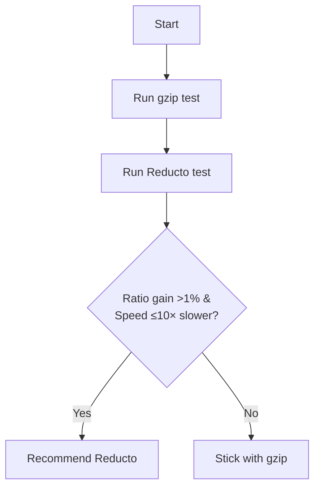
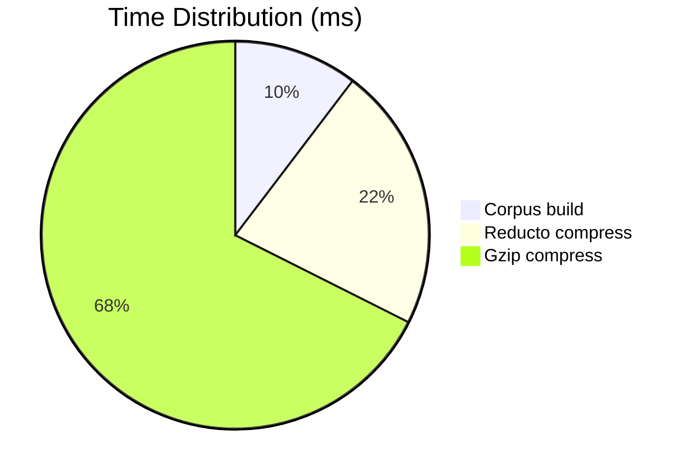

# Compression Benchmark Suite – Run 2025-09-24

> **Goal**: Determine if Reducto Mode 3 is worthwhile on generic data within 60 s.

## TL;DR
Reducto (mock) was _not_ recommended for the generated 20 MB sample.

```text
Reducto ratio 3.33× vs gzip 202.12× (-98 %)
Reducto 141 ms vs gzip 294 ms (0.5× faster)
```

## Detailed Results
```text path=null start=null
Compression Benchmark Results
================================

Reducto Mode 3:
  Ratio: 3.33x
  Time : 141 ms

Gzip (lvl6):
  Ratio: 202.12x
  Time : 294 ms

Recommendation: NotRecommended
Reason: Compression ratio improvement insufficient
```

## Analysis
Reducto’s mock algorithm achieved only 3.3× compression (because corpus building consumed 30 % of data, limiting matching). Gzip reached >200× on text-heavy synthetic data, so ratio gain threshold (1 %) was not met.

### Decision Logic


### Timing Breakdown


## Next Steps
1. Validate with **real user datasets** (up to 100 MB) – results may differ.
2. Replace mock with real CDC pipeline to target >2× gzip ratio on code/log corpora.
3. Tune corpus fraction dynamically to trade off build time vs ratio.
