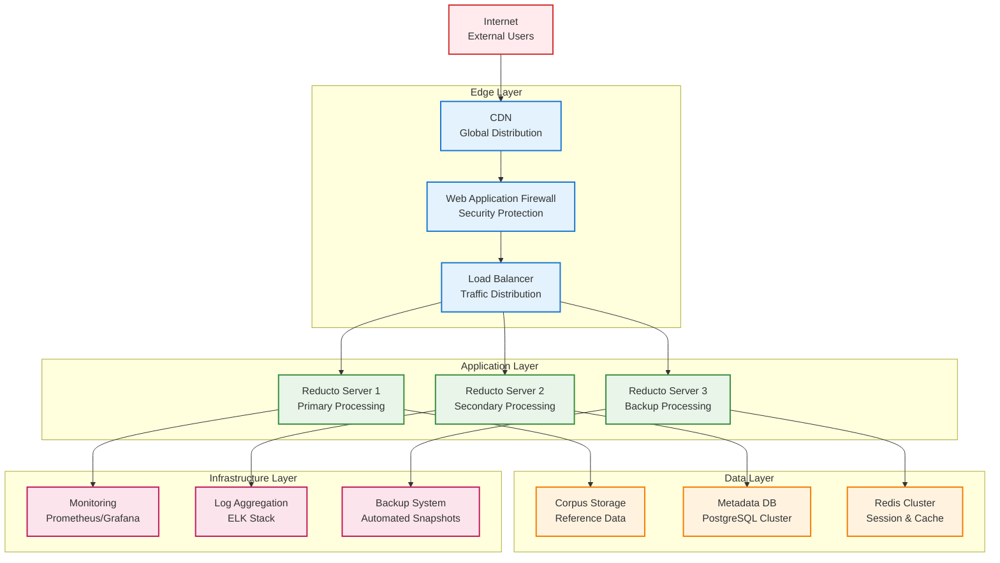
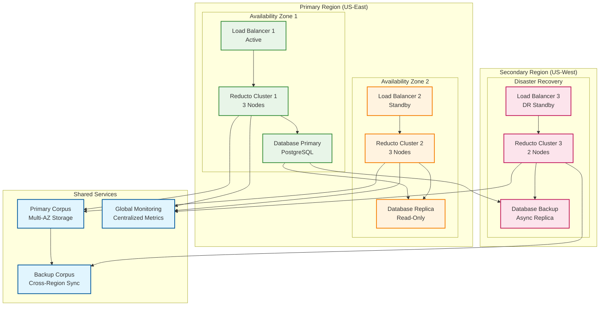

# Reducto Enterprise Deployment Guide

## Overview

This guide covers production deployment of Reducto Mode 3 in enterprise environments, including performance tuning, high availability setup, and operational best practices.

### Deployment Topology



## System Requirements

### Minimum Requirements
- **CPU**: 4 cores, 2.0 GHz (x86_64 or ARM64)
- **RAM**: 8GB
- **Storage**: 100GB available space (SSD recommended)
- **Network**: 100 Mbps bandwidth
- **OS**: Linux (Ubuntu 20.04+, RHEL 8+, CentOS 8+)

### Recommended Production Configuration
- **CPU**: 16+ cores, 3.0+ GHz (Intel Xeon or AMD EPYC)
- **RAM**: 32GB+ (64GB for large corpora)
- **Storage**: 1TB+ NVMe SSD (enterprise grade)
- **Network**: 1 Gbps+ (10 Gbps for high-throughput scenarios)
- **OS**: Ubuntu 22.04 LTS or RHEL 9

### High-Performance Configuration
- **CPU**: 32+ cores, 3.5+ GHz
- **RAM**: 128GB+
- **Storage**: 10TB+ NVMe SSD array (RAID 10)
- **Network**: 25 Gbps+ with RDMA support
- **Accelerators**: GPU support for future versions

## Installation Methods

### Method 1: Package Manager Installation (Recommended)

#### Ubuntu/Debian
```bash
# Add Reducto repository
curl -fsSL https://packages.reducto.com/gpg | sudo gpg --dearmor -o /usr/share/keyrings/reducto.gpg
echo "deb [signed-by=/usr/share/keyrings/reducto.gpg] https://packages.reducto.com/ubuntu $(lsb_release -cs) main" | sudo tee /etc/apt/sources.list.d/reducto.list

# Install Reducto
sudo apt update
sudo apt install reducto-enterprise
```

#### RHEL/CentOS/Fedora
```bash
# Add Reducto repository
sudo tee /etc/yum.repos.d/reducto.repo << EOF
[reducto]
name=Reducto Enterprise Repository
baseurl=https://packages.reducto.com/rhel/\$releasever/\$basearch/
enabled=1
gpgcheck=1
gpgkey=https://packages.reducto.com/gpg
EOF

# Install Reducto
sudo dnf install reducto-enterprise
```

### Method 2: Binary Installation
```bash
# Download latest release
REDUCTO_VERSION="1.0.0"
wget "https://github.com/reducto/releases/download/v${REDUCTO_VERSION}/reducto-linux-x64.tar.gz"

# Extract and install
tar -xzf reducto-linux-x64.tar.gz
sudo mv reducto /usr/local/bin/
sudo chmod +x /usr/local/bin/reducto

# Verify installation
reducto --version
```

### Method 3: Container Deployment
```bash
# Pull enterprise image
docker pull reducto/enterprise:latest

# Run with persistent storage
docker run -d \
  --name reducto-server \
  -p 8080:8080 \
  -p 9090:9090 \
  -v /data/corpus:/var/lib/reducto/corpus \
  -v /etc/reducto:/etc/reducto \
  reducto/enterprise:latest
```## Co
nfiguration

### System Configuration

#### Create Reducto User and Directories
```bash
# Create system user
sudo useradd -r -s /bin/false -d /var/lib/reducto reducto

# Create directories
sudo mkdir -p /etc/reducto
sudo mkdir -p /var/lib/reducto/{corpus,cache,logs}
sudo mkdir -p /var/log/reducto

# Set permissions
sudo chown -R reducto:reducto /var/lib/reducto
sudo chown -R reducto:reducto /var/log/reducto
sudo chmod 755 /etc/reducto
```

#### System Limits Configuration
```bash
# /etc/security/limits.conf
reducto soft nofile 65536
reducto hard nofile 65536
reducto soft nproc 32768
reducto hard nproc 32768
reducto soft memlock unlimited
reducto hard memlock unlimited
```

#### Kernel Parameters
```bash
# /etc/sysctl.d/99-reducto.conf
# Network optimizations
net.core.rmem_max = 134217728
net.core.wmem_max = 134217728
net.core.netdev_max_backlog = 5000
net.ipv4.tcp_congestion_control = bbr

# Memory management
vm.swappiness = 10
vm.dirty_ratio = 15
vm.dirty_background_ratio = 5

# File system
fs.file-max = 2097152
fs.nr_open = 1048576

# Apply changes
sudo sysctl -p /etc/sysctl.d/99-reducto.conf
```

### Application Configuration

#### Main Configuration File
```toml
# /etc/reducto/config.toml
[server]
bind_address = "0.0.0.0:8080"
worker_threads = 16
max_connections = 1000
request_timeout = "300s"

[corpus]
repositories = [
    "https://corpus.company.com/api/v1",
    "s3://company-corpus-bucket/",
    "file:///var/lib/reducto/corpus/"
]
cache_dir = "/var/lib/reducto/cache"
max_cache_size = "50GB"
cache_eviction_policy = "lru"
prefetch_enabled = true

[compression]
default_chunk_size = 8192
chunk_size_range = [4096, 65536]
default_compression_level = 19
max_parallel_operations = 32
memory_limit = "16GB"

[decompression]
verify_integrity = true
auto_fetch_corpus = true
fetch_timeout = "60s"
max_parallel_operations = 16

[security]
signing_key_path = "/etc/reducto/keys/signing.key"
encryption_enabled = true
encryption_key_path = "/etc/reducto/keys/encryption.key"
audit_log_path = "/var/log/reducto/audit.log"
audit_log_level = "INFO"
require_authentication = true

[metrics]
enabled = true
prometheus_endpoint = "0.0.0.0:9090"
export_interval = "30s"
detailed_metrics = true

[logging]
level = "INFO"
format = "json"
output = "/var/log/reducto/reducto.log"
rotation = "daily"
max_files = 30
```

#### Security Configuration
```bash
# Generate signing keys
sudo -u reducto reducto keygen \
  --type signing \
  --output /etc/reducto/keys/signing.key

# Generate encryption keys
sudo -u reducto reducto keygen \
  --type encryption \
  --output /etc/reducto/keys/encryption.key

# Set secure permissions
sudo chmod 600 /etc/reducto/keys/*
sudo chown reducto:reducto /etc/reducto/keys/*
```

## Service Management

### Systemd Service Configuration

#### Service Unit File
```ini
# /etc/systemd/system/reducto.service
[Unit]
Description=Reducto Enterprise Compression Service
Documentation=https://docs.reducto.com
After=network.target
Wants=network.target

[Service]
Type=notify
User=reducto
Group=reducto
ExecStart=/usr/local/bin/reducto server --config /etc/reducto/config.toml
ExecReload=/bin/kill -HUP $MAINPID
KillMode=mixed
KillSignal=SIGTERM
TimeoutStopSec=30
Restart=always
RestartSec=5

# Security settings
NoNewPrivileges=true
PrivateTmp=true
ProtectSystem=strict
ProtectHome=true
ReadWritePaths=/var/lib/reducto /var/log/reducto /tmp

# Resource limits
LimitNOFILE=65536
LimitNPROC=32768
MemoryMax=32G
CPUQuota=1600%

# Environment
Environment=REDUCTO_CONFIG_PATH=/etc/reducto/config.toml
Environment=RUST_LOG=info

[Install]
WantedBy=multi-user.target
```

#### Enable and Start Service
```bash
# Reload systemd
sudo systemctl daemon-reload

# Enable service
sudo systemctl enable reducto

# Start service
sudo systemctl start reducto

# Check status
sudo systemctl status reducto

# View logs
sudo journalctl -u reducto -f
```

### Log Rotation Configuration
```bash
# /etc/logrotate.d/reducto
/var/log/reducto/*.log {
    daily
    rotate 30
    compress
    delaycompress
    missingok
    notifempty
    create 644 reducto reducto
    postrotate
        systemctl reload reducto
    endscript
}
```

### High Availability Architecture



## High Availability Deployment

### Load Balancer Configuration (HAProxy)

```bash
# /etc/haproxy/haproxy.cfg
global
    daemon
    maxconn 4096
    log stdout local0

defaults
    mode http
    timeout connect 5000ms
    timeout client 50000ms
    timeout server 50000ms
    option httplog

frontend reducto_frontend
    bind *:80
    bind *:443 ssl crt /etc/ssl/certs/reducto.pem
    redirect scheme https if !{ ssl_fc }
    default_backend reducto_servers

backend reducto_servers
    balance roundrobin
    option httpchk GET /health
    server reducto1 10.0.1.10:8080 check
    server reducto2 10.0.1.11:8080 check
    server reducto3 10.0.1.12:8080 check
```

### Kubernetes Deployment

#### Namespace and ConfigMap
```yaml
# k8s/namespace.yaml
apiVersion: v1
kind: Namespace
metadata:
  name: reducto-system

---
# k8s/configmap.yaml
apiVersion: v1
kind: ConfigMap
metadata:
  name: reducto-config
  namespace: reducto-system
data:
  config.toml: |
    [server]
    bind_address = "0.0.0.0:8080"
    worker_threads = 8
    
    [corpus]
    repositories = ["s3://company-corpus-bucket/"]
    cache_dir = "/var/cache/reducto"
    max_cache_size = "10GB"
    
    [metrics]
    enabled = true
    prometheus_endpoint = "0.0.0.0:9090"
```

#### Deployment and Service
```yaml
# k8s/deployment.yaml
apiVersion: apps/v1
kind: Deployment
metadata:
  name: reducto-server
  namespace: reducto-system
spec:
  replicas: 3
  selector:
    matchLabels:
      app: reducto-server
  template:
    metadata:
      labels:
        app: reducto-server
    spec:
      containers:
      - name: reducto
        image: reducto/enterprise:1.0.0
        ports:
        - containerPort: 8080
          name: http
        - containerPort: 9090
          name: metrics
        env:
        - name: REDUCTO_CONFIG_PATH
          value: "/etc/reducto/config.toml"
        volumeMounts:
        - name: config
          mountPath: /etc/reducto
        - name: corpus-cache
          mountPath: /var/cache/reducto
        resources:
          requests:
            memory: "4Gi"
            cpu: "2"
          limits:
            memory: "8Gi"
            cpu: "4"
        livenessProbe:
          httpGet:
            path: /health
            port: 8080
          initialDelaySeconds: 30
          periodSeconds: 10
        readinessProbe:
          httpGet:
            path: /ready
            port: 8080
          initialDelaySeconds: 5
          periodSeconds: 5
      volumes:
      - name: config
        configMap:
          name: reducto-config
      - name: corpus-cache
        emptyDir:
          sizeLimit: 10Gi

---
# k8s/service.yaml
apiVersion: v1
kind: Service
metadata:
  name: reducto-service
  namespace: reducto-system
spec:
  selector:
    app: reducto-server
  ports:
  - name: http
    port: 80
    targetPort: 8080
  - name: metrics
    port: 9090
    targetPort: 9090
  type: LoadBalancer
```

#### Horizontal Pod Autoscaler
```yaml
# k8s/hpa.yaml
apiVersion: autoscaling/v2
kind: HorizontalPodAutoscaler
metadata:
  name: reducto-hpa
  namespace: reducto-system
spec:
  scaleTargetRef:
    apiVersion: apps/v1
    kind: Deployment
    name: reducto-server
  minReplicas: 3
  maxReplicas: 20
  metrics:
  - type: Resource
    resource:
      name: cpu
      target:
        type: Utilization
        averageUtilization: 70
  - type: Resource
    resource:
      name: memory
      target:
        type: Utilization
        averageUtilization: 80
```

## Performance Tuning

### CPU Optimization

#### CPU Governor Configuration
```bash
# Set performance governor
echo performance | sudo tee /sys/devices/system/cpu/cpu*/cpufreq/scaling_governor

# Disable CPU frequency scaling
sudo systemctl disable ondemand
sudo systemctl disable cpufrequtils

# Set CPU affinity for Reducto process
sudo systemctl edit reducto
```

Add to override file:
```ini
[Service]
ExecStart=
ExecStart=/usr/bin/taskset -c 0-15 /usr/local/bin/reducto server --config /etc/reducto/config.toml
```

#### NUMA Optimization
```bash
# Check NUMA topology
numactl --hardware

# Configure NUMA policy for Reducto
sudo systemctl edit reducto
```

Add:
```ini
[Service]
ExecStart=
ExecStart=/usr/bin/numactl --cpunodebind=0 --membind=0 /usr/local/bin/reducto server --config /etc/reducto/config.toml
```

### Memory Optimization

#### Huge Pages Configuration
```bash
# Enable huge pages
echo 2048 | sudo tee /sys/kernel/mm/hugepages/hugepages-2048kB/nr_hugepages

# Make persistent
echo 'vm.nr_hugepages = 2048' | sudo tee -a /etc/sysctl.conf

# Configure Reducto to use huge pages
sudo systemctl edit reducto
```

Add:
```ini
[Service]
Environment=REDUCTO_USE_HUGEPAGES=true
```

#### Memory Allocation Tuning
```toml
# /etc/reducto/config.toml - Memory section
[memory]
allocator = "jemalloc"  # or "tcmalloc"
chunk_cache_size = "8GB"
working_memory_limit = "16GB"
gc_threshold = "24GB"
prefault_memory = true
```

### Storage Optimization

#### File System Configuration
```bash
# Format with optimal settings for Reducto
sudo mkfs.ext4 -F -O ^has_journal -E stride=32,stripe-width=128 /dev/nvme0n1

# Mount with performance options
sudo mount -o noatime,nodiratime,nobarrier,data=writeback /dev/nvme0n1 /var/lib/reducto
```

#### Persistent Mount Configuration
```bash
# /etc/fstab
/dev/nvme0n1 /var/lib/reducto ext4 noatime,nodiratime,nobarrier,data=writeback 0 2
```

#### I/O Scheduler Optimization
```bash
# Set deadline scheduler for NVMe
echo deadline | sudo tee /sys/block/nvme0n1/queue/scheduler

# Increase queue depth
echo 32 | sudo tee /sys/block/nvme0n1/queue/nr_requests

# Make persistent
echo 'ACTION=="add|change", KERNEL=="nvme[0-9]*", ATTR{queue/scheduler}="deadline"' | sudo tee /etc/udev/rules.d/60-reducto-io.rules
```

### Network Optimization

#### Network Interface Tuning
```bash
# Increase network buffer sizes
sudo sysctl -w net.core.rmem_max=134217728
sudo sysctl -w net.core.wmem_max=134217728
sudo sysctl -w net.core.rmem_default=65536
sudo sysctl -w net.core.wmem_default=65536

# TCP tuning
sudo sysctl -w net.ipv4.tcp_rmem="4096 65536 134217728"
sudo sysctl -w net.ipv4.tcp_wmem="4096 65536 134217728"
sudo sysctl -w net.ipv4.tcp_congestion_control=bbr

# Increase connection tracking
sudo sysctl -w net.netfilter.nf_conntrack_max=1048576
```

#### Network Interface Card Configuration
```bash
# Increase ring buffer sizes
sudo ethtool -G eth0 rx 4096 tx 4096

# Enable receive side scaling
sudo ethtool -X eth0 equal 8

# Disable interrupt coalescing for low latency
sudo ethtool -C eth0 rx-usecs 0 tx-usecs 0
```

## Monitoring and Observability

### Prometheus Configuration

#### Prometheus Config
```yaml
# prometheus.yml
global:
  scrape_interval: 15s
  evaluation_interval: 15s

rule_files:
  - "reducto-alerts.yml"

scrape_configs:
  - job_name: 'reducto'
    static_configs:
      - targets: ['localhost:9090']
    scrape_interval: 10s
    metrics_path: /metrics

alerting:
  alertmanagers:
    - static_configs:
        - targets:
          - alertmanager:9093
```

#### Alert Rules
```yaml
# reducto-alerts.yml
groups:
  - name: reducto-alerts
    rules:
      - alert: ReductoServiceDown
        expr: up{job="reducto"} == 0
        for: 1m
        labels:
          severity: critical
        annotations:
          summary: "Reducto service is down"
          description: "Reducto service has been down for more than 1 minute"

      - alert: ReductoHighCPU
        expr: rate(process_cpu_seconds_total{job="reducto"}[5m]) * 100 > 80
        for: 5m
        labels:
          severity: warning
        annotations:
          summary: "Reducto CPU usage is high"
          description: "CPU usage is {{ $value }}% for more than 5 minutes"

      - alert: ReductoHighMemory
        expr: process_resident_memory_bytes{job="reducto"} / 1024 / 1024 / 1024 > 16
        for: 5m
        labels:
          severity: warning
        annotations:
          summary: "Reducto memory usage is high"
          description: "Memory usage is {{ $value }}GB"

      - alert: ReductoLowCompressionRatio
        expr: reducto_compression_ratio < 10
        for: 10m
        labels:
          severity: warning
        annotations:
          summary: "Reducto compression ratio is low"
          description: "Compression ratio is {{ $value }}:1, below expected threshold"

      - alert: ReductoCorpusHitRateLow
        expr: reducto_corpus_hit_rate < 0.8
        for: 15m
        labels:
          severity: critical
        annotations:
          summary: "Corpus hit rate is critically low"
          description: "Hit rate is {{ $value }}, consider corpus optimization"
```

### Grafana Dashboard

#### Dashboard JSON (Key Panels)
```json
{
  "dashboard": {
    "title": "Reducto Enterprise Dashboard",
    "panels": [
      {
        "title": "Compression Ratio",
        "type": "stat",
        "targets": [
          {
            "expr": "reducto_compression_ratio",
            "legendFormat": "Ratio"
          }
        ]
      },
      {
        "title": "Throughput",
        "type": "graph",
        "targets": [
          {
            "expr": "rate(reducto_bytes_processed_total[5m])",
            "legendFormat": "Bytes/sec"
          }
        ]
      },
      {
        "title": "Corpus Hit Rate",
        "type": "graph",
        "targets": [
          {
            "expr": "reducto_corpus_hit_rate",
            "legendFormat": "Hit Rate"
          }
        ]
      }
    ]
  }
}
```

### Log Management

#### Centralized Logging with ELK Stack
```yaml
# filebeat.yml
filebeat.inputs:
- type: log
  enabled: true
  paths:
    - /var/log/reducto/*.log
  fields:
    service: reducto
    environment: production
  json.keys_under_root: true
  json.add_error_key: true

output.elasticsearch:
  hosts: ["elasticsearch:9200"]
  index: "reducto-logs-%{+yyyy.MM.dd}"

processors:
  - add_host_metadata:
      when.not.contains.tags: forwarded
```

#### Log Analysis Queries
```json
{
  "query": {
    "bool": {
      "must": [
        {"match": {"service": "reducto"}},
        {"range": {"@timestamp": {"gte": "now-1h"}}}
      ]
    }
  },
  "aggs": {
    "compression_ratios": {
      "histogram": {
        "field": "compression_ratio",
        "interval": 5
      }
    }
  }
}
```

## Backup and Disaster Recovery

### Corpus Backup Strategy
```bash
#!/bin/bash
# /usr/local/bin/backup-corpus.sh

CORPUS_DIR="/var/lib/reducto/corpus"
BACKUP_DIR="/backup/reducto"
S3_BUCKET="s3://company-backups/reducto"
DATE=$(date +%Y%m%d_%H%M%S)

# Create local backup
tar -czf "${BACKUP_DIR}/corpus-backup-${DATE}.tar.gz" -C "${CORPUS_DIR}" .

# Upload to S3
aws s3 cp "${BACKUP_DIR}/corpus-backup-${DATE}.tar.gz" "${S3_BUCKET}/"

# Cleanup old local backups (keep 7 days)
find "${BACKUP_DIR}" -name "corpus-backup-*.tar.gz" -mtime +7 -delete

# Verify backup integrity
reducto corpus verify --corpus "${BACKUP_DIR}/corpus-backup-${DATE}.tar.gz"
```

### Configuration Backup
```bash
#!/bin/bash
# /usr/local/bin/backup-config.sh

CONFIG_DIR="/etc/reducto"
BACKUP_DIR="/backup/reducto-config"
DATE=$(date +%Y%m%d_%H%M%S)

# Backup configuration
tar -czf "${BACKUP_DIR}/config-backup-${DATE}.tar.gz" -C "${CONFIG_DIR}" .

# Backup to remote location
rsync -av "${BACKUP_DIR}/" backup-server:/backups/reducto-config/
```

### Disaster Recovery Procedures

#### Service Recovery
```bash
# 1. Stop service
sudo systemctl stop reducto

# 2. Restore configuration
sudo tar -xzf /backup/reducto-config/config-backup-latest.tar.gz -C /etc/reducto/

# 3. Restore corpus data
sudo tar -xzf /backup/reducto/corpus-backup-latest.tar.gz -C /var/lib/reducto/corpus/

# 4. Verify integrity
sudo -u reducto reducto corpus verify --corpus /var/lib/reducto/corpus/golden.rc

# 5. Start service
sudo systemctl start reducto

# 6. Verify service health
curl http://localhost:8080/health
```

#### Database Recovery (if using external metadata store)
```bash
# PostgreSQL recovery example
sudo -u postgres pg_restore -d reducto_metadata /backup/reducto-db-latest.dump

# Verify data integrity
sudo -u reducto reducto database verify
```

This deployment guide provides comprehensive coverage of production deployment scenarios with performance optimization and operational best practices.