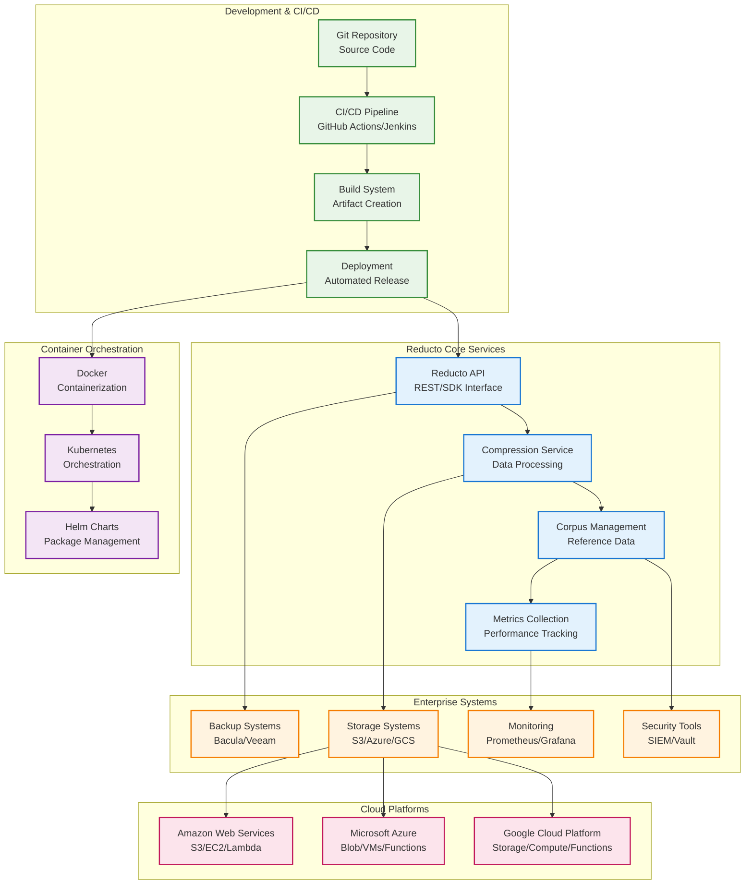
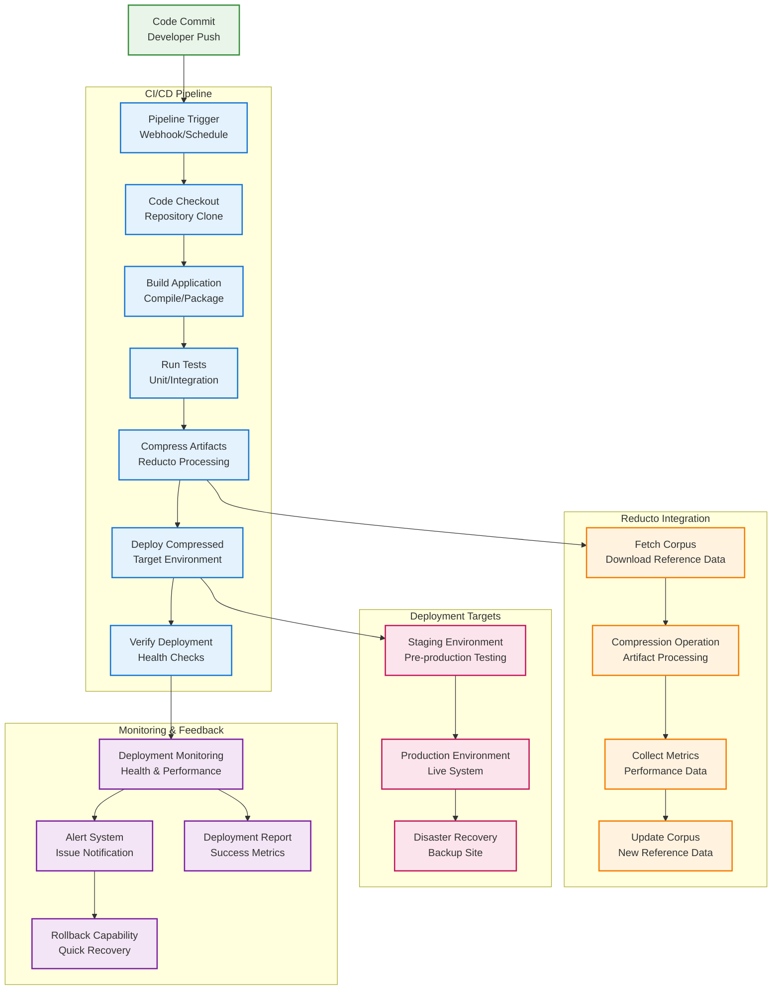

# Reducto Enterprise Integration Guide

## Overview

This guide provides comprehensive integration patterns for Reducto with common enterprise tools and workflows, including CI/CD pipelines, backup systems, cloud platforms, and monitoring solutions.

### Integration Architecture



### CI/CD Integration Flow



## CI/CD Pipeline Integration

### GitHub Actions Integration

#### Basic Workflow
```yaml
# .github/workflows/deploy-with-reducto.yml
name: Deploy with Reducto Compression

on:
  push:
    branches: [main, develop]
  pull_request:
    branches: [main]

env:
  REDUCTO_VERSION: "1.0.0"
  CORPUS_REPOSITORY: "https://corpus.company.com"

jobs:
  compress-and-deploy:
    runs-on: ubuntu-latest
    
    steps:
    - name: Checkout code
      uses: actions/checkout@v4
      
    - name: Install Reducto
      run: |
        wget "https://github.com/reducto/releases/download/v${REDUCTO_VERSION}/reducto-linux-x64.tar.gz"
        tar -xzf reducto-linux-x64.tar.gz
        sudo mv reducto /usr/local/bin/
        reducto --version
        
    - name: Configure Reducto
      run: |
        mkdir -p ~/.config/reducto
        cat > ~/.config/reducto/config.toml << EOF
        [corpus]
        repositories = ["${{ env.CORPUS_REPOSITORY }}"]
        cache_dir = "/tmp/reducto-cache"
        
        [compression]
        default_chunk_size = 8192
        default_compression_level = 19
        EOF
        
    - name: Build application artifacts
      run: |
        npm ci
        npm run build
        
    - name: Compress build artifacts
      run: |
        reducto compress \
          --input dist/ \
          --corpus-id "webapp-v1" \
          --output build-artifacts.reducto \
          --metrics \
          --report-format json > compression-report.json
          
    - name: Upload compression metrics
      uses: actions/upload-artifact@v3
      with:
        name: compression-metrics
        path: compression-report.json
        
    - name: Deploy compressed artifacts
      run: |
        # Upload to deployment server
        scp build-artifacts.reducto deploy@${{ secrets.DEPLOY_SERVER }}:/tmp/
        
        # Decompress on target server
        ssh deploy@${{ secrets.DEPLOY_SERVER }} '
          reducto decompress \
            --input /tmp/build-artifacts.reducto \
            --output /var/www/html/ \
            --verify
        '
        
    - name: Verify deployment
      run: |
        curl -f http://${{ secrets.DEPLOY_SERVER }}/health
```

#### Advanced Workflow with Matrix Strategy
```yaml
# .github/workflows/multi-environment-deploy.yml
name: Multi-Environment Deployment

on:
  workflow_dispatch:
    inputs:
      environment:
        description: 'Target environment'
        required: true
        default: 'staging'
        type: choice
        options:
        - staging
        - production

jobs:
  compress-artifacts:
    runs-on: ubuntu-latest
    strategy:
      matrix:
        artifact-type: [webapp, api, worker]
        
    steps:
    - uses: actions/checkout@v4
    
    - name: Setup Reducto
      uses: ./.github/actions/setup-reducto
      with:
        version: ${{ env.REDUCTO_VERSION }}
        
    - name: Build ${{ matrix.artifact-type }}
      run: |
        cd ${{ matrix.artifact-type }}
        make build
        
    - name: Compress with environment-specific corpus
      run: |
        reducto compress \
          --input ${{ matrix.artifact-type }}/dist \
          --corpus-id "${{ matrix.artifact-type }}-${{ github.event.inputs.environment }}" \
          --output ${{ matrix.artifact-type }}.reducto \
          --compression-level 22 \
          --parallel 4
          
    - name: Upload artifact
      uses: actions/upload-artifact@v3
      with:
        name: ${{ matrix.artifact-type }}-compressed
        path: ${{ matrix.artifact-type }}.reducto
        
  deploy:
    needs: compress-artifacts
    runs-on: ubuntu-latest
    environment: ${{ github.event.inputs.environment }}
    
    steps:
    - name: Download all artifacts
      uses: actions/download-artifact@v3
      
    - name: Deploy to ${{ github.event.inputs.environment }}
      run: |
        for artifact in webapp api worker; do
          scp ${artifact}-compressed/${artifact}.reducto \
            deploy@${{ secrets.DEPLOY_SERVER }}:/tmp/
            
          ssh deploy@${{ secrets.DEPLOY_SERVER }} "
            reducto decompress \
              --input /tmp/${artifact}.reducto \
              --output /opt/${artifact}/ \
              --verify \
              --auto-fetch-corpus
          "
        done
```

### GitLab CI Integration

#### Pipeline Configuration
```yaml
# .gitlab-ci.yml
stages:
  - build
  - compress
  - deploy
  - verify

variables:
  REDUCTO_VERSION: "1.0.0"
  CORPUS_REPOSITORY: "https://corpus.company.com"
  DOCKER_DRIVER: overlay2

before_script:
  - apt-get update -qq && apt-get install -y -qq wget curl
  - wget "https://github.com/reducto/releases/download/v${REDUCTO_VERSION}/reducto-linux-x64.tar.gz"
  - tar -xzf reducto-linux-x64.tar.gz && mv reducto /usr/local/bin/

build-application:
  stage: build
  script:
    - npm ci
    - npm run build
    - npm run test
  artifacts:
    paths:
      - dist/
    expire_in: 1 hour

compress-artifacts:
  stage: compress
  dependencies:
    - build-application
  script:
    - |
      reducto compress \
        --input dist/ \
        --corpus-id "webapp-${CI_COMMIT_REF_SLUG}" \
        --output webapp-${CI_COMMIT_SHA}.reducto \
        --metrics \
        --report-format json > compression-metrics.json
    - |
      echo "Compression completed:"
      cat compression-metrics.json | jq '.compression_ratio'
  artifacts:
    paths:
      - webapp-${CI_COMMIT_SHA}.reducto
      - compression-metrics.json
    expire_in: 1 day

deploy-staging:
  stage: deploy
  environment:
    name: staging
    url: https://staging.company.com
  dependencies:
    - compress-artifacts
  script:
    - |
      scp webapp-${CI_COMMIT_SHA}.reducto staging@${STAGING_SERVER}:/tmp/
      ssh staging@${STAGING_SERVER} "
        reducto decompress \
          --input /tmp/webapp-${CI_COMMIT_SHA}.reducto \
          --output /var/www/staging/ \
          --verify \
          --backup-existing
      "
  only:
    - develop

deploy-production:
  stage: deploy
  environment:
    name: production
    url: https://company.com
  dependencies:
    - compress-artifacts
  script:
    - |
      # Deploy to multiple production servers
      for server in ${PRODUCTION_SERVERS}; do
        scp webapp-${CI_COMMIT_SHA}.reducto prod@${server}:/tmp/
        ssh prod@${server} "
          reducto decompress \
            --input /tmp/webapp-${CI_COMMIT_SHA}.reducto \
            --output /var/www/production/ \
            --verify \
            --atomic-deployment
        "
      done
  when: manual
  only:
    - main

verify-deployment:
  stage: verify
  script:
    - |
      for url in ${DEPLOYMENT_URLS}; do
        curl -f ${url}/health || exit 1
        curl -f ${url}/api/status || exit 1
      done
    - echo "All deployments verified successfully"
```

### Jenkins Pipeline Integration

#### Declarative Pipeline
```groovy
// Jenkinsfile
pipeline {
    agent any
    
    environment {
        REDUCTO_VERSION = '1.0.0'
        CORPUS_REPOSITORY = 'https://corpus.company.com'
        REDUCTO_CONFIG = credentials('reducto-config')
    }
    
    stages {
        stage('Setup') {
            steps {
                script {
                    // Install Reducto
                    sh '''
                        wget "https://github.com/reducto/releases/download/v${REDUCTO_VERSION}/reducto-linux-x64.tar.gz"
                        tar -xzf reducto-linux-x64.tar.gz
                        sudo mv reducto /usr/local/bin/
                        reducto --version
                    '''
                    
                    // Configure Reducto
                    sh '''
                        mkdir -p ~/.config/reducto
                        cp ${REDUCTO_CONFIG} ~/.config/reducto/config.toml
                    '''
                }
            }
        }
        
        stage('Build') {
            parallel {
                stage('Frontend') {
                    steps {
                        dir('frontend') {
                            sh 'npm ci && npm run build'
                        }
                    }
                }
                stage('Backend') {
                    steps {
                        dir('backend') {
                            sh 'mvn clean package -DskipTests'
                        }
                    }
                }
            }
        }
        
        stage('Compress') {
            steps {
                script {
                    // Compress frontend
                    sh '''
                        reducto compress \
                            --input frontend/dist \
                            --corpus-id "frontend-v1" \
                            --output frontend-${BUILD_NUMBER}.reducto \
                            --metrics > frontend-metrics.json
                    '''
                    
                    // Compress backend
                    sh '''
                        reducto compress \
                            --input backend/target \
                            --corpus-id "backend-v1" \
                            --output backend-${BUILD_NUMBER}.reducto \
                            --metrics > backend-metrics.json
                    '''
                    
                    // Archive compression metrics
                    archiveArtifacts artifacts: '*-metrics.json', fingerprint: true
                    
                    // Parse and display metrics
                    def frontendMetrics = readJSON file: 'frontend-metrics.json'
                    def backendMetrics = readJSON file: 'backend-metrics.json'
                    
                    echo "Frontend compression ratio: ${frontendMetrics.compression_ratio}:1"
                    echo "Backend compression ratio: ${backendMetrics.compression_ratio}:1"
                }
            }
        }
        
        stage('Deploy') {
            when {
                anyOf {
                    branch 'main'
                    branch 'develop'
                }
            }
            steps {
                script {
                    def environment = env.BRANCH_NAME == 'main' ? 'production' : 'staging'
                    def servers = env.BRANCH_NAME == 'main' ? 
                        ['prod1.company.com', 'prod2.company.com'] : 
                        ['staging.company.com']
                    
                    servers.each { server ->
                        sh """
                            scp frontend-${BUILD_NUMBER}.reducto deploy@${server}:/tmp/
                            scp backend-${BUILD_NUMBER}.reducto deploy@${server}:/tmp/
                            
                            ssh deploy@${server} '
                                reducto decompress \
                                    --input /tmp/frontend-${BUILD_NUMBER}.reducto \
                                    --output /var/www/${environment}/frontend/ \
                                    --verify
                                    
                                reducto decompress \
                                    --input /tmp/backend-${BUILD_NUMBER}.reducto \
                                    --output /opt/${environment}/backend/ \
                                    --verify
                                    
                                systemctl restart ${environment}-backend
                            '
                        """
                    }
                }
            }
        }
        
        stage('Verify') {
            steps {
                script {
                    def environment = env.BRANCH_NAME == 'main' ? 'production' : 'staging'
                    def baseUrl = env.BRANCH_NAME == 'main' ? 
                        'https://api.company.com' : 
                        'https://staging-api.company.com'
                    
                    // Health check
                    sh "curl -f ${baseUrl}/health"
                    
                    // Functional tests
                    sh "curl -f ${baseUrl}/api/status"
                    
                    echo "Deployment to ${environment} verified successfully"
                }
            }
        }
    }
    
    post {
        always {
            // Clean up temporary files
            sh 'rm -f *.reducto *.json'
        }
        success {
            // Notify success
            slackSend(
                channel: '#deployments',
                color: 'good',
                message: "✅ Deployment successful: ${env.JOB_NAME} #${env.BUILD_NUMBER}"
            )
        }
        failure {
            // Notify failure
            slackSend(
                channel: '#deployments',
                color: 'danger',
                message: "❌ Deployment failed: ${env.JOB_NAME} #${env.BUILD_NUMBER}"
            )
        }
    }
}
```

## Container and Orchestration Integration

### Docker Integration

#### Multi-stage Dockerfile with Reducto
```dockerfile
# Dockerfile
FROM node:18-alpine AS builder
WORKDIR /app
COPY package*.json ./
RUN npm ci --only=production

COPY . .
RUN npm run build

# Reducto compression stage
FROM reducto/enterprise:latest AS compressor
COPY --from=builder /app/dist /data/
RUN reducto compress \
    --input /data \
    --corpus-id "webapp-docker-v1" \
    --output /compressed.reducto \
    --compression-level 22

# Final runtime stage
FROM nginx:alpine
COPY --from=compressor /compressed.reducto /tmp/
RUN apk add --no-cache curl && \
    curl -L "https://github.com/reducto/releases/latest/download/reducto-linux-musl.tar.gz" | \
    tar -xz -C /usr/local/bin/ && \
    reducto decompress \
        --input /tmp/compressed.reducto \
        --output /usr/share/nginx/html/ && \
    rm /tmp/compressed.reducto /usr/local/bin/reducto

EXPOSE 80
CMD ["nginx", "-g", "daemon off;"]
```

#### Docker Compose with Reducto Service
```yaml
# docker-compose.yml
version: '3.8'

services:
  reducto-server:
    image: reducto/enterprise:latest
    container_name: reducto-server
    ports:
      - "8080:8080"
      - "9090:9090"
    volumes:
      - ./config/reducto.toml:/etc/reducto/config.toml:ro
      - reducto-corpus:/var/lib/reducto/corpus
      - reducto-cache:/var/cache/reducto
    environment:
      - REDUCTO_CONFIG_PATH=/etc/reducto/config.toml
      - RUST_LOG=info
    healthcheck:
      test: ["CMD", "curl", "-f", "http://localhost:8080/health"]
      interval: 30s
      timeout: 10s
      retries: 3
    restart: unless-stopped

  webapp:
    build:
      context: .
      dockerfile: Dockerfile
    depends_on:
      reducto-server:
        condition: service_healthy
    ports:
      - "80:80"
    environment:
      - REDUCTO_SERVER=http://reducto-server:8080

  prometheus:
    image: prom/prometheus:latest
    ports:
      - "9091:9090"
    volumes:
      - ./monitoring/prometheus.yml:/etc/prometheus/prometheus.yml:ro
    command:
      - '--config.file=/etc/prometheus/prometheus.yml'
      - '--storage.tsdb.path=/prometheus'
      - '--web.console.libraries=/etc/prometheus/console_libraries'
      - '--web.console.templates=/etc/prometheus/consoles'

volumes:
  reducto-corpus:
  reducto-cache:
```

### Kubernetes Integration

#### Deployment Configuration
```yaml
# k8s/reducto-deployment.yaml
apiVersion: apps/v1
kind: Deployment
metadata:
  name: reducto-server
  namespace: reducto-system
  labels:
    app: reducto-server
    version: v1.0.0
spec:
  replicas: 3
  selector:
    matchLabels:
      app: reducto-server
  template:
    metadata:
      labels:
        app: reducto-server
        version: v1.0.0
      annotations:
        prometheus.io/scrape: "true"
        prometheus.io/port: "9090"
        prometheus.io/path: "/metrics"
    spec:
      serviceAccountName: reducto-service-account
      securityContext:
        runAsNonRoot: true
        runAsUser: 1000
        fsGroup: 1000
      containers:
      - name: reducto
        image: reducto/enterprise:1.0.0
        imagePullPolicy: IfNotPresent
        ports:
        - containerPort: 8080
          name: http
          protocol: TCP
        - containerPort: 9090
          name: metrics
          protocol: TCP
        env:
        - name: REDUCTO_CONFIG_PATH
          value: "/etc/reducto/config.toml"
        - name: RUST_LOG
          value: "info"
        - name: RUST_BACKTRACE
          value: "1"
        volumeMounts:
        - name: config
          mountPath: /etc/reducto
          readOnly: true
        - name: corpus-storage
          mountPath: /var/lib/reducto/corpus
        - name: cache-storage
          mountPath: /var/cache/reducto
        - name: keys
          mountPath: /etc/reducto/keys
          readOnly: true
        resources:
          requests:
            memory: "4Gi"
            cpu: "2"
          limits:
            memory: "8Gi"
            cpu: "4"
        livenessProbe:
          httpGet:
            path: /health
            port: http
          initialDelaySeconds: 30
          periodSeconds: 10
          timeoutSeconds: 5
          failureThreshold: 3
        readinessProbe:
          httpGet:
            path: /ready
            port: http
          initialDelaySeconds: 5
          periodSeconds: 5
          timeoutSeconds: 3
          failureThreshold: 3
        startupProbe:
          httpGet:
            path: /health
            port: http
          initialDelaySeconds: 10
          periodSeconds: 10
          timeoutSeconds: 5
          failureThreshold: 30
      volumes:
      - name: config
        configMap:
          name: reducto-config
      - name: corpus-storage
        persistentVolumeClaim:
          claimName: reducto-corpus-pvc
      - name: cache-storage
        emptyDir:
          sizeLimit: 10Gi
      - name: keys
        secret:
          secretName: reducto-keys
          defaultMode: 0600
      nodeSelector:
        node-type: compute-optimized
      tolerations:
      - key: "compute-optimized"
        operator: "Equal"
        value: "true"
        effect: "NoSchedule"

---
# Service configuration
apiVersion: v1
kind: Service
metadata:
  name: reducto-service
  namespace: reducto-system
  labels:
    app: reducto-server
spec:
  type: ClusterIP
  ports:
  - port: 80
    targetPort: http
    protocol: TCP
    name: http
  - port: 9090
    targetPort: metrics
    protocol: TCP
    name: metrics
  selector:
    app: reducto-server

---
# Ingress configuration
apiVersion: networking.k8s.io/v1
kind: Ingress
metadata:
  name: reducto-ingress
  namespace: reducto-system
  annotations:
    kubernetes.io/ingress.class: nginx
    cert-manager.io/cluster-issuer: letsencrypt-prod
    nginx.ingress.kubernetes.io/ssl-redirect: "true"
    nginx.ingress.kubernetes.io/proxy-body-size: "10g"
    nginx.ingress.kubernetes.io/proxy-read-timeout: "300"
    nginx.ingress.kubernetes.io/proxy-send-timeout: "300"
spec:
  tls:
  - hosts:
    - reducto.company.com
    secretName: reducto-tls
  rules:
  - host: reducto.company.com
    http:
      paths:
      - path: /
        pathType: Prefix
        backend:
          service:
            name: reducto-service
            port:
              number: 80
```

#### Horizontal Pod Autoscaler
```yaml
# k8s/hpa.yaml
apiVersion: autoscaling/v2
kind: HorizontalPodAutoscaler
metadata:
  name: reducto-hpa
  namespace: reducto-system
spec:
  scaleTargetRef:
    apiVersion: apps/v1
    kind: Deployment
    name: reducto-server
  minReplicas: 3
  maxReplicas: 20
  metrics:
  - type: Resource
    resource:
      name: cpu
      target:
        type: Utilization
        averageUtilization: 70
  - type: Resource
    resource:
      name: memory
      target:
        type: Utilization
        averageUtilization: 80
  - type: Pods
    pods:
      metric:
        name: reducto_active_compressions
      target:
        type: AverageValue
        averageValue: "10"
  behavior:
    scaleDown:
      stabilizationWindowSeconds: 300
      policies:
      - type: Percent
        value: 10
        periodSeconds: 60
    scaleUp:
      stabilizationWindowSeconds: 60
      policies:
      - type: Percent
        value: 50
        periodSeconds: 60
      - type: Pods
        value: 2
        periodSeconds: 60
      selectPolicy: Max
```

## Backup System Integration

### Rsync Integration

#### Enhanced Backup Script
```bash
#!/bin/bash
# /usr/local/bin/reducto-backup.sh

set -euo pipefail

# Configuration
SOURCE_DIR="/data/important"
BACKUP_SERVER="backup.company.com"
BACKUP_USER="backup"
CORPUS_PATH="/etc/reducto/corpus/backup-corpus.rc"
TEMP_DIR="/tmp/reducto-backup-$$"
LOG_FILE="/var/log/reducto/backup.log"
RETENTION_DAYS=30

# Logging function
log() {
    echo "$(date '+%Y-%m-%d %H:%M:%S') - $1" | tee -a "$LOG_FILE"
}

# Cleanup function
cleanup() {
    rm -rf "$TEMP_DIR"
}
trap cleanup EXIT

# Create temporary directory
mkdir -p "$TEMP_DIR"

log "Starting Reducto backup process"

# Compress data with Reducto
log "Compressing data with Reducto"
reducto compress \
    --input "$SOURCE_DIR" \
    --corpus "$CORPUS_PATH" \
    --output "$TEMP_DIR/backup-$(date +%Y%m%d_%H%M%S).reducto" \
    --compression-level 22 \
    --parallel 8 \
    --metrics > "$TEMP_DIR/compression-metrics.json"

# Log compression metrics
COMPRESSION_RATIO=$(jq -r '.compression_ratio' "$TEMP_DIR/compression-metrics.json")
ORIGINAL_SIZE=$(jq -r '.original_size' "$TEMP_DIR/compression-metrics.json")
COMPRESSED_SIZE=$(jq -r '.compressed_size' "$TEMP_DIR/compression-metrics.json")

log "Compression completed - Ratio: ${COMPRESSION_RATIO}:1, Original: ${ORIGINAL_SIZE} bytes, Compressed: ${COMPRESSED_SIZE} bytes"

# Transfer to backup server
log "Transferring compressed backup to server"
rsync -avz --progress \
    --timeout=3600 \
    --partial \
    --inplace \
    "$TEMP_DIR"/*.reducto \
    "${BACKUP_USER}@${BACKUP_SERVER}:/backups/reducto/"

# Verify transfer
log "Verifying backup integrity on remote server"
ssh "${BACKUP_USER}@${BACKUP_SERVER}" \
    "reducto verify --input /backups/reducto/backup-$(date +%Y%m%d_%H%M%S).reducto"

# Cleanup old backups
log "Cleaning up old backups (retention: ${RETENTION_DAYS} days)"
ssh "${BACKUP_USER}@${BACKUP_SERVER}" \
    "find /backups/reducto/ -name 'backup-*.reducto' -mtime +${RETENTION_DAYS} -delete"

# Update backup corpus if needed
log "Checking if corpus update is needed"
CORPUS_AGE=$(find "$CORPUS_PATH" -mtime +7 | wc -l)
if [ "$CORPUS_AGE" -gt 0 ]; then
    log "Updating backup corpus (older than 7 days)"
    reducto corpus build \
        --input "$SOURCE_DIR" \
        --output "$CORPUS_PATH.new" \
        --optimize \
        --parallel 8
    
    mv "$CORPUS_PATH.new" "$CORPUS_PATH"
    log "Corpus updated successfully"
fi

log "Backup process completed successfully"

# Send notification
if command -v mail >/dev/null 2>&1; then
    echo "Backup completed successfully. Compression ratio: ${COMPRESSION_RATIO}:1" | \
        mail -s "Reducto Backup Success - $(hostname)" admin@company.com
fi
```

### Bacula Integration

#### Bacula Job Configuration
```bash
# /etc/bacula/bacula-dir.conf

Job {
  Name = "ReductoBackup"
  Type = Backup
  Level = Incremental
  Client = reducto-client
  FileSet = "ReductoFileSet"
  Schedule = "WeeklyCycle"
  Storage = File
  Messages = Standard
  Pool = File
  Priority = 10
  Write Bootstrap = "/var/lib/bacula/ReductoBackup.bsr"
  
  # Pre-job script to compress with Reducto
  RunBeforeJob = "/usr/local/bin/bacula-reducto-compress.sh"
  
  # Post-job script to cleanup
  RunAfterJob = "/usr/local/bin/bacula-reducto-cleanup.sh"
}

FileSet {
  Name = "ReductoFileSet"
  Include {
    Options {
      signature = MD5
      compression = GZIP
    }
    File = /tmp/bacula-reducto
  }
}
```

#### Bacula Pre-job Script
```bash
#!/bin/bash
# /usr/local/bin/bacula-reducto-compress.sh

BACKUP_DIR="/tmp/bacula-reducto"
SOURCE_DIRS=("/data/databases" "/data/files" "/data/logs")
CORPUS_PATH="/etc/reducto/corpus/bacula-corpus.rc"

# Create backup directory
mkdir -p "$BACKUP_DIR"

# Compress each source directory
for dir in "${SOURCE_DIRS[@]}"; do
    if [ -d "$dir" ]; then
        basename=$(basename "$dir")
        reducto compress \
            --input "$dir" \
            --corpus "$CORPUS_PATH" \
            --output "$BACKUP_DIR/${basename}.reducto" \
            --compression-level 19
    fi
done

exit 0
```

## Cloud Platform Integration

### AWS Integration

#### S3 Backup with Reducto
```bash
#!/bin/bash
# /usr/local/bin/aws-s3-reducto-backup.sh

set -euo pipefail

# Configuration
AWS_PROFILE="backup"
S3_BUCKET="company-backups-reducto"
SOURCE_DIR="/data/production"
CORPUS_S3_PATH="s3://${S3_BUCKET}/corpus/production-corpus.rc"
LOCAL_CORPUS="/tmp/production-corpus.rc"

# Download corpus from S3
aws s3 cp "$CORPUS_S3_PATH" "$LOCAL_CORPUS" --profile "$AWS_PROFILE"

# Compress data
BACKUP_FILE="backup-$(date +%Y%m%d_%H%M%S).reducto"
reducto compress \
    --input "$SOURCE_DIR" \
    --corpus "$LOCAL_CORPUS" \
    --output "/tmp/$BACKUP_FILE" \
    --compression-level 22 \
    --parallel 8

# Upload to S3 with server-side encryption
aws s3 cp "/tmp/$BACKUP_FILE" "s3://${S3_BUCKET}/backups/" \
    --profile "$AWS_PROFILE" \
    --server-side-encryption AES256 \
    --storage-class STANDARD_IA

# Set lifecycle policy for cost optimization
aws s3api put-object-lifecycle-configuration \
    --bucket "$S3_BUCKET" \
    --profile "$AWS_PROFILE" \
    --lifecycle-configuration file:///etc/reducto/s3-lifecycle.json

# Cleanup
rm -f "/tmp/$BACKUP_FILE" "$LOCAL_CORPUS"

echo "Backup uploaded to s3://${S3_BUCKET}/backups/$BACKUP_FILE"
```

#### S3 Lifecycle Policy
```json
{
  "Rules": [
    {
      "ID": "ReductoBackupLifecycle",
      "Status": "Enabled",
      "Filter": {
        "Prefix": "backups/"
      },
      "Transitions": [
        {
          "Days": 30,
          "StorageClass": "STANDARD_IA"
        },
        {
          "Days": 90,
          "StorageClass": "GLACIER"
        },
        {
          "Days": 365,
          "StorageClass": "DEEP_ARCHIVE"
        }
      ],
      "Expiration": {
        "Days": 2555
      }
    }
  ]
}
```

### Azure Integration

#### Azure Blob Storage Backup
```bash
#!/bin/bash
# /usr/local/bin/azure-blob-reducto-backup.sh

set -euo pipefail

# Configuration
STORAGE_ACCOUNT="companybackups"
CONTAINER_NAME="reducto-backups"
SOURCE_DIR="/data/production"
CORPUS_BLOB="corpus/production-corpus.rc"
LOCAL_CORPUS="/tmp/production-corpus.rc"

# Download corpus from Azure Blob
az storage blob download \
    --account-name "$STORAGE_ACCOUNT" \
    --container-name "$CONTAINER_NAME" \
    --name "$CORPUS_BLOB" \
    --file "$LOCAL_CORPUS"

# Compress data
BACKUP_FILE="backup-$(date +%Y%m%d_%H%M%S).reducto"
reducto compress \
    --input "$SOURCE_DIR" \
    --corpus "$LOCAL_CORPUS" \
    --output "/tmp/$BACKUP_FILE" \
    --compression-level 22

# Upload to Azure Blob with encryption
az storage blob upload \
    --account-name "$STORAGE_ACCOUNT" \
    --container-name "$CONTAINER_NAME" \
    --name "backups/$BACKUP_FILE" \
    --file "/tmp/$BACKUP_FILE" \
    --tier Cool \
    --encryption-scope reducto-encryption

# Set retention policy
az storage blob set-tier \
    --account-name "$STORAGE_ACCOUNT" \
    --container-name "$CONTAINER_NAME" \
    --name "backups/$BACKUP_FILE" \
    --tier Archive \
    --rehydrate-priority Standard

# Cleanup
rm -f "/tmp/$BACKUP_FILE" "$LOCAL_CORPUS"

echo "Backup uploaded to Azure Blob: backups/$BACKUP_FILE"
```

### Google Cloud Integration

#### GCS Backup with Reducto
```bash
#!/bin/bash
# /usr/local/bin/gcs-reducto-backup.sh

set -euo pipefail

# Configuration
GCS_BUCKET="company-backups-reducto"
SOURCE_DIR="/data/production"
CORPUS_GCS_PATH="gs://${GCS_BUCKET}/corpus/production-corpus.rc"
LOCAL_CORPUS="/tmp/production-corpus.rc"

# Download corpus from GCS
gsutil cp "$CORPUS_GCS_PATH" "$LOCAL_CORPUS"

# Compress data
BACKUP_FILE="backup-$(date +%Y%m%d_%H%M%S).reducto"
reducto compress \
    --input "$SOURCE_DIR" \
    --corpus "$LOCAL_CORPUS" \
    --output "/tmp/$BACKUP_FILE" \
    --compression-level 22

# Upload to GCS with encryption
gsutil -o "GSUtil:encryption_key=$(cat /etc/reducto/gcs-encryption-key.txt)" \
    cp "/tmp/$BACKUP_FILE" "gs://${GCS_BUCKET}/backups/"

# Set storage class for cost optimization
gsutil lifecycle set /etc/reducto/gcs-lifecycle.json "gs://${GCS_BUCKET}"

# Cleanup
rm -f "/tmp/$BACKUP_FILE" "$LOCAL_CORPUS"

echo "Backup uploaded to gs://${GCS_BUCKET}/backups/$BACKUP_FILE"
```

## Monitoring Integration

### Prometheus Integration

#### Prometheus Configuration
```yaml
# prometheus.yml
global:
  scrape_interval: 15s
  evaluation_interval: 15s

rule_files:
  - "reducto-alerts.yml"

scrape_configs:
  - job_name: 'reducto'
    static_configs:
      - targets: ['reducto-server:9090']
    scrape_interval: 10s
    metrics_path: /metrics
    scrape_timeout: 5s

  - job_name: 'reducto-nodes'
    kubernetes_sd_configs:
      - role: pod
        namespaces:
          names:
            - reducto-system
    relabel_configs:
      - source_labels: [__meta_kubernetes_pod_annotation_prometheus_io_scrape]
        action: keep
        regex: true
      - source_labels: [__meta_kubernetes_pod_annotation_prometheus_io_path]
        action: replace
        target_label: __metrics_path__
        regex: (.+)
      - source_labels: [__address__, __meta_kubernetes_pod_annotation_prometheus_io_port]
        action: replace
        regex: ([^:]+)(?::\d+)?;(\d+)
        replacement: $1:$2
        target_label: __address__

alerting:
  alertmanagers:
    - static_configs:
        - targets:
          - alertmanager:9093
```

#### Custom Metrics Export
```rust
// Custom metrics implementation
use prometheus::{Counter, Histogram, Gauge, Registry};

pub struct ReductoMetrics {
    pub compression_operations: Counter,
    pub compression_ratio: Histogram,
    pub corpus_hit_rate: Gauge,
    pub processing_time: Histogram,
    pub memory_usage: Gauge,
    pub active_operations: Gauge,
}

impl ReductoMetrics {
    pub fn new(registry: &Registry) -> Self {
        let compression_operations = Counter::new(
            "reducto_compression_operations_total",
            "Total number of compression operations"
        ).unwrap();
        
        let compression_ratio = Histogram::with_opts(
            prometheus::HistogramOpts::new(
                "reducto_compression_ratio",
                "Compression ratio achieved"
            ).buckets(vec![1.0, 5.0, 10.0, 20.0, 50.0, 100.0, 200.0])
        ).unwrap();
        
        let corpus_hit_rate = Gauge::new(
            "reducto_corpus_hit_rate",
            "Corpus hit rate (0.0 to 1.0)"
        ).unwrap();
        
        let processing_time = Histogram::with_opts(
            prometheus::HistogramOpts::new(
                "reducto_processing_time_seconds",
                "Time spent processing operations"
            ).buckets(prometheus::exponential_buckets(0.001, 2.0, 15).unwrap())
        ).unwrap();
        
        let memory_usage = Gauge::new(
            "reducto_memory_usage_bytes",
            "Current memory usage in bytes"
        ).unwrap();
        
        let active_operations = Gauge::new(
            "reducto_active_operations",
            "Number of currently active operations"
        ).unwrap();
        
        // Register metrics
        registry.register(Box::new(compression_operations.clone())).unwrap();
        registry.register(Box::new(compression_ratio.clone())).unwrap();
        registry.register(Box::new(corpus_hit_rate.clone())).unwrap();
        registry.register(Box::new(processing_time.clone())).unwrap();
        registry.register(Box::new(memory_usage.clone())).unwrap();
        registry.register(Box::new(active_operations.clone())).unwrap();
        
        Self {
            compression_operations,
            compression_ratio,
            corpus_hit_rate,
            processing_time,
            memory_usage,
            active_operations,
        }
    }
    
    pub fn record_compression(&self, ratio: f64, hit_rate: f64, duration: f64) {
        self.compression_operations.inc();
        self.compression_ratio.observe(ratio);
        self.corpus_hit_rate.set(hit_rate);
        self.processing_time.observe(duration);
    }
}
```

### Grafana Integration

#### Dashboard Configuration
```json
{
  "dashboard": {
    "id": null,
    "title": "Reducto Enterprise Dashboard",
    "tags": ["reducto", "compression"],
    "timezone": "browser",
    "panels": [
      {
        "id": 1,
        "title": "Compression Ratio",
        "type": "stat",
        "targets": [
          {
            "expr": "avg(reducto_compression_ratio)",
            "legendFormat": "Average Ratio"
          }
        ],
        "fieldConfig": {
          "defaults": {
            "unit": "short",
            "min": 0,
            "thresholds": {
              "steps": [
                {"color": "red", "value": 0},
                {"color": "yellow", "value": 10},
                {"color": "green", "value": 20}
              ]
            }
          }
        }
      },
      {
        "id": 2,
        "title": "Operations per Second",
        "type": "graph",
        "targets": [
          {
            "expr": "rate(reducto_compression_operations_total[5m])",
            "legendFormat": "Compressions/sec"
          }
        ]
      },
      {
        "id": 3,
        "title": "Corpus Hit Rate",
        "type": "graph",
        "targets": [
          {
            "expr": "reducto_corpus_hit_rate",
            "legendFormat": "Hit Rate"
          }
        ],
        "yAxes": [
          {
            "min": 0,
            "max": 1,
            "unit": "percentunit"
          }
        ]
      },
      {
        "id": 4,
        "title": "Processing Time Distribution",
        "type": "heatmap",
        "targets": [
          {
            "expr": "rate(reducto_processing_time_seconds_bucket[5m])",
            "format": "heatmap",
            "legendFormat": "{{le}}"
          }
        ]
      }
    ],
    "time": {
      "from": "now-1h",
      "to": "now"
    },
    "refresh": "30s"
  }
}
```

This integration guide provides comprehensive patterns for integrating Reducto with enterprise tools and workflows, enabling seamless adoption in existing infrastructure.