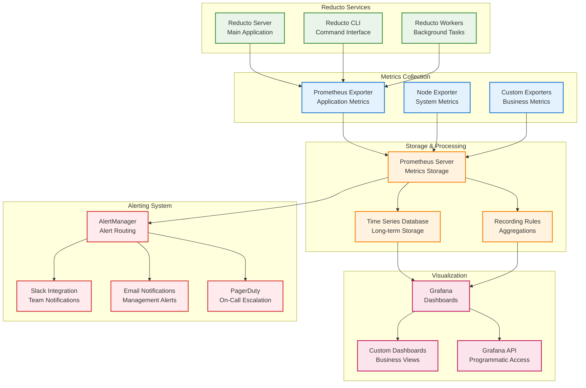
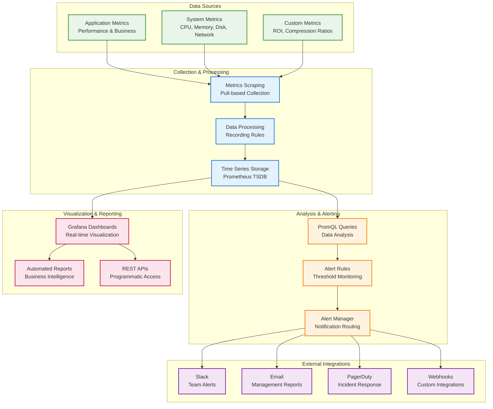

# Reducto Monitoring and Alerting Setup Guide

## Overview

This guide provides comprehensive monitoring and alerting configuration for Reducto enterprise deployments, including metrics collection, visualization, alerting rules, and operational dashboards.

## Monitoring Architecture

### Components Overview



### Metrics Flow Architecture



## Prometheus Configuration

### Server Configuration

#### Main Prometheus Config
```yaml
# /etc/prometheus/prometheus.yml
global:
  scrape_interval: 15s
  evaluation_interval: 15s
  external_labels:
    cluster: 'reducto-production'
    environment: 'production'

rule_files:
  - "rules/reducto-alerts.yml"
  - "rules/reducto-recording.yml"
  - "rules/system-alerts.yml"

scrape_configs:
  # Reducto application metrics
  - job_name: 'reducto-server'
    static_configs:
      - targets: 
        - 'reducto-01:9090'
        - 'reducto-02:9090'
        - 'reducto-03:9090'
    scrape_interval: 10s
    scrape_timeout: 5s
    metrics_path: /metrics
    params:
      format: ['prometheus']

  # Reducto worker nodes
  - job_name: 'reducto-workers'
    static_configs:
      - targets:
        - 'worker-01:9090'
        - 'worker-02:9090'
        - 'worker-03:9090'
        - 'worker-04:9090'
    scrape_interval: 15s

  # System metrics
  - job_name: 'node-exporter'
    static_configs:
      - targets:
        - 'reducto-01:9100'
        - 'reducto-02:9100'
        - 'reducto-03:9100'
        - 'worker-01:9100'
        - 'worker-02:9100'
        - 'worker-03:9100'
        - 'worker-04:9100'

  # Kubernetes service discovery (if using K8s)
  - job_name: 'kubernetes-pods'
    kubernetes_sd_configs:
      - role: pod
        namespaces:
          names:
            - reducto-system
    relabel_configs:
      - source_labels: [__meta_kubernetes_pod_annotation_prometheus_io_scrape]
        action: keep
        regex: true
      - source_labels: [__meta_kubernetes_pod_annotation_prometheus_io_path]
        action: replace
        target_label: __metrics_path__
        regex: (.+)
      - source_labels: [__address__, __meta_kubernetes_pod_annotation_prometheus_io_port]
        action: replace
        regex: ([^:]+)(?::\d+)?;(\d+)
        replacement: $1:$2
        target_label: __address__
      - source_labels: [__meta_kubernetes_namespace]
        action: replace
        target_label: kubernetes_namespace
      - source_labels: [__meta_kubernetes_pod_name]
        action: replace
        target_label: kubernetes_pod_name

  # Custom corpus repository metrics
  - job_name: 'corpus-repository'
    static_configs:
      - targets: ['corpus-repo:8080']
    metrics_path: /api/v1/metrics
    scrape_interval: 30s

alerting:
  alertmanagers:
    - static_configs:
        - targets:
          - alertmanager:9093
      timeout: 10s
      api_version: v2

# Remote write for long-term storage (optional)
remote_write:
  - url: "https://prometheus-remote-write.company.com/api/v1/write"
    basic_auth:
      username: "reducto-metrics"
      password_file: "/etc/prometheus/remote-write-password"
    queue_config:
      max_samples_per_send: 1000
      max_shards: 200
      capacity: 2500
```

### Recording Rules

#### Performance Recording Rules
```yaml
# /etc/prometheus/rules/reducto-recording.yml
groups:
  - name: reducto.performance
    interval: 30s
    rules:
      # Compression throughput
      - record: reducto:compression_throughput_mbps
        expr: rate(reducto_bytes_compressed_total[5m]) / 1024 / 1024

      # Decompression throughput
      - record: reducto:decompression_throughput_mbps
        expr: rate(reducto_bytes_decompressed_total[5m]) / 1024 / 1024

      # Average compression ratio
      - record: reducto:avg_compression_ratio_5m
        expr: avg_over_time(reducto_compression_ratio[5m])

      # Corpus hit rate
      - record: reducto:corpus_hit_rate_5m
        expr: avg_over_time(reducto_corpus_hit_rate[5m])

      # Operations per second
      - record: reducto:compression_ops_per_sec
        expr: rate(reducto_compression_operations_total[5m])

      - record: reducto:decompression_ops_per_sec
        expr: rate(reducto_decompression_operations_total[5m])

      # Error rates
      - record: reducto:compression_error_rate
        expr: rate(reducto_compression_errors_total[5m]) / rate(reducto_compression_operations_total[5m])

      - record: reducto:decompression_error_rate
        expr: rate(reducto_decompression_errors_total[5m]) / rate(reducto_decompression_operations_total[5m])

  - name: reducto.business
    interval: 60s
    rules:
      # Cost savings metrics
      - record: reducto:bandwidth_saved_gb_per_hour
        expr: rate(reducto_bandwidth_saved_bytes_total[1h]) / 1024 / 1024 / 1024

      - record: reducto:storage_saved_gb_per_hour
        expr: rate(reducto_storage_saved_bytes_total[1h]) / 1024 / 1024 / 1024

      # ROI calculations
      - record: reducto:hourly_cost_savings_usd
        expr: rate(reducto_cost_savings_usd_total[1h])

      # Efficiency metrics
      - record: reducto:system_efficiency
        expr: (reducto:compression_throughput_mbps + reducto:decompression_throughput_mbps) / (rate(process_cpu_seconds_total{job="reducto-server"}[5m]) * 100)

  - name: reducto.capacity
    interval: 60s
    rules:
      # Resource utilization
      - record: reducto:cpu_utilization
        expr: rate(process_cpu_seconds_total{job="reducto-server"}[5m]) * 100

      - record: reducto:memory_utilization_percent
        expr: (process_resident_memory_bytes{job="reducto-server"} / node_memory_MemTotal_bytes) * 100

      # Queue depths
      - record: reducto:avg_queue_depth
        expr: avg_over_time(reducto_operation_queue_size[5m])

      # Corpus cache efficiency
      - record: reducto:corpus_cache_hit_rate
        expr: rate(reducto_corpus_cache_hits_total[5m]) / (rate(reducto_corpus_cache_hits_total[5m]) + rate(reducto_corpus_cache_misses_total[5m]))
```

### Alert Rules

#### Critical Alerts
```yaml
# /etc/prometheus/rules/reducto-alerts.yml
groups:
  - name: reducto.critical
    rules:
      - alert: ReductoServiceDown
        expr: up{job="reducto-server"} == 0
        for: 1m
        labels:
          severity: critical
          service: reducto
        annotations:
          summary: "Reducto service is down on {{ $labels.instance }}"
          description: "Reducto service has been down for more than 1 minute on {{ $labels.instance }}"
          runbook_url: "https://docs.company.com/runbooks/reducto-service-down"

      - alert: ReductoHighErrorRate
        expr: reducto:compression_error_rate > 0.05
        for: 5m
        labels:
          severity: critical
          service: reducto
        annotations:
          summary: "High error rate in Reducto compression operations"
          description: "Compression error rate is {{ $value | humanizePercentage }} for more than 5 minutes"
          runbook_url: "https://docs.company.com/runbooks/reducto-high-error-rate"

      - alert: ReductoCorpusUnavailable
        expr: reducto_corpus_availability == 0
        for: 2m
        labels:
          severity: critical
          service: reducto
        annotations:
          summary: "Reducto corpus is unavailable"
          description: "Primary corpus {{ $labels.corpus_id }} is unavailable for more than 2 minutes"
          runbook_url: "https://docs.company.com/runbooks/reducto-corpus-unavailable"

  - name: reducto.warning
    rules:
      - alert: ReductoHighCPUUsage
        expr: reducto:cpu_utilization > 80
        for: 10m
        labels:
          severity: warning
          service: reducto
        annotations:
          summary: "High CPU usage on Reducto server"
          description: "CPU usage is {{ $value }}% on {{ $labels.instance }} for more than 10 minutes"

      - alert: ReductoHighMemoryUsage
        expr: reducto:memory_utilization_percent > 85
        for: 10m
        labels:
          severity: warning
          service: reducto
        annotations:
          summary: "High memory usage on Reducto server"
          description: "Memory usage is {{ $value }}% on {{ $labels.instance }} for more than 10 minutes"

      - alert: ReductoLowCompressionRatio
        expr: reducto:avg_compression_ratio_5m < 10
        for: 15m
        labels:
          severity: warning
          service: reducto
        annotations:
          summary: "Low compression ratio detected"
          description: "Average compression ratio is {{ $value }}:1, below expected threshold of 10:1"
          runbook_url: "https://docs.company.com/runbooks/reducto-low-compression-ratio"

      - alert: ReductoCorpusHitRateLow
        expr: reducto:corpus_hit_rate_5m < 0.8
        for: 20m
        labels:
          severity: warning
          service: reducto
        annotations:
          summary: "Low corpus hit rate"
          description: "Corpus hit rate is {{ $value | humanizePercentage }}, consider corpus optimization"
          runbook_url: "https://docs.company.com/runbooks/reducto-corpus-optimization"

      - alert: ReductoSlowProcessing
        expr: histogram_quantile(0.95, rate(reducto_processing_time_seconds_bucket[5m])) > 30
        for: 10m
        labels:
          severity: warning
          service: reducto
        annotations:
          summary: "Slow processing times detected"
          description: "95th percentile processing time is {{ $value }}s, above 30s threshold"

  - name: reducto.business
    rules:
      - alert: ReductoROIBelowTarget
        expr: reducto:hourly_cost_savings_usd < 100
        for: 4h
        labels:
          severity: warning
          service: reducto
          team: business
        annotations:
          summary: "ROI below target threshold"
          description: "Hourly cost savings is ${{ $value }}, below target of $100/hour"

      - alert: ReductoEfficiencyDegraded
        expr: reducto:system_efficiency < 50
        for: 30m
        labels:
          severity: warning
          service: reducto
        annotations:
          summary: "System efficiency degraded"
          description: "System efficiency is {{ $value }}, below optimal threshold"
```

## AlertManager Configuration

### Main Configuration
```yaml
# /etc/alertmanager/alertmanager.yml
global:
  smtp_smarthost: 'smtp.company.com:587'
  smtp_from: 'alerts@company.com'
  smtp_auth_username: 'alerts@company.com'
  smtp_auth_password_file: '/etc/alertmanager/smtp-password'

route:
  group_by: ['alertname', 'cluster', 'service']
  group_wait: 10s
  group_interval: 10s
  repeat_interval: 1h
  receiver: 'default'
  routes:
    # Critical alerts go to PagerDuty and Slack
    - match:
        severity: critical
      receiver: 'critical-alerts'
      group_wait: 0s
      repeat_interval: 5m

    # Warning alerts go to Slack only
    - match:
        severity: warning
      receiver: 'warning-alerts'
      repeat_interval: 2h

    # Business alerts go to business team
    - match:
        team: business
      receiver: 'business-alerts'
      repeat_interval: 4h

receivers:
  - name: 'default'
    email_configs:
      - to: 'ops-team@company.com'
        subject: 'Reducto Alert: {{ .GroupLabels.alertname }}'
        body: |
          {{ range .Alerts }}
          Alert: {{ .Annotations.summary }}
          Description: {{ .Annotations.description }}
          Instance: {{ .Labels.instance }}
          Severity: {{ .Labels.severity }}
          {{ end }}

  - name: 'critical-alerts'
    pagerduty_configs:
      - service_key_file: '/etc/alertmanager/pagerduty-key'
        description: 'Reducto Critical Alert: {{ .GroupLabels.alertname }}'
        details:
          firing: '{{ .Alerts.Firing | len }}'
          resolved: '{{ .Alerts.Resolved | len }}'
    slack_configs:
      - api_url_file: '/etc/alertmanager/slack-webhook'
        channel: '#reducto-critical'
        color: 'danger'
        title: 'CRITICAL: {{ .GroupLabels.alertname }}'
        text: |
          {{ range .Alerts }}
          *Alert:* {{ .Annotations.summary }}
          *Description:* {{ .Annotations.description }}
          *Instance:* {{ .Labels.instance }}
          *Runbook:* {{ .Annotations.runbook_url }}
          {{ end }}

  - name: 'warning-alerts'
    slack_configs:
      - api_url_file: '/etc/alertmanager/slack-webhook'
        channel: '#reducto-alerts'
        color: 'warning'
        title: 'WARNING: {{ .GroupLabels.alertname }}'
        text: |
          {{ range .Alerts }}
          *Alert:* {{ .Annotations.summary }}
          *Description:* {{ .Annotations.description }}
          *Instance:* {{ .Labels.instance }}
          {{ end }}

  - name: 'business-alerts'
    email_configs:
      - to: 'business-team@company.com'
        subject: 'Reducto Business Metric Alert: {{ .GroupLabels.alertname }}'
        body: |
          {{ range .Alerts }}
          Business Alert: {{ .Annotations.summary }}
          Description: {{ .Annotations.description }}
          Current Value: {{ .Annotations.value }}
          {{ end }}

inhibit_rules:
  # Inhibit warning alerts when critical alerts are firing
  - source_match:
      severity: 'critical'
    target_match:
      severity: 'warning'
    equal: ['alertname', 'instance']
```

## Grafana Configuration

### Data Source Configuration
```yaml
# /etc/grafana/provisioning/datasources/prometheus.yml
apiVersion: 1

datasources:
  - name: Prometheus
    type: prometheus
    access: proxy
    url: http://prometheus:9090
    isDefault: true
    editable: false
    jsonData:
      timeInterval: "15s"
      queryTimeout: "60s"
      httpMethod: "POST"
    secureJsonData:
      basicAuthPassword: "prometheus-password"

  - name: Prometheus-LongTerm
    type: prometheus
    access: proxy
    url: https://prometheus-longterm.company.com
    basicAuth: true
    basicAuthUser: "grafana"
    jsonData:
      timeInterval: "1m"
      queryTimeout: "300s"
    secureJsonData:
      basicAuthPassword: "longterm-password"
```

### Dashboard Provisioning
```yaml
# /etc/grafana/provisioning/dashboards/reducto.yml
apiVersion: 1

providers:
  - name: 'Reducto Dashboards'
    orgId: 1
    folder: 'Reducto'
    type: file
    disableDeletion: false
    updateIntervalSeconds: 10
    allowUiUpdates: true
    options:
      path: /var/lib/grafana/dashboards/reducto
```

### Main Operations Dashboard
```json
{
  "dashboard": {
    "id": null,
    "title": "Reducto Operations Dashboard",
    "tags": ["reducto", "operations"],
    "timezone": "browser",
    "refresh": "30s",
    "time": {
      "from": "now-1h",
      "to": "now"
    },
    "panels": [
      {
        "id": 1,
        "title": "Service Status",
        "type": "stat",
        "gridPos": {"h": 4, "w": 6, "x": 0, "y": 0},
        "targets": [
          {
            "expr": "up{job=\"reducto-server\"}",
            "legendFormat": "{{ instance }}"
          }
        ],
        "fieldConfig": {
          "defaults": {
            "mappings": [
              {"options": {"0": {"text": "DOWN", "color": "red"}}, "type": "value"},
              {"options": {"1": {"text": "UP", "color": "green"}}, "type": "value"}
            ],
            "thresholds": {
              "steps": [
                {"color": "red", "value": 0},
                {"color": "green", "value": 1}
              ]
            }
          }
        }
      },
      {
        "id": 2,
        "title": "Compression Ratio",
        "type": "stat",
        "gridPos": {"h": 4, "w": 6, "x": 6, "y": 0},
        "targets": [
          {
            "expr": "reducto:avg_compression_ratio_5m",
            "legendFormat": "Avg Ratio"
          }
        ],
        "fieldConfig": {
          "defaults": {
            "unit": "short",
            "decimals": 1,
            "thresholds": {
              "steps": [
                {"color": "red", "value": 0},
                {"color": "yellow", "value": 10},
                {"color": "green", "value": 20}
              ]
            }
          }
        }
      },
      {
        "id": 3,
        "title": "Operations per Second",
        "type": "graph",
        "gridPos": {"h": 8, "w": 12, "x": 0, "y": 4},
        "targets": [
          {
            "expr": "reducto:compression_ops_per_sec",
            "legendFormat": "Compressions/sec"
          },
          {
            "expr": "reducto:decompression_ops_per_sec",
            "legendFormat": "Decompressions/sec"
          }
        ],
        "yAxes": [
          {
            "label": "Operations/sec",
            "min": 0
          }
        ]
      },
      {
        "id": 4,
        "title": "Throughput",
        "type": "graph",
        "gridPos": {"h": 8, "w": 12, "x": 12, "y": 4},
        "targets": [
          {
            "expr": "reducto:compression_throughput_mbps",
            "legendFormat": "Compression MB/s"
          },
          {
            "expr": "reducto:decompression_throughput_mbps",
            "legendFormat": "Decompression MB/s"
          }
        ],
        "yAxes": [
          {
            "label": "MB/s",
            "min": 0
          }
        ]
      },
      {
        "id": 5,
        "title": "Corpus Hit Rate",
        "type": "graph",
        "gridPos": {"h": 8, "w": 12, "x": 0, "y": 12},
        "targets": [
          {
            "expr": "reducto:corpus_hit_rate_5m",
            "legendFormat": "Hit Rate"
          }
        ],
        "yAxes": [
          {
            "label": "Hit Rate",
            "min": 0,
            "max": 1,
            "unit": "percentunit"
          }
        ]
      },
      {
        "id": 6,
        "title": "Error Rates",
        "type": "graph",
        "gridPos": {"h": 8, "w": 12, "x": 12, "y": 12},
        "targets": [
          {
            "expr": "reducto:compression_error_rate",
            "legendFormat": "Compression Errors"
          },
          {
            "expr": "reducto:decompression_error_rate",
            "legendFormat": "Decompression Errors"
          }
        ],
        "yAxes": [
          {
            "label": "Error Rate",
            "min": 0,
            "unit": "percentunit"
          }
        ]
      }
    ]
  }
}
```

### Business Metrics Dashboard
```json
{
  "dashboard": {
    "id": null,
    "title": "Reducto Business Metrics",
    "tags": ["reducto", "business", "roi"],
    "timezone": "browser",
    "refresh": "5m",
    "time": {
      "from": "now-24h",
      "to": "now"
    },
    "panels": [
      {
        "id": 1,
        "title": "Cost Savings (Last 24h)",
        "type": "stat",
        "gridPos": {"h": 4, "w": 8, "x": 0, "y": 0},
        "targets": [
          {
            "expr": "sum(increase(reducto_cost_savings_usd_total[24h]))",
            "legendFormat": "Total Savings"
          }
        ],
        "fieldConfig": {
          "defaults": {
            "unit": "currencyUSD",
            "decimals": 0,
            "thresholds": {
              "steps": [
                {"color": "red", "value": 0},
                {"color": "yellow", "value": 1000},
                {"color": "green", "value": 5000}
              ]
            }
          }
        }
      },
      {
        "id": 2,
        "title": "Bandwidth Saved (GB/hour)",
        "type": "graph",
        "gridPos": {"h": 8, "w": 12, "x": 0, "y": 4},
        "targets": [
          {
            "expr": "reducto:bandwidth_saved_gb_per_hour",
            "legendFormat": "Bandwidth Saved"
          }
        ],
        "yAxes": [
          {
            "label": "GB/hour",
            "min": 0
          }
        ]
      },
      {
        "id": 3,
        "title": "Storage Efficiency",
        "type": "graph",
        "gridPos": {"h": 8, "w": 12, "x": 12, "y": 4},
        "targets": [
          {
            "expr": "reducto:storage_saved_gb_per_hour",
            "legendFormat": "Storage Saved"
          }
        ],
        "yAxes": [
          {
            "label": "GB/hour",
            "min": 0
          }
        ]
      }
    ]
  }
}
```

## Custom Exporters

### Corpus Repository Exporter
```rust
// Custom exporter for corpus repository metrics
use prometheus::{Encoder, TextEncoder, Counter, Gauge, Histogram, Registry};
use warp::{Filter, Reply};
use std::sync::Arc;

pub struct CorpusMetrics {
    pub corpus_requests: Counter,
    pub corpus_size_bytes: Gauge,
    pub corpus_download_duration: Histogram,
    pub active_downloads: Gauge,
}

impl CorpusMetrics {
    pub fn new() -> Self {
        Self {
            corpus_requests: Counter::new(
                "corpus_requests_total",
                "Total corpus requests"
            ).unwrap(),
            corpus_size_bytes: Gauge::new(
                "corpus_size_bytes",
                "Size of corpus in bytes"
            ).unwrap(),
            corpus_download_duration: Histogram::with_opts(
                prometheus::HistogramOpts::new(
                    "corpus_download_duration_seconds",
                    "Time to download corpus"
                ).buckets(vec![0.1, 0.5, 1.0, 5.0, 10.0, 30.0, 60.0])
            ).unwrap(),
            active_downloads: Gauge::new(
                "corpus_active_downloads",
                "Number of active downloads"
            ).unwrap(),
        }
    }
}

pub async fn metrics_handler(
    registry: Arc<Registry>
) -> Result<impl Reply, warp::Rejection> {
    let encoder = TextEncoder::new();
    let metric_families = registry.gather();
    let mut buffer = Vec::new();
    encoder.encode(&metric_families, &mut buffer).unwrap();
    
    Ok(warp::reply::with_header(
        buffer,
        "content-type",
        "text/plain; version=0.0.4"
    ))
}

#[tokio::main]
async fn main() {
    let registry = Arc::new(Registry::new());
    let metrics = Arc::new(CorpusMetrics::new());
    
    // Register metrics
    registry.register(Box::new(metrics.corpus_requests.clone())).unwrap();
    registry.register(Box::new(metrics.corpus_size_bytes.clone())).unwrap();
    registry.register(Box::new(metrics.corpus_download_duration.clone())).unwrap();
    registry.register(Box::new(metrics.active_downloads.clone())).unwrap();
    
    let metrics_route = warp::path("metrics")
        .and(warp::get())
        .and(warp::any().map(move || registry.clone()))
        .and_then(metrics_handler);
    
    warp::serve(metrics_route)
        .run(([0, 0, 0, 0], 8080))
        .await;
}
```

## Log Aggregation and Analysis

### ELK Stack Integration

#### Filebeat Configuration
```yaml
# /etc/filebeat/filebeat.yml
filebeat.inputs:
- type: log
  enabled: true
  paths:
    - /var/log/reducto/*.log
  fields:
    service: reducto
    environment: production
    datacenter: us-east-1
  fields_under_root: true
  json.keys_under_root: true
  json.add_error_key: true
  multiline.pattern: '^\d{4}-\d{2}-\d{2}'
  multiline.negate: true
  multiline.match: after

- type: log
  enabled: true
  paths:
    - /var/log/reducto/audit.log
  fields:
    service: reducto-audit
    log_type: audit
  json.keys_under_root: true

processors:
  - add_host_metadata:
      when.not.contains.tags: forwarded
  - add_docker_metadata: ~
  - add_kubernetes_metadata: ~

output.elasticsearch:
  hosts: ["elasticsearch-01:9200", "elasticsearch-02:9200", "elasticsearch-03:9200"]
  index: "reducto-logs-%{+yyyy.MM.dd}"
  template.settings:
    index.number_of_shards: 3
    index.number_of_replicas: 1

setup.kibana:
  host: "kibana:5601"

logging.level: info
logging.to_files: true
logging.files:
  path: /var/log/filebeat
  name: filebeat
  keepfiles: 7
  permissions: 0644
```

#### Logstash Pipeline
```ruby
# /etc/logstash/conf.d/reducto.conf
input {
  beats {
    port => 5044
  }
}

filter {
  if [service] == "reducto" {
    # Parse structured logs
    if [message] =~ /^\{/ {
      json {
        source => "message"
      }
    }
    
    # Extract compression metrics
    if [operation] == "compression" {
      mutate {
        convert => {
          "compression_ratio" => "float"
          "processing_time_ms" => "integer"
          "input_size" => "integer"
          "output_size" => "integer"
        }
      }
    }
    
    # Parse error messages
    if [level] == "ERROR" {
      grok {
        match => { "message" => "%{GREEDYDATA:error_details}" }
        tag_on_failure => ["_grokparsefailure_error"]
      }
    }
  }
  
  # GeoIP for client IPs (if present)
  if [client_ip] {
    geoip {
      source => "client_ip"
      target => "geoip"
    }
  }
  
  # Add timestamp
  date {
    match => [ "timestamp", "ISO8601" ]
  }
}

output {
  elasticsearch {
    hosts => ["elasticsearch-01:9200", "elasticsearch-02:9200"]
    index => "reducto-logs-%{+YYYY.MM.dd}"
  }
  
  # Send critical errors to alerting
  if [level] == "ERROR" or [level] == "CRITICAL" {
    http {
      url => "https://alerting.company.com/webhook"
      http_method => "post"
      format => "json"
      mapping => {
        "service" => "reducto"
        "level" => "%{level}"
        "message" => "%{message}"
        "host" => "%{host}"
        "timestamp" => "%{@timestamp}"
      }
    }
  }
}
```

### Kibana Dashboards

#### Operations Dashboard
```json
{
  "version": "7.15.0",
  "objects": [
    {
      "id": "reducto-operations-dashboard",
      "type": "dashboard",
      "attributes": {
        "title": "Reducto Operations Dashboard",
        "hits": 0,
        "description": "Operational metrics and logs for Reducto",
        "panelsJSON": "[{\"version\":\"7.15.0\",\"gridData\":{\"x\":0,\"y\":0,\"w\":24,\"h\":15,\"i\":\"1\"},\"panelIndex\":\"1\",\"embeddableConfig\":{},\"panelRefName\":\"panel_1\"}]",
        "timeRestore": false,
        "timeTo": "now",
        "timeFrom": "now-24h",
        "refreshInterval": {
          "pause": false,
          "value": 30000
        }
      }
    }
  ]
}
```

## Health Checks and SLA Monitoring

### Health Check Endpoints
```rust
// Health check implementation
use warp::{Filter, Reply};
use serde_json::json;

pub async fn health_check() -> Result<impl Reply, warp::Rejection> {
    // Check critical components
    let corpus_status = check_corpus_availability().await;
    let database_status = check_database_connection().await;
    let memory_status = check_memory_usage().await;
    
    let overall_status = if corpus_status && database_status && memory_status {
        "healthy"
    } else {
        "unhealthy"
    };
    
    let response = json!({
        "status": overall_status,
        "timestamp": chrono::Utc::now().to_rfc3339(),
        "components": {
            "corpus": corpus_status,
            "database": database_status,
            "memory": memory_status
        },
        "version": env!("CARGO_PKG_VERSION")
    });
    
    if overall_status == "healthy" {
        Ok(warp::reply::with_status(
            warp::reply::json(&response),
            warp::http::StatusCode::OK
        ))
    } else {
        Ok(warp::reply::with_status(
            warp::reply::json(&response),
            warp::http::StatusCode::SERVICE_UNAVAILABLE
        ))
    }
}

async fn check_corpus_availability() -> bool {
    // Implementation to check corpus accessibility
    true
}

async fn check_database_connection() -> bool {
    // Implementation to check database connectivity
    true
}

async fn check_memory_usage() -> bool {
    // Check if memory usage is within acceptable limits
    let memory_usage = get_memory_usage_percent();
    memory_usage < 90.0
}
```

### SLA Monitoring
```yaml
# SLA monitoring rules
groups:
  - name: reducto.sla
    rules:
      # 99.9% uptime SLA
      - record: reducto:uptime_sla_compliance
        expr: avg_over_time(up{job="reducto-server"}[30d]) * 100

      # Response time SLA (95th percentile < 5s)
      - record: reducto:response_time_sla_compliance
        expr: histogram_quantile(0.95, rate(reducto_processing_time_seconds_bucket[5m])) < 5

      # Throughput SLA (minimum 100 MB/s)
      - record: reducto:throughput_sla_compliance
        expr: (reducto:compression_throughput_mbps + reducto:decompression_throughput_mbps) > 100

      # Error rate SLA (< 0.1%)
      - record: reducto:error_rate_sla_compliance
        expr: (reducto:compression_error_rate + reducto:decompression_error_rate) < 0.001
```

This monitoring setup provides comprehensive observability for Reducto enterprise deployments with proactive alerting and detailed performance tracking.