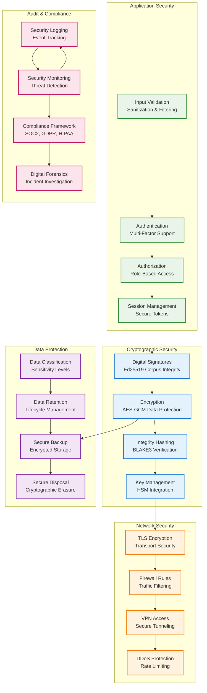

# Reducto Security Configuration Guide

## Overview

This guide covers comprehensive security configuration for Reducto enterprise deployments, including cryptographic settings, access controls, audit logging, and compliance requirements.

## Security Architecture

### Security Layers



### Threat Model

```mermaid
graph TD
    %% Protected assets
    subgraph "Protected Assets"
        direction TB
        CORPUS[Reference Corpora<br/>Intellectual Property]
        DATA[Compressed Data<br/>Potentially Sensitive]
        KEYS[Cryptographic Keys<br/>Security Foundation]
        LOGS[Audit Logs<br/>Compliance Evidence]
        CONFIG[System Configuration<br/>Operational Secrets]
    end
    
    %% Threat actors
    subgraph "Threat Actors"
        direction TB
        EXTERNAL[External Attackers<br/>Unauthorized Access]
        INSIDER[Insider Threats<br/>Privileged Misuse]
        NATION[Nation State<br/>Advanced Persistent Threats]
        CRIMINAL[Cybercriminals<br/>Financial Motivation]
    end
    
    %% Attack vectors
    subgraph "Attack Vectors"
        direction TB
        NETWORK[Network Attacks<br/>Interception & Tampering]
        PHYSICAL[Physical Access<br/>Hardware Compromise]
        SOCIAL[Social Engineering<br/>Human Manipulation]
        SUPPLY[Supply Chain<br/>Third-party Compromise]
        SIDE[Side-Channel<br/>Information Leakage]
    end
    
    %% Security controls
    subgraph "Security Controls"
        direction TB
        PREVENT[Preventive Controls<br/>Access Control & Encryption]
        DETECT[Detective Controls<br/>Monitoring & Alerting]
        RESPOND[Response Controls<br/>Incident Management]
        RECOVER[Recovery Controls<br/>Business Continuity]
    end
    
    %% Threat relationships
    EXTERNAL --> NETWORK
    INSIDER --> PHYSICAL
    NATION --> SUPPLY
    CRIMINAL --> SOCIAL
    
    NETWORK --> CORPUS
    PHYSICAL --> KEYS
    SOCIAL --> CONFIG
    SUPPLY --> DATA
    SIDE --> LOGS
    
    %% Control relationships
    PREVENT --> CORPUS
    DETECT --> DATA
    RESPOND --> KEYS
    RECOVER --> LOGS
    
    %% Styling
    classDef asset fill:#e8f5e8,stroke:#388e3c,stroke-width:2px
    classDef threat fill:#ffebee,stroke:#d32f2f,stroke-width:2px
    classDef vector fill:#fff3e0,stroke:#f57c00,stroke-width:2px
    classDef control fill:#e3f2fd,stroke:#1976d2,stroke-width:2px
    
    class CORPUS,DATA,KEYS,LOGS,CONFIG asset
    class EXTERNAL,INSIDER,NATION,CRIMINAL threat
    class NETWORK,PHYSICAL,SOCIAL,SUPPLY,SIDE vector
    class PREVENT,DETECT,RESPOND,RECOVER control
```



**Protected Assets:**
- Reference corpora (intellectual property)
- Compressed data (potentially sensitive)
- Cryptographic keys and certificates
- Audit logs and operational data
- System configuration and metadata

**Threat Vectors:**
- Unauthorized corpus access
- Data tampering during transit/storage
- Key compromise and misuse
- Privilege escalation attacks
- Side-channel information leakage

## Cryptographic Configuration

### Digital Signatures

#### Ed25519 Signature Configuration
```toml
# /etc/reducto/security.toml
[signatures]
algorithm = "Ed25519"
key_size = 256
signature_format = "ASN.1-DER"
verify_all_signatures = true
signature_cache_size = 10000

[signature_keys]
corpus_signing_key = "/etc/reducto/keys/corpus-signing.key"
data_signing_key = "/etc/reducto/keys/data-signing.key"
backup_signing_keys = [
    "/etc/reducto/keys/backup-signing-1.key",
    "/etc/reducto/keys/backup-signing-2.key"
]
```

#### Key Generation and Management
```bash
# Generate Ed25519 signing key pair
reducto keygen \
    --algorithm ed25519 \
    --purpose signing \
    --output /etc/reducto/keys/corpus-signing.key \
    --password-file /etc/reducto/keys/signing-password.txt

# Generate backup keys
for i in {1..3}; do
    reducto keygen \
        --algorithm ed25519 \
        --purpose signing \
        --output "/etc/reducto/keys/backup-signing-${i}.key" \
        --password-file "/etc/reducto/keys/backup-password-${i}.txt"
done

# Set secure permissions
sudo chown reducto:reducto /etc/reducto/keys/*
sudo chmod 600 /etc/reducto/keys/*.key
sudo chmod 600 /etc/reducto/keys/*.txt
```

#### Signature Verification Process
```rust
// Example signature verification implementation
use ed25519_dalek::{PublicKey, Signature, Verifier};

pub fn verify_corpus_signature(
    corpus_data: &[u8],
    signature: &[u8],
    public_key: &[u8]
) -> Result<bool, SecurityError> {
    let public_key = PublicKey::from_bytes(public_key)
        .map_err(|e| SecurityError::InvalidPublicKey(e.to_string()))?;
    
    let signature = Signature::from_bytes(signature)
        .map_err(|e| SecurityError::InvalidSignature(e.to_string()))?;
    
    // Verify signature using constant-time comparison
    match public_key.verify(corpus_data, &signature) {
        Ok(()) => Ok(true),
        Err(_) => Ok(false)
    }
}
```

### Encryption Configuration

#### AES-GCM Encryption Settings
```toml
[encryption]
algorithm = "AES-256-GCM"
key_derivation = "PBKDF2-SHA256"
pbkdf2_iterations = 100000
salt_size = 32
nonce_size = 12
tag_size = 16

[encryption_keys]
master_key_path = "/etc/reducto/keys/master-encryption.key"
data_encryption_key = "/etc/reducto/keys/data-encryption.key"
key_rotation_days = 90
key_backup_count = 5
```

#### Key Derivation and Management
```bash
# Generate master encryption key
reducto keygen \
    --algorithm aes-256 \
    --purpose encryption \
    --output /etc/reducto/keys/master-encryption.key \
    --key-derivation pbkdf2 \
    --iterations 100000

# Derive data encryption keys
reducto derive-key \
    --master-key /etc/reducto/keys/master-encryption.key \
    --purpose data-encryption \
    --output /etc/reducto/keys/data-encryption.key \
    --context "reducto-data-v1"

# Set up key rotation
cat > /etc/cron.d/reducto-key-rotation << EOF
0 2 * * 0 reducto rotate-keys --config /etc/reducto/security.toml
EOF
```

#### Encryption Implementation
```rust
use aes_gcm::{Aes256Gcm, Key, Nonce, aead::{Aead, NewAead}};
use rand::{RngCore, thread_rng};

pub struct EncryptionManager {
    cipher: Aes256Gcm,
}

impl EncryptionManager {
    pub fn new(key: &[u8; 32]) -> Self {
        let key = Key::from_slice(key);
        let cipher = Aes256Gcm::new(key);
        Self { cipher }
    }
    
    pub fn encrypt(&self, plaintext: &[u8]) -> Result<Vec<u8>, SecurityError> {
        let mut nonce_bytes = [0u8; 12];
        thread_rng().fill_bytes(&mut nonce_bytes);
        let nonce = Nonce::from_slice(&nonce_bytes);
        
        let ciphertext = self.cipher.encrypt(nonce, plaintext)
            .map_err(|e| SecurityError::EncryptionFailed(e.to_string()))?;
        
        // Prepend nonce to ciphertext
        let mut result = Vec::with_capacity(12 + ciphertext.len());
        result.extend_from_slice(&nonce_bytes);
        result.extend_from_slice(&ciphertext);
        
        Ok(result)
    }
    
    pub fn decrypt(&self, encrypted_data: &[u8]) -> Result<Vec<u8>, SecurityError> {
        if encrypted_data.len() < 12 {
            return Err(SecurityError::InvalidEncryptedData);
        }
        
        let (nonce_bytes, ciphertext) = encrypted_data.split_at(12);
        let nonce = Nonce::from_slice(nonce_bytes);
        
        self.cipher.decrypt(nonce, ciphertext)
            .map_err(|e| SecurityError::DecryptionFailed(e.to_string()))
    }
}
```

### Hash-Based Integrity

#### BLAKE3 Configuration
```toml
[integrity]
hash_algorithm = "BLAKE3"
chunk_hash_size = 32
file_hash_size = 32
merkle_tree_enabled = true
parallel_hashing = true
hash_cache_size = 50000

[integrity_verification]
verify_on_read = true
verify_on_write = true
fail_on_mismatch = true
repair_corrupted_data = false
```

#### Integrity Verification Implementation
```rust
use blake3::{Hasher, Hash};

pub struct IntegrityManager {
    hasher: Hasher,
}

impl IntegrityManager {
    pub fn new() -> Self {
        Self {
            hasher: Hasher::new(),
        }
    }
    
    pub fn hash_chunk(&mut self, data: &[u8]) -> Hash {
        let mut hasher = Hasher::new();
        hasher.update(data);
        hasher.finalize()
    }
    
    pub fn verify_chunk(&self, data: &[u8], expected_hash: &Hash) -> bool {
        let actual_hash = self.hash_chunk(data);
        // Constant-time comparison to prevent timing attacks
        actual_hash.as_bytes() == expected_hash.as_bytes()
    }
    
    pub fn build_merkle_tree(&self, chunk_hashes: &[Hash]) -> Hash {
        if chunk_hashes.is_empty() {
            return Hash::from([0u8; 32]);
        }
        
        if chunk_hashes.len() == 1 {
            return chunk_hashes[0];
        }
        
        let mut current_level = chunk_hashes.to_vec();
        
        while current_level.len() > 1 {
            let mut next_level = Vec::new();
            
            for pair in current_level.chunks(2) {
                let mut hasher = Hasher::new();
                hasher.update(pair[0].as_bytes());
                if pair.len() > 1 {
                    hasher.update(pair[1].as_bytes());
                }
                next_level.push(hasher.finalize());
            }
            
            current_level = next_level;
        }
        
        current_level[0]
    }
}
```

## Access Control and Authentication

### Role-Based Access Control (RBAC)

#### Role Definitions
```toml
[rbac]
enabled = true
default_role = "guest"
role_hierarchy = true

[roles.admin]
description = "Full system administration"
permissions = [
    "corpus:create", "corpus:read", "corpus:update", "corpus:delete",
    "compress:execute", "decompress:execute",
    "config:read", "config:write",
    "users:create", "users:read", "users:update", "users:delete",
    "audit:read", "metrics:read"
]

[roles.operator]
description = "Operations and monitoring"
permissions = [
    "corpus:read", "compress:execute", "decompress:execute",
    "metrics:read", "audit:read"
]

[roles.user]
description = "Basic compression operations"
permissions = [
    "compress:execute", "decompress:execute",
    "corpus:read"
]

[roles.readonly]
description = "Read-only access"
permissions = [
    "corpus:read", "metrics:read"
]
```

#### User Management
```bash
# Create users with roles
reducto user create \
    --username alice \
    --role admin \
    --email alice@company.com \
    --password-file /tmp/alice-password.txt

reducto user create \
    --username bob \
    --role operator \
    --email bob@company.com \
    --auth-method certificate \
    --certificate /etc/reducto/certs/bob.crt

# Assign additional permissions
reducto user grant \
    --username bob \
    --permission "corpus:create"

# List users and permissions
reducto user list --detailed
reducto user show --username alice --permissions
```

### Authentication Methods

#### Token-Based Authentication
```toml
[authentication]
method = "token"
token_type = "JWT"
token_expiry = "24h"
refresh_token_expiry = "7d"
secret_key_path = "/etc/reducto/keys/jwt-secret.key"

[jwt]
algorithm = "HS256"
issuer = "reducto-enterprise"
audience = "reducto-api"
claims_namespace = "https://reducto.company.com/"
```

#### Certificate-Based Authentication
```toml
[authentication]
method = "certificate"
ca_certificate_path = "/etc/reducto/certs/ca.crt"
client_certificate_required = true
certificate_revocation_list = "/etc/reducto/certs/crl.pem"
ocsp_enabled = true

[certificate_validation]
verify_chain = true
verify_hostname = true
verify_expiration = true
allow_self_signed = false
max_chain_length = 5
```

#### Multi-Factor Authentication
```toml
[mfa]
enabled = true
required_for_admin = true
methods = ["totp", "webauthn"]
backup_codes_count = 10

[totp]
issuer = "Reducto Enterprise"
algorithm = "SHA1"
digits = 6
period = 30

[webauthn]
rp_id = "reducto.company.com"
rp_name = "Reducto Enterprise"
require_resident_key = false
user_verification = "preferred"
```

### API Security

#### Rate Limiting
```toml
[rate_limiting]
enabled = true
default_rate = "100/minute"
burst_size = 200

[rate_limits.compress]
rate = "10/minute"
burst_size = 20

[rate_limits.decompress]
rate = "50/minute"
burst_size = 100

[rate_limits.corpus_build]
rate = "1/hour"
burst_size = 2
```

#### Request Validation
```toml
[request_validation]
max_request_size = "1GB"
max_file_size = "10GB"
allowed_file_types = [".img", ".tar", ".zip", ".reducto"]
scan_uploads = true
virus_scanner = "clamav"

[input_sanitization]
sanitize_filenames = true
validate_paths = true
prevent_directory_traversal = true
max_path_length = 4096
```

## Audit Logging and Monitoring

### Audit Configuration

#### Comprehensive Audit Logging
```toml
[audit]
enabled = true
log_level = "INFO"
log_format = "json"
log_path = "/var/log/reducto/audit.log"
log_rotation = "daily"
max_log_files = 365
compress_old_logs = true

[audit_events]
authentication = true
authorization = true
corpus_access = true
compression_operations = true
configuration_changes = true
key_operations = true
system_events = true

[audit_details]
include_request_body = false
include_response_body = false
include_user_agent = true
include_source_ip = true
include_session_id = true
include_request_id = true
```

#### Audit Event Structure
```json
{
  "timestamp": "2024-01-15T14:30:00.123Z",
  "event_id": "evt-123e4567-e89b-12d3-a456-426614174000",
  "event_type": "corpus_access",
  "severity": "INFO",
  "user": {
    "id": "user-456",
    "username": "alice",
    "role": "operator",
    "session_id": "sess-789"
  },
  "request": {
    "id": "req-abc123",
    "method": "GET",
    "path": "/api/v1/corpus/golden-v1",
    "source_ip": "10.0.1.100",
    "user_agent": "reducto-cli/1.0.0"
  },
  "resource": {
    "type": "corpus",
    "id": "golden-v1",
    "action": "read"
  },
  "result": {
    "status": "success",
    "response_code": 200,
    "processing_time_ms": 45
  },
  "metadata": {
    "corpus_size": 52428800000,
    "hit_rate": 0.94,
    "compression_ratio": 42.1
  }
}
```

### Security Monitoring

#### Real-time Security Alerts
```toml
[security_monitoring]
enabled = true
alert_threshold = "WARNING"
alert_destinations = [
    "syslog://security-siem.company.com:514",
    "webhook://security-webhook.company.com/alerts",
    "email://security-team@company.com"
]

[security_rules]
failed_auth_threshold = 5
failed_auth_window = "5m"
suspicious_activity_threshold = 10
unusual_access_pattern_detection = true
privilege_escalation_detection = true
```

#### Security Metrics
```toml
[security_metrics]
track_authentication_failures = true
track_authorization_failures = true
track_suspicious_requests = true
track_key_usage = true
export_to_prometheus = true

[prometheus_security_metrics]
endpoint = "0.0.0.0:9091"
namespace = "reducto_security"
```

## Compliance Configuration

### SOC 2 Type II Compliance

#### Control Implementation
```toml
[compliance.soc2]
enabled = true
control_framework = "SOC2-Type2"

[soc2_controls]
# CC6.1 - Logical and Physical Access Controls
access_controls_enabled = true
multi_factor_authentication = true
privileged_access_management = true

# CC6.2 - System Access Monitoring
access_monitoring = true
session_monitoring = true
anomaly_detection = true

# CC6.3 - Access Revocation
automated_access_revocation = true
periodic_access_review = true

# CC7.1 - System Monitoring
system_monitoring = true
security_monitoring = true
performance_monitoring = true

# CC7.2 - Change Management
change_approval_required = true
change_logging = true
rollback_procedures = true
```

#### Audit Trail Requirements
```bash
# Configure audit retention for SOC 2 (7 years)
reducto config set audit.retention_days 2555

# Enable comprehensive logging
reducto config set audit.log_level DEBUG
reducto config set audit.include_all_events true

# Set up automated compliance reporting
cat > /etc/cron.d/reducto-compliance << EOF
0 1 * * * reducto compliance-report --framework soc2 --output /var/log/reducto/compliance/
EOF
```

### GDPR Compliance

#### Data Protection Configuration
```toml
[compliance.gdpr]
enabled = true
data_protection_officer = "dpo@company.com"
lawful_basis = "legitimate_interest"

[gdpr_rights]
right_to_access = true
right_to_rectification = true
right_to_erasure = true
right_to_portability = true
right_to_object = true

[data_retention]
default_retention_days = 2555  # 7 years
personal_data_retention_days = 1095  # 3 years
audit_log_retention_days = 2555
automatic_deletion = true
```

#### Data Subject Rights Implementation
```bash
# Implement right to erasure
reducto gdpr erase-user-data \
    --user-id "user-123" \
    --verification-token "token-abc" \
    --secure-deletion true

# Data portability export
reducto gdpr export-user-data \
    --user-id "user-123" \
    --format json \
    --output user-123-export.json \
    --encrypt true

# Access request fulfillment
reducto gdpr access-request \
    --user-id "user-123" \
    --include-audit-logs true \
    --output user-123-access-report.pdf
```

### HIPAA Compliance

#### PHI Protection Configuration
```toml
[compliance.hipaa]
enabled = true
covered_entity = true
business_associate = false

[phi_protection]
encryption_at_rest = true
encryption_in_transit = true
access_logging = true
audit_controls = true
integrity_controls = true
transmission_security = true

[hipaa_safeguards]
administrative_safeguards = true
physical_safeguards = true
technical_safeguards = true
```

#### BAA (Business Associate Agreement) Support
```bash
# Configure HIPAA-compliant audit logging
reducto config set hipaa.audit_level COMPREHENSIVE
reducto config set hipaa.phi_access_logging true
reducto config set hipaa.minimum_necessary true

# Enable secure deletion for PHI
reducto config set hipaa.secure_deletion true
reducto config set hipaa.deletion_verification true
```

## Key Management

### Hardware Security Module (HSM) Integration

#### HSM Configuration
```toml
[hsm]
enabled = true
provider = "pkcs11"
library_path = "/usr/lib/libpkcs11.so"
slot_id = 0
pin_file = "/etc/reducto/hsm-pin.txt"

[hsm_keys]
signing_key_label = "reducto-signing-key"
encryption_key_label = "reducto-encryption-key"
key_generation_in_hsm = true
key_extraction_prohibited = true
```

#### Key Lifecycle Management
```bash
# Generate keys in HSM
reducto hsm generate-key \
    --type signing \
    --algorithm ed25519 \
    --label "reducto-signing-$(date +%Y%m%d)" \
    --extractable false

# Key rotation with HSM
reducto hsm rotate-keys \
    --old-key-label "reducto-signing-20240101" \
    --new-key-label "reducto-signing-20240115" \
    --transition-period "30d"

# Key backup and recovery
reducto hsm backup-key \
    --key-label "reducto-encryption-key" \
    --backup-location "hsm-backup-slot-1" \
    --require-quorum 3
```

### Key Escrow and Recovery

#### Key Escrow Configuration
```toml
[key_escrow]
enabled = true
escrow_agents = [
    "escrow-agent-1@company.com",
    "escrow-agent-2@company.com",
    "escrow-agent-3@company.com"
]
threshold = 2  # Require 2 of 3 agents for recovery
escrow_encryption = "AES-256-GCM"
```

#### Emergency Key Recovery
```bash
# Initiate key recovery process
reducto key-recovery initiate \
    --key-id "key-123" \
    --justification "Primary key corrupted, business continuity required" \
    --approver-1 "manager@company.com" \
    --approver-2 "security@company.com"

# Agent participation in recovery
reducto key-recovery participate \
    --recovery-id "recovery-456" \
    --agent-key "/etc/reducto/escrow/agent-1.key" \
    --signature-file "/tmp/recovery-signature.sig"
```

## Security Hardening

### System-Level Hardening

#### File System Security
```bash
# Set up secure mount options
echo "/dev/nvme0n1 /var/lib/reducto ext4 nodev,nosuid,noexec,noatime 0 2" >> /etc/fstab

# Configure file permissions
find /etc/reducto -type f -exec chmod 600 {} \;
find /etc/reducto -type d -exec chmod 700 {} \;
chown -R reducto:reducto /etc/reducto

# Set up file integrity monitoring
aide --init
aide --check
```

#### Network Security
```bash
# Configure firewall rules
ufw default deny incoming
ufw default allow outgoing
ufw allow from 10.0.0.0/8 to any port 8080  # API access
ufw allow from 10.0.0.0/8 to any port 9090  # Metrics
ufw enable

# Disable unnecessary services
systemctl disable telnet
systemctl disable ftp
systemctl disable rsh
systemctl disable rlogin
```

#### Process Security
```bash
# Configure AppArmor profile for Reducto
cat > /etc/apparmor.d/usr.local.bin.reducto << EOF
#include <tunables/global>

/usr/local/bin/reducto {
  #include <abstractions/base>
  #include <abstractions/nameservice>
  
  capability dac_override,
  capability setuid,
  capability setgid,
  
  /usr/local/bin/reducto mr,
  /etc/reducto/** r,
  /var/lib/reducto/** rw,
  /var/log/reducto/** rw,
  /tmp/reducto-** rw,
  
  deny /etc/shadow r,
  deny /etc/passwd w,
  deny /etc/group w,
}
EOF

# Enable AppArmor profile
apparmor_parser -r /etc/apparmor.d/usr.local.bin.reducto
```

### Application-Level Hardening

#### Secure Coding Practices
```rust
// Example: Secure memory handling
use zeroize::{Zeroize, ZeroizeOnDrop};

#[derive(ZeroizeOnDrop)]
pub struct SecretKey {
    key_data: [u8; 32],
}

impl SecretKey {
    pub fn new(key_data: [u8; 32]) -> Self {
        Self { key_data }
    }
    
    pub fn as_bytes(&self) -> &[u8] {
        &self.key_data
    }
}

impl Drop for SecretKey {
    fn drop(&mut self) {
        // Explicitly zero memory
        self.key_data.zeroize();
    }
}

// Constant-time comparison for security-sensitive operations
use subtle::ConstantTimeEq;

pub fn verify_signature_constant_time(
    signature1: &[u8],
    signature2: &[u8]
) -> bool {
    signature1.ct_eq(signature2).into()
}
```

#### Input Validation and Sanitization
```rust
use validator::{Validate, ValidationError};

#[derive(Validate)]
pub struct CompressRequest {
    #[validate(length(min = 1, max = 4096))]
    pub input_path: String,
    
    #[validate(custom = "validate_corpus_id")]
    pub corpus_id: String,
    
    #[validate(range(min = 1, max = 22))]
    pub compression_level: u8,
}

fn validate_corpus_id(corpus_id: &str) -> Result<(), ValidationError> {
    // Validate corpus ID format and prevent injection attacks
    if !corpus_id.chars().all(|c| c.is_alphanumeric() || c == '-' || c == '_') {
        return Err(ValidationError::new("invalid_corpus_id"));
    }
    
    if corpus_id.len() > 64 {
        return Err(ValidationError::new("corpus_id_too_long"));
    }
    
    Ok(())
}
```

This security guide provides comprehensive coverage of all security aspects for enterprise Reducto deployments, ensuring compliance with major security frameworks and industry best practices.