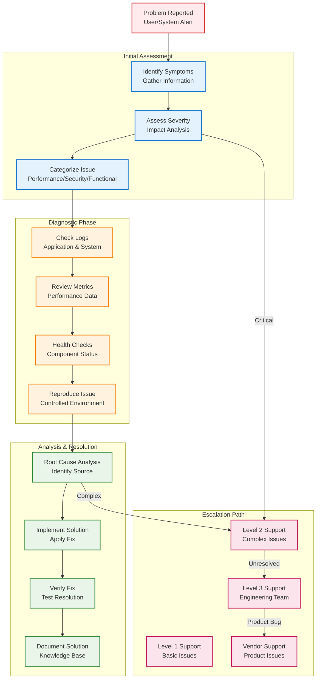
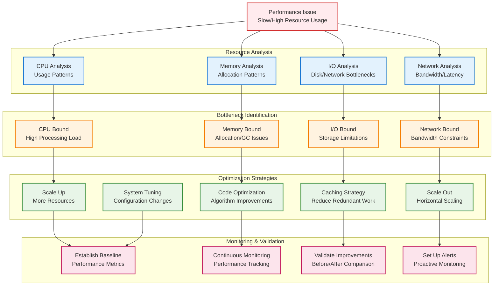

# Reducto Troubleshooting Guide

## Overview

This guide provides systematic approaches to diagnosing and resolving common issues in Reducto enterprise deployments.

### Troubleshooting Methodology



## Diagnostic Tools

### Built-in Diagnostics

#### System Health Check
```bash
# Comprehensive system health check
reducto doctor --comprehensive --output health-report.json

# Quick health check
reducto doctor --quick

# Specific component checks
reducto doctor --component corpus
reducto doctor --component compression
reducto doctor --component network
```

#### Performance Profiling
```bash
# CPU and memory profiling
reducto profile --duration 60s --output profile.json

# I/O profiling
reducto profile --io-only --duration 30s

# Network profiling
reducto profile --network --duration 45s
```

#### Debug Information Collection
```bash
# Generate support bundle
reducto support-bundle --output reducto-debug-$(date +%Y%m%d).tar.gz

# Include system information
reducto support-bundle --include-system --output debug-bundle.tar.gz
```

### Log Analysis Tools

#### Real-time Log Monitoring
```bash
# Follow application logs
sudo journalctl -u reducto -f

# Filter by log level
sudo journalctl -u reducto -p err -f

# Search for specific patterns
sudo journalctl -u reducto | grep "compression_ratio"
```

#### Log Analysis Commands
```bash
# Analyze performance metrics from logs
reducto logs analyze --metric throughput --timerange "24h"

# Error analysis
reducto logs analyze --errors --timerange "1h" --output error-summary.json

# Compression ratio trends
reducto logs analyze --metric compression_ratio --timerange "7d" --format chart
```

## Common Issues and Solutions

### Issue 1: Low Compression Ratios

#### Symptoms
- Compression ratios below 10:1 for expected high-redundancy data
- Warning messages about low corpus hit rates
- Larger than expected output files

#### Diagnostic Steps
```bash
# Analyze compression effectiveness
reducto analyze --input problem-file.img --corpus current-corpus.rc --detailed

# Check corpus coverage
reducto corpus analyze --corpus current-corpus.rc --test-data problem-dataset/

# Compare with different chunk sizes
reducto benchmark --input problem-file.img --chunk-sizes 4096,8192,16384,32768
```

#### Common Causes and Solutions

**Cause 1: Corpus not optimized for target data**
```bash
# Solution: Rebuild corpus with representative data
reducto corpus build \
    --input target-dataset/ \
    --output optimized-corpus.rc \
    --optimize \
    --frequency-threshold 0.05

# Verify improvement
reducto analyze --input problem-file.img --corpus optimized-corpus.rc
```

**Cause 2: Incorrect chunk size configuration**
```bash
# Solution: Find optimal chunk size
reducto optimize-chunk-size \
    --input representative-dataset/ \
    --corpus current-corpus.rc \
    --output optimization-report.json

# Apply recommended settings
reducto config set compression.default_chunk_size 16384
```

**Cause 3: Data has genuinely low redundancy**
```bash
# Solution: Analyze data characteristics
reducto analyze --input problem-file.img --entropy-analysis

# Consider alternative approaches
reducto analyze --input problem-file.img --suggest-alternatives
```

### Issue 2: High Memory Usage

#### Symptoms
- Reducto process consuming excessive RAM
- Out of memory errors in logs
- System becoming unresponsive

#### Diagnostic Steps
```bash
# Monitor memory usage
reducto debug memory-usage --duration 60s

# Check for memory leaks
reducto debug memory-profile --duration 300s --output memory-profile.json

# Analyze memory allocation patterns
valgrind --tool=massif reducto compress --input test-file.img --corpus test-corpus.rc
```

#### Solutions

**Solution 1: Reduce corpus cache size**
```toml
# /etc/reducto/config.toml
[corpus]
cache_size = "4GB"  # Reduced from default
cache_eviction_policy = "lru"
```

**Solution 2: Enable memory-mapped corpus access**
```toml
[corpus]
memory_mapped = true
lazy_loading = true
```

**Solution 3: Limit concurrent operations**
```toml
[compression]
max_parallel_operations = 8  # Reduced from default
memory_limit = "8GB"
```

**Solution 4: Configure memory allocator**
```bash
# Use jemalloc for better memory management
export MALLOC_CONF="dirty_decay_ms:1000,muzzy_decay_ms:1000"
sudo systemctl restart reducto
```

### Issue 3: Slow Compression Performance

#### Symptoms
- Compression throughput below expected levels
- High CPU usage with low throughput
- Long processing times for typical files

#### Diagnostic Steps
```bash
# Performance benchmark
reducto benchmark \
    --input test-dataset/ \
    --corpus current-corpus.rc \
    --iterations 5 \
    --detailed-profiling

# CPU profiling
perf record -g reducto compress --input large-file.img --corpus corpus.rc
perf report

# I/O analysis
iotop -p $(pgrep reducto)
```

#### Solutions

**Solution 1: Optimize thread configuration**
```toml
[compression]
worker_threads = 16  # Match CPU core count
io_threads = 4
```

**Solution 2: Improve I/O performance**
```bash
# Check I/O scheduler
cat /sys/block/nvme0n1/queue/scheduler

# Set optimal scheduler
echo deadline | sudo tee /sys/block/nvme0n1/queue/scheduler
```

**Solution 3: CPU affinity optimization**
```bash
# Pin Reducto to specific CPU cores
sudo systemctl edit reducto
```

Add:
```ini
[Service]
ExecStart=
ExecStart=/usr/bin/taskset -c 0-15 /usr/local/bin/reducto server
```

**Solution 4: Memory bandwidth optimization**
```bash
# Check NUMA topology
numactl --hardware

# Configure NUMA affinity
sudo systemctl edit reducto
```

Add:
```ini
[Service]
ExecStart=
ExecStart=/usr/bin/numactl --cpunodebind=0 --membind=0 /usr/local/bin/reducto server
```

### Issue 4: Corpus Access Problems

#### Symptoms
- "Corpus not found" errors
- Slow corpus fetching
- Network timeouts during corpus access

#### Diagnostic Steps
```bash
# Test corpus connectivity
reducto test-connection --corpus-url https://corpus.company.com

# Check local corpus integrity
reducto corpus verify --corpus /var/lib/reducto/corpus/golden.rc --deep-check

# Network diagnostics
curl -I https://corpus.company.com/api/v1/health
ping corpus.company.com
```

#### Solutions

**Solution 1: Configure corpus repositories**
```toml
[corpus]
repositories = [
    "file:///var/lib/reducto/corpus/",  # Local first
    "https://corpus-primary.company.com",
    "https://corpus-backup.company.com"
]
fetch_timeout = "120s"
retry_attempts = 3
```

**Solution 2: Pre-fetch corpus locally**
```bash
# Download corpus to local cache
reducto corpus fetch --corpus-id golden-v1 --local-cache

# Verify local copy
reducto corpus verify --corpus /var/cache/reducto/golden-v1.rc
```

**Solution 3: Configure network settings**
```toml
[networking]
connection_pool_size = 50
keep_alive_timeout = "30s"
dns_cache_ttl = "300s"
```

### Issue 5: Decompression Failures

#### Symptoms
- Decompression operations failing
- Corrupted output files
- Integrity verification failures

#### Diagnostic Steps
```bash
# Verify compressed file integrity
reducto verify --input compressed-file.reducto

# Check corpus availability
reducto corpus check --corpus-id $(reducto info --input compressed-file.reducto --field corpus_id)

# Test with known good corpus
reducto decompress --input compressed-file.reducto --corpus /backup/known-good-corpus.rc
```

#### Solutions

**Solution 1: Repair corrupted corpus**
```bash
# Attempt corpus repair
reducto corpus repair --input corrupted-corpus.rc --output repaired-corpus.rc

# Rebuild from backup if repair fails
cp /backup/corpus/golden-v1.rc /var/lib/reducto/corpus/
```

**Solution 2: Handle version mismatches**
```bash
# Check format version compatibility
reducto info --input compressed-file.reducto --verbose

# Convert to compatible format if needed
reducto convert --input old-format.reducto --output new-format.reducto
```

**Solution 3: Network-related decompression issues**
```bash
# Enable local corpus caching
reducto config set corpus.auto_cache true

# Increase network timeouts
reducto config set networking.timeout "180s"
```

### Issue 6: Security and Authentication Problems

#### Symptoms
- Authentication failures
- Signature verification errors
- Access denied errors

#### Diagnostic Steps
```bash
# Check key permissions
ls -la /etc/reducto/keys/

# Verify key integrity
reducto keygen verify --key /etc/reducto/keys/signing.key

# Test authentication
reducto auth test --endpoint https://api.reducto.company.com
```

#### Solutions

**Solution 1: Fix key permissions**
```bash
sudo chown reducto:reducto /etc/reducto/keys/*
sudo chmod 600 /etc/reducto/keys/*
```

**Solution 2: Regenerate corrupted keys**
```bash
# Backup old keys
sudo cp -r /etc/reducto/keys /etc/reducto/keys.backup

# Generate new keys
sudo -u reducto reducto keygen --type signing --output /etc/reducto/keys/signing.key
sudo -u reducto reducto keygen --type encryption --output /etc/reducto/keys/encryption.key
```

**Solution 3: Update authentication configuration**
```toml
[security]
auth_method = "token"  # or "certificate"
token_path = "/etc/reducto/auth-token"
verify_certificates = true
```

### Performance Issue Diagnosis Flow



## Performance Troubleshooting

### CPU Performance Issues

#### High CPU Usage
```bash
# Identify CPU bottlenecks
top -p $(pgrep reducto)
htop -p $(pgrep reducto)

# CPU profiling
perf top -p $(pgrep reducto)

# Check CPU frequency scaling
cat /sys/devices/system/cpu/cpu*/cpufreq/scaling_governor
```

**Solutions:**
```bash
# Set performance governor
echo performance | sudo tee /sys/devices/system/cpu/cpu*/cpufreq/scaling_governor

# Disable CPU frequency scaling
sudo systemctl disable ondemand

# Optimize thread affinity
reducto config set performance.cpu_affinity "0-15"
```

#### Low CPU Utilization
```bash
# Check for I/O bottlenecks
iotop -p $(pgrep reducto)

# Monitor system calls
strace -p $(pgrep reducto) -c

# Check thread utilization
reducto debug threads --duration 30s
```

### Memory Performance Issues

#### Memory Leaks
```bash
# Monitor memory growth
watch -n 5 'ps -p $(pgrep reducto) -o pid,vsz,rss,pmem'

# Detailed memory analysis
valgrind --tool=memcheck --leak-check=full reducto compress --input test.img
```

**Solutions:**
```bash
# Configure memory limits
reducto config set memory.max_heap_size "16GB"
reducto config set memory.gc_threshold "12GB"

# Use alternative allocator
export MALLOC_CONF="background_thread:true,metadata_thp:auto"
```

#### Memory Fragmentation
```bash
# Check memory fragmentation
cat /proc/buddyinfo
cat /proc/pagetypeinfo

# Monitor huge pages usage
cat /proc/meminfo | grep Huge
```

**Solutions:**
```bash
# Enable transparent huge pages
echo always | sudo tee /sys/kernel/mm/transparent_hugepage/enabled

# Configure huge pages
echo 1024 | sudo tee /sys/kernel/mm/hugepages/hugepages-2048kB/nr_hugepages
```

### I/O Performance Issues

#### Disk I/O Bottlenecks
```bash
# Monitor disk I/O
iostat -x 1 10

# Check disk utilization
iotop -o -d 1

# Analyze I/O patterns
blktrace -d /dev/nvme0n1 -o trace
blkparse trace.blktrace.0
```

**Solutions:**
```bash
# Optimize I/O scheduler
echo deadline | sudo tee /sys/block/nvme0n1/queue/scheduler

# Increase queue depth
echo 32 | sudo tee /sys/block/nvme0n1/queue/nr_requests

# Configure read-ahead
blockdev --setra 4096 /dev/nvme0n1
```

#### Network I/O Issues
```bash
# Monitor network usage
iftop -i eth0
nethogs -d 1

# Check network buffer usage
ss -i

# Test network throughput
iperf3 -c corpus.company.com -p 443
```

**Solutions:**
```bash
# Optimize network buffers
sudo sysctl -w net.core.rmem_max=134217728
sudo sysctl -w net.core.wmem_max=134217728

# Enable TCP window scaling
sudo sysctl -w net.ipv4.tcp_window_scaling=1

# Use faster congestion control
sudo sysctl -w net.ipv4.tcp_congestion_control=bbr
```

## Error Code Reference

### Compression Errors

| Error Code | Description | Solution |
|------------|-------------|----------|
| COMP_001 | Insufficient corpus coverage | Rebuild corpus with target data |
| COMP_002 | Chunk size too large | Reduce chunk size to 8192 or 16384 |
| COMP_003 | Memory allocation failed | Increase available memory or reduce cache size |
| COMP_004 | I/O error during compression | Check disk space and permissions |
| COMP_005 | Corpus signature verification failed | Verify corpus integrity and signatures |

### Decompression Errors

| Error Code | Description | Solution |
|------------|-------------|----------|
| DECOMP_001 | Corpus not found | Check corpus repositories configuration |
| DECOMP_002 | Invalid file format | Verify input file is valid .reducto format |
| DECOMP_003 | Integrity check failed | Re-download corpus or source file |
| DECOMP_004 | Insufficient disk space | Free up disk space for output |
| DECOMP_005 | Network timeout | Increase network timeout settings |

### System Errors

| Error Code | Description | Solution |
|------------|-------------|----------|
| SYS_001 | Configuration file not found | Create /etc/reducto/config.toml |
| SYS_002 | Permission denied | Check file permissions and user privileges |
| SYS_003 | Port already in use | Change port or stop conflicting service |
| SYS_004 | SSL certificate error | Update certificates or disable SSL verification |
| SYS_005 | Database connection failed | Check database connectivity and credentials |

## Emergency Procedures

### Service Recovery

#### Complete Service Failure
```bash
# 1. Stop service
sudo systemctl stop reducto

# 2. Check system resources
df -h
free -h
ps aux | grep reducto

# 3. Clear temporary files
sudo rm -rf /tmp/reducto-*
sudo rm -rf /var/cache/reducto/temp/*

# 4. Verify configuration
reducto config validate --config /etc/reducto/config.toml

# 5. Start in debug mode
sudo -u reducto reducto server --config /etc/reducto/config.toml --debug

# 6. If successful, restart service
sudo systemctl start reducto
```

#### Partial Service Degradation
```bash
# 1. Check service status
sudo systemctl status reducto

# 2. Reload configuration
sudo systemctl reload reducto

# 3. Monitor logs
sudo journalctl -u reducto -f --since "5 minutes ago"

# 4. Test functionality
curl http://localhost:8080/health
```

### Data Recovery

#### Corpus Corruption
```bash
# 1. Stop service
sudo systemctl stop reducto

# 2. Backup corrupted corpus
cp /var/lib/reducto/corpus/golden.rc /backup/corrupted-corpus-$(date +%Y%m%d).rc

# 3. Attempt repair
reducto corpus repair --input /var/lib/reducto/corpus/golden.rc --output /tmp/repaired.rc

# 4. If repair fails, restore from backup
cp /backup/corpus/golden-v1.rc /var/lib/reducto/corpus/golden.rc

# 5. Verify integrity
reducto corpus verify --corpus /var/lib/reducto/corpus/golden.rc

# 6. Restart service
sudo systemctl start reducto
```

#### Configuration Recovery
```bash
# 1. Restore from backup
sudo cp /backup/reducto-config/config.toml /etc/reducto/

# 2. Verify configuration
reducto config validate

# 3. Restart service
sudo systemctl restart reducto
```

### Escalation Procedures

#### When to Escalate
- Service down for more than 15 minutes
- Data corruption detected
- Security breach suspected
- Performance degradation > 50% for > 1 hour

#### Escalation Contacts
- **Level 1**: Operations team (ops@company.com)
- **Level 2**: Engineering team (engineering@company.com)
- **Level 3**: Reducto support (support@reducto.com)

#### Information to Collect
```bash
# Generate comprehensive debug bundle
reducto support-bundle \
    --include-system \
    --include-logs \
    --include-config \
    --duration 24h \
    --output escalation-bundle-$(date +%Y%m%d_%H%M%S).tar.gz
```

This troubleshooting guide provides systematic approaches to identifying and resolving the most common issues in Reducto deployments.